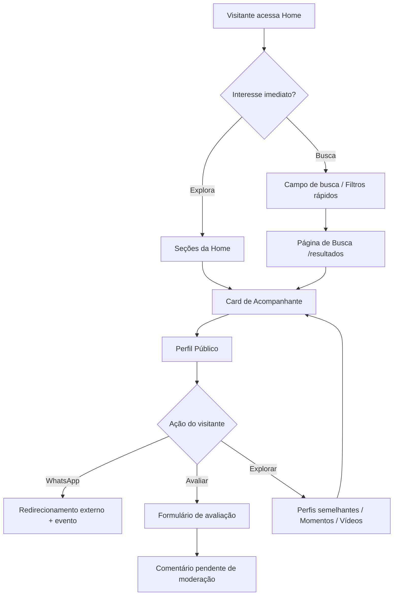
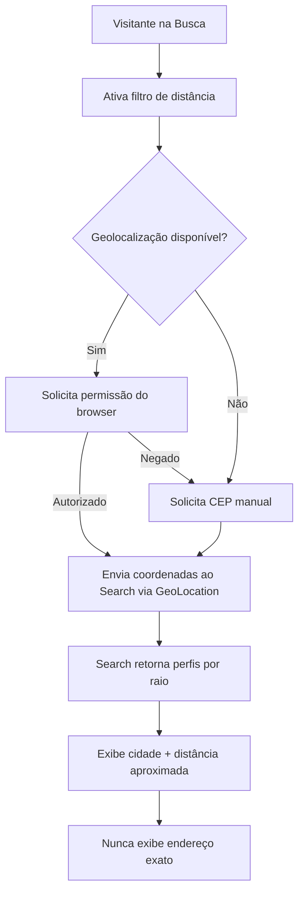
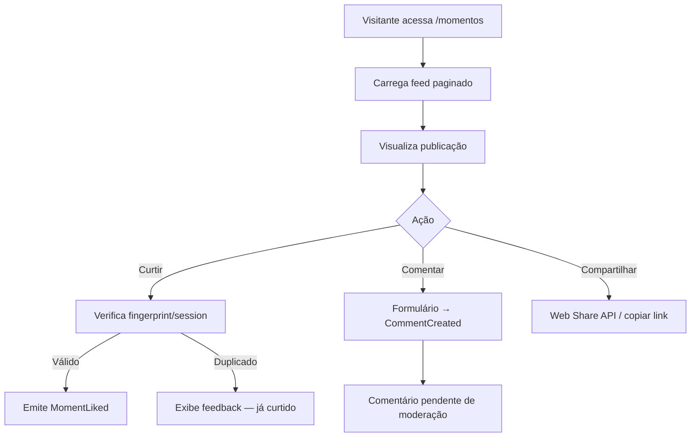
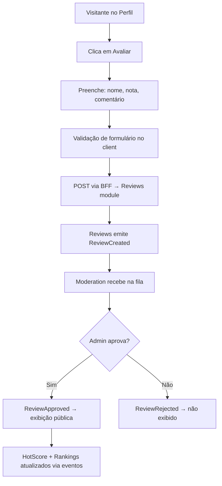

# Documento 2 — Área Pública da Plataforma

**Versão:** 1.0.0  
**Status:** Especificação Oficial  
**Última atualização:** 2026-07-08  
**Dependência:** [Documento 1 — Arquitetura da Plataforma](../arquitetura/DOCUMENTO-01-ARQUITETURA-DA-PLATAFORMA.md)  
**Escopo:** Funcionalidades, telas, componentes e regras de negócio para visitantes não autenticados

---

## Sumário

1. [Visão Geral e Princípios](#1-visão-geral-e-princípios)
2. [Mapa de Páginas Públicas](#2-mapa-de-páginas-públicas)
3. [Fluxos de Navegação](#3-fluxos-de-navegação)
4. [Componentes Necessários](#4-componentes-necessários)
5. [Especificação por Página](#5-especificação-por-página)
6. [Regras de Negócio](#6-regras-de-negócio)
7. [Integração com Módulos](#7-integração-com-módulos)
8. [Eventos Gerados](#8-eventos-gerados)
9. [Requisitos de UX e Design System](#9-requisitos-de-ux-e-design-system)
10. [Requisitos de Performance](#10-requisitos-de-performance)
11. [Regras de SEO](#11-regras-de-seo)
12. [Critérios de Aceitação](#12-critérios-de-aceitação)

---

## 1. Visão Geral e Princípios

### 1.1 Objetivo

A Área Pública é a superfície de descoberta da plataforma. Ela permite que visitantes naveguem, pesquisem e explorem perfis de acompanhantes com uma experiência **premium, rápida e intuitiva**, transmitindo:

| Valor | Manifestação na interface |
|---|---|
| **Exclusividade** | Layout refinado, badges Premium/Destaque, curadoria visual |
| **Confiança** | Selo de verificação, avaliações moderadas, informações claras |
| **Sofisticação** | Tema escuro, tipografia elegante, animações suaves |
| **Facilidade** | Busca inteligente, filtros rápidos, navegação fluida |

### 1.2 Posicionamento Arquitetural

A Área Pública **não possui regras de negócio próprias**. Ela é exclusivamente uma **camada de apresentação** que:

- Consome dados via **interfaces públicas** dos módulos de domínio.
- Dispara **eventos de domínio** para efeitos colaterais (analytics, hot score, etc.).
- Delega toda lógica de cálculo, moderação, indexação e pontuação aos módulos responsáveis.
- Reside em `apps/web/app/(public)/` conforme Documento 1.

```
┌─────────────────────────────────────────────────────────────┐
│                    ÁREA PÚBLICA (apps/web)                │
│  Páginas │ Componentes │ Hooks de leitura │ Event emitters │
│         ★ SEM repositories │ SEM regras de negócio ★       │
└────────────────────────────┬────────────────────────────────┘
                             │ BFF / API Routes (leitura)
              ┌──────────────┼──────────────┐
              ▼              ▼              ▼
         Profiles       Search        Rankings
         Photos         HotScore      Moments
         Videos         Reviews       Analytics
         Tags           GeoLocation   SEO
         Comments       Settings      Cache
```

### 1.3 Restrições Obrigatórias (Documento 1)

| Restrição | Aplicação na Área Pública |
|---|---|
| Sem regra de negócio em componentes | Validação mínima de formulário apenas; regras ficam nos módulos |
| Sem acesso direto a repositories | Toda leitura via `I*Service` ou BFF |
| Efeitos colaterais via eventos | Clique WhatsApp, curtida, comentário → evento, nunca escrita direta em Analytics |
| Configurações dinâmicas | Limites, pesos e flags vêm do módulo Settings |
| Componentes pequenos e reutilizáveis | Máx. 300 linhas/arquivo; composição sobre herança |

---

## 2. Mapa de Páginas Públicas

### 2.1 Inventário de Rotas

| Rota | Página | Renderização | Módulos principais |
|---|---|---|---|
| `/` | Página Inicial | ISR (60s) | Profiles, Rankings, HotScore, Moments, Video Gallery, Tags, Settings |
| `/busca` | Busca Avançada | CSR + SSR inicial | Search, GeoLocation, Tags, Profiles |
| `/perfil/[slug]` | Perfil Público | ISR (120s) | Profiles, Photos, Videos, Reviews, Comments, HotScore, Moments, SEO |
| `/momentos` | Feed de Momentos | CSR (infinite scroll) | Moments, Profiles, Comments |
| `/videos` | Galeria de Vídeos | CSR + SSR inicial | Video Gallery, Videos, Profiles, Tags |
| `/rankings` | Rankings Públicos | ISR (300s) | Rankings, HotScore, Profiles, Settings |
| `/categoria/[slug]` | Listagem por Tag | ISR (120s) | Tags, Search, Profiles |
| `/sobre` | Página institucional | SSG | CMS |
| `/termos` | Termos de uso | SSG | CMS |
| `/privacidade` | Política de privacidade | SSG | CMS |
| `/contato` | Contato | SSG | CMS |

### 2.2 Estrutura de Arquivos (Apresentação)

```
apps/web/app/(public)/
├── layout.tsx                    # Layout público (header, footer, tema)
├── page.tsx                      # Home
├── busca/
│   └── page.tsx
├── perfil/
│   └── [slug]/
│       └── page.tsx
├── momentos/
│   └── page.tsx
├── videos/
│   └── page.tsx
├── rankings/
│   └── page.tsx
├── categoria/
│   └── [slug]/
│       └── page.tsx
└── (institucional)/
    ├── sobre/page.tsx
    ├── termos/page.tsx
    ├── privacidade/page.tsx
    └── contato/page.tsx
```

### 2.3 Layout Global Público

Elementos presentes em todas as páginas (exceto modais/overlays):

| Elemento | Descrição | Fonte de dados |
|---|---|---|
| **Header** | Logo, menu principal, campo de busca compacto | Settings (logo, menu), CMS |
| **Footer** | Links institucionais, redes sociais, copyright | CMS, Settings |
| **Cookie Banner** | Consentimento LGPD para analytics e geolocalização | Settings |
| **Scroll to Top** | Botão flutuante após 400px de scroll | — |

---

## 3. Fluxos de Navegação

### 3.1 Fluxo Principal — Descoberta



### 3.2 Fluxo — Busca por Proximidade



### 3.3 Fluxo — Interação com Momentos



### 3.4 Fluxo — Avaliação de Perfil



### 3.5 Mapa de Navegação do Menu

| Item de Menu | Destino | Observação |
|---|---|---|
| Início | `/` | — |
| Buscar | `/busca` | Abre com filtros expandidos |
| Momentos | `/momentos` | — |
| Vídeos | `/videos` | — |
| Rankings | `/rankings` | — |
| Categorias | Dropdown com tags populares | Fonte: Tags module |
| Entrar | `/login` | Redireciona para área autenticada (fora do escopo deste doc) |

---

## 4. Componentes Necessários

### 4.1 Componentes Globais (packages/ui + apps/web)

| Componente | Responsabilidade | Props principais | Módulo de dados |
|---|---|---|---|
| `PublicHeader` | Navegação, logo, busca compacta | `menuItems`, `logoUrl` | Settings, CMS |
| `PublicFooter` | Links, copyright | `links`, `social` | CMS |
| `SearchBar` | Input de busca com autocomplete | `onSearch`, `suggestions` | Search |
| `FilterChip` | Filtro rápido toggleável | `label`, `active`, `onToggle` | — |
| `Pagination` | Navegação de páginas / cursor | `cursor`, `hasMore`, `onLoadMore` | Shared Core |
| `EmptyState` | Estado vazio ilustrado | `title`, `description`, `action` | — |
| `LoadingSkeleton` | Placeholder de carregamento | `variant` (card, profile, grid) | — |
| `CookieConsent` | Banner LGPD | `onAccept`, `onReject` | Settings |
| `GeoLocationPrompt` | Solicitação de localização | `onGrant`, `onDeny`, `onManualCep` | GeoLocation |
| `SeoHead` | Meta tags dinâmicas | `meta` (SeoMetaDTO) | SEO |

### 4.2 Componentes de Descoberta

| Componente | Responsabilidade | Props principais | Módulo de dados |
|---|---|---|---|
| `CompanionCard` | Card principal de perfil | `profile`, `photos`, `badges`, `hotScore` | Profiles, Photos, HotScore, Tags |
| `CompanionCardGallery` | Navegação de fotos no card | `photos`, `mode` (hover/swipe) | Photos |
| `BadgePremium` | Selo premium | `active` | Profiles |
| `BadgeFeatured` | Selo destaque | `active` | Profiles |
| `BadgeVerified` | Selo verificado | `active` | Verification |
| `HotScoreIndicator` | Indicador visual de score | `score`, `level`, `trend` | HotScore |
| `TagList` | Lista de tags (máx. 3 no card) | `tags`, `maxVisible` | Tags |
| `ProfileGrid` | Grid responsivo de cards | `profiles`, `columns` | Profiles |
| `SectionCarousel` | Carrossel horizontal de seções | `title`, `items`, `viewAllHref` | — |

### 4.3 Componentes de Perfil

| Componente | Responsabilidade | Props principais | Módulo de dados |
|---|---|---|---|
| `ProfileHero` | Cabeçalho do perfil (foto, nome, badges) | `profile` | Profiles |
| `PhotoGallery` | Galeria completa com lightbox | `photos` | Photos |
| `VideoPlayer` | Player de vídeo otimizado | `video`, `autoplay` | Videos |
| `ProfileBio` | Biografia e preferências | `bio`, `preferences` | Profiles |
| `ProfileTags` | Tags completas do perfil | `tags` | Tags |
| `PricingTable` | Tabela de valores | `pricing`, `displayMode` | Profiles |
| `AvailabilitySchedule` | Horários de atendimento | `schedule` | Profiles |
| `WhatsAppButton` | CTA de contato | `phone`, `profileId`, `message` | Profiles |
| `ReviewSummary` | Média e contagem de avaliações | `average`, `count`, `distribution` | Reviews |
| `ReviewList` | Lista de comentários aprovados | `reviews`, `paginated` | Reviews, Comments |
| `ReviewForm` | Formulário de avaliação | `profileId`, `onSubmit` | Reviews |
| `HotScoreHistory` | Gráfico de evolução do score | `history`, `current` | HotScore |
| `SimilarProfiles` | Seção de recomendação | `profiles` | Search (recommendation) |
| `MomentStrip` | Momentos do perfil | `moments` | Moments |
| `ProfileVideoList` | Vídeos públicos do perfil | `videos` | Videos |

### 4.4 Componentes de Busca

| Componente | Responsabilidade | Props principais | Módulo de dados |
|---|---|---|---|
| `SearchFilters` | Painel de filtros avançados | `filters`, `onChange` | Search |
| `FilterCity` | Seletor de cidade | `cities`, `selected` | GeoLocation |
| `FilterDistance` | Raio de proximidade | `radius`, `onChange` | GeoLocation |
| `FilterAge` | Faixa etária (range slider) | `min`, `max` | Search |
| `FilterTags` | Multi-select de tags | `tags`, `selected` | Tags |
| `FilterToggle` | Toggle booleano (premium, verificado) | `label`, `value` | Search |
| `FilterRating` | Avaliação mínima | `minRating` | Search |
| `FilterHotScore` | Faixa de Hot Score | `min`, `max` | HotScore |
| `SortSelector` | Ordenação de resultados | `sort`, `options` | Search |
| `SearchResults` | Grid de resultados | `results`, `total`, `sort` | Search |
| `ActiveFilters` | Chips de filtros ativos | `filters`, `onRemove` | — |

### 4.5 Componentes de Conteúdo

| Componente | Responsabilidade | Props principais | Módulo de dados |
|---|---|---|---|
| `MomentCard` | Card de momento no feed | `moment`, `profile` | Moments, Profiles |
| `MomentFeed` | Feed infinito de momentos | `moments` | Moments |
| `LikeButton` | Botão de curtir com proteção | `targetId`, `type`, `liked` | Moments / Videos |
| `ShareButton` | Compartilhamento | `url`, `title` | — |
| `VideoCard` | Card de vídeo na galeria | `video`, `profile` | Videos, Profiles |
| `VideoGrid` | Grid de vídeos | `videos` | Video Gallery |
| `RankingTable` | Tabela de ranking | `entries`, `type` | Rankings |
| `RankingTabs` | Abas de categorias de ranking | `tabs`, `active` | Rankings |
| `TrendIndicator` | Indicador de tendência (↑↓) | `direction`, `value` | Rankings |

### 4.6 Hierarquia de Composição — CompanionCard

```
CompanionCard
├── CompanionCardGallery
│   ├── Image (next/image, lazy, blur hash)
│   ├── NavigationArrow (desktop hover)
│   └── SwipeIndicator (mobile)
├── CardOverlay
│   ├── BadgePremium (condicional)
│   ├── BadgeFeatured (condicional)
│   └── BadgeVerified (condicional)
├── CardContent
│   ├── ProfileName
│   ├── ProfileMeta (idade, cidade)
│   ├── PreferenceLabel
│   ├── TagList (maxVisible: 3)
│   └── HotScoreIndicator
└── CardLink (wrap → /perfil/[slug])
```

---

## 5. Especificação por Página

### 5.1 Página Inicial (`/`)

#### 5.1.1 Seções e Ordem de Exibição

| Ordem | Seção | Título sugerido | Fonte | Quantidade padrão |
|---|---|---|---|---|
| 1 | Hero + Busca | "Encontre acompanhantes exclusivas" | — | 1 |
| 2 | Filtros rápidos | Chips de categorias populares | Tags, Settings | 8–12 chips |
| 3 | Em destaque | "Acompanhantes em Destaque" | Rankings (`featured`) | 8 cards |
| 4 | Premium | "Perfis Premium" | Profiles (`isPremium`) | 8 cards |
| 5 | Em alta | "Perfis em Alta" | HotScore (`trending`) | 8 cards |
| 6 | Rankings | "Top da Semana" | Rankings | Top 5 preview |
| 7 | Momentos | "Momentos Recentes" | Moments | 6 cards |
| 8 | Vídeos | "Galeria de Vídeos" | Video Gallery | 6 cards |
| 9 | Categorias | "Categorias Populares" | Tags | 12 tags |

> Quantidades configuráveis via Settings (`public.home.*`).

#### 5.1.2 Comportamento

- Cada seção carrega de forma **independente** (streaming SSR ou parallel data fetching).
- Seções com falha individual exibem fallback graceful (seção oculta, não erro global).
- Link "Ver todos" em cada seção aponta para a página dedicada com filtro pré-aplicado.
- Primeira seção above-the-fold priorizada para LCP (Largest Contentful Paint).

#### 5.1.3 Filtros Rápidos (Hero)

Chips pré-configurados que redirecionam para `/busca` com query params:

| Chip exemplo | Query param |
|---|---|
| São Paulo | `?cidade=sao-paulo` |
| Premium | `?premium=true` |
| Verificadas | `?verificado=true` |
| Com vídeos | `?videos=true` |

Lista de chips administrável via Settings.

---

### 5.2 CompanionCard — Componente Central

#### 5.2.1 Dados Exibidos

| Campo | Origem | Regra de exibição |
|---|---|---|
| Foto principal | Photos | Primeira foto aprovada por ordem da acompanhante |
| Nome | Profiles | `displayName` |
| Idade | Profiles | Calculada a partir de `birthDate` |
| Cidade | GeoLocation | Cidade/região — **nunca endereço** |
| Preferência sexual | Profiles | Campo `sexualPreference` |
| Tags | Tags | **Apenas as 3 primeiras** ordenadas pela acompanhante |
| Badge Premium | Profiles | Visível se `isPremium === true` |
| Badge Destaque | Profiles | Visível se `isFeatured === true` |
| Badge Verificado | Verification | Visível se `isVerified === true` |
| Hot Score | HotScore | Indicador numérico + nível visual (configurável) |

#### 5.2.2 Interação — Desktop

| Ação | Comportamento |
|---|---|
| Hover no card | Transição suave (300ms); overlay com navegação de fotos |
| Setas ← → | Navega entre fotos aprovadas do perfil (máx. 5 no hover) |
| Click | Navega para `/perfil/[slug]` |
| Sem fotos adicionais | Hover exibe zoom sutil da foto principal |

#### 5.2.3 Interação — Mobile

| Ação | Comportamento |
|---|---|
| Swipe horizontal | Navega entre fotos (touch, threshold 50px) |
| Tap | Navega para `/perfil/[slug]` |
| Indicador de páginas | Dots abaixo da imagem (máx. 5) |

#### 5.2.4 Otimização de Carregamento

| Técnica | Aplicação |
|---|---|
| `next/image` | Todas as imagens com sizes responsivos |
| Blur hash (LQIP) | Placeholder enquanto carrega |
| Lazy load | Cards abaixo da dobra |
| Preload | Primeira foto do primeiro card (LCP) |
| Srcset | 3 tamanhos: thumb (400w), medium (600w), large (800w) |

---

### 5.3 Página de Perfil Público (`/perfil/[slug]`)

#### 5.3.1 Estrutura da Página

| Seção | Ordem | Conteúdo | Condicional |
|---|---|---|---|
| Hero | 1 | Foto principal, nome, idade, cidade, badges | — |
| Galeria | 2 | Grid de fotos com lightbox | Se houver fotos aprovadas |
| Informações | 3 | Bio, preferências, posição, tags | — |
| Hot Score | 4 | Score atual + indicador + histórico | Sempre |
| Valores | 5 | Tabela de preços ou "Consultar valores" | Se configurado pela acompanhante |
| Horários | 6 | Disponibilidade semanal | Se preenchido |
| Vídeos | 7 | Player + lista de vídeos públicos | Se houver vídeos aprovados |
| Momentos | 8 | Strip de momentos recentes | Se houver momentos ativos |
| Avaliações | 9 | Média, distribuição, lista aprovada | Se houver reviews aprovadas |
| Formulário | 10 | Avaliar perfil (nome, nota, comentário) | Sempre |
| WhatsApp CTA | Fixo | Botão flutuante/sticky | Se telefone configurado |
| Semelhantes | 11 | Grid de perfis recomendados | Mín. 4 recomendações |

#### 5.3.2 Dados do Perfil — Mapeamento

| Campo exibido | Campo do módulo | Transformação na apresentação |
|---|---|---|
| Nome | `Profiles.displayName` | Nenhuma |
| Idade | `Profiles.birthDate` | Calcular idade |
| Cidade | `GeoLocation.city` | Exibir cidade + estado |
| Bio | `Profiles.bio` | Renderizar com sanitização |
| Preferências | `Profiles.preferences[]` | Lista formatada |
| Posição | `Profiles.position` | Label traduzido (Ativo/Passivo/Versátil) |
| Tags | `Tags.getByProfileId()` | Todas as tags (sem limite) |
| Premium | `Profiles.isPremium` | Badge |
| Destaque | `Profiles.isFeatured` | Badge |
| Verificado | `Verification.isVerified` | Badge |

#### 5.3.3 Regras de Visibilidade

- Perfil exibido apenas se `status === 'approved'` e `isPublic === true`.
- Perfil inexistente ou não aprovado → página 404 customizada.
- Perfil desativado → 410 Gone com mensagem elegante.
- Fotos/vídeos exibem **somente** conteúdo com `moderationStatus === 'approved'`.

#### 5.3.4 WhatsApp Button

| Aspecto | Especificação |
|---|---|
| Posição | Sticky bottom em mobile; lateral direita em desktop |
| Texto | "Conversar no WhatsApp" (configurável via Settings) |
| URL | `https://wa.me/{phone}?text={encodedMessage}` |
| Mensagem padrão | "Olá! Vi seu perfil em {siteName} e gostaria de mais informações." |
| Ao clicar | 1. Emite `WhatsAppClicked` → 2. Abre WhatsApp em nova aba |
| Telefone | Nunca exibido em texto — apenas no link |

#### 5.3.5 Tabela de Valores

| Modo | Exibição |
|---|---|
| `displayMode: 'show'` | Tabela com valores |
| `displayMode: 'consult'` | Texto "Consultar valores" com ícone |
| `displayMode: 'hidden'` | Seção não renderizada |

Estrutura da tabela (quando `show`):

| Duração | Campo |
|---|---|
| 30 minutos | `pricing.thirtyMin` |
| 1 hora | `pricing.oneHour` |
| 2 horas | `pricing.twoHours` |
| Pernoite | `pricing.overnight` |
| Personalizados | `pricing.custom[]` → `{ label, value }` |

Formatação monetária: `R$ XX,XX` (locale pt-BR). Valores configurados pela acompanhante no módulo Profiles.

#### 5.3.6 Horários

Exibição em grid semanal:

| Dia | Formato |
|---|---|
| Segunda–Domingo | `09:00 – 22:00` ou "Não disponível" |

Fonte: `Profiles.availabilitySchedule`. Exibição opcional — seção oculta se vazio.

---

### 5.4 Sistema de Busca (`/busca`)

#### 5.4.1 Filtros Disponíveis

| Filtro | Tipo UI | Param | Módulo |
|---|---|---|---|
| Texto livre | Input | `q` | Search |
| Cidade | Autocomplete | `cidade` | GeoLocation |
| Distância | Select | `distancia` | GeoLocation + Search |
| Idade | Range slider (18–99) | `idade_min`, `idade_max` | Search |
| Tags | Multi-select chips | `tags[]` | Tags |
| Preferência sexual | Select | `preferencia` | Search |
| Posição | Radio group | `posicao` | Search |
| Premium | Toggle | `premium` | Search |
| Destaque | Toggle | `destaque` | Search |
| Verificado | Toggle | `verificado` | Search |
| Avaliação mínima | Star selector (1–5) | `avaliacao_min` | Search |
| Possui vídeos | Toggle | `videos` | Search |
| Possui momentos | Toggle | `momentos` | Search |
| Hot Score | Range slider | `hotscore_min`, `hotscore_max` | HotScore |

#### 5.4.2 Busca por Proximidade

| Raio | Valor do param `distancia` |
|---|---|
| Até 2 km | `2` |
| Até 5 km | `5` |
| Até 10 km | `10` |
| Até 20 km | `20` |
| Até 50 km | `50` |

**Regras de privacidade:**

1. Localização exata do acompanhante **nunca** é exposta.
2. Visitante vê: cidade + "a ~X km de você" (distância arredondada).
3. Cálculo de distância: módulo GeoLocation (Haversine sobre coordenadas do CEP).
4. Coordenadas do visitante: armazenadas apenas em session (não persistidas).
5. Fallback sem geolocalização: busca por CEP manual → convertido em coordenadas.

#### 5.4.3 Ordenação

| Opção | Param `ordenar` | Lógica (módulo Search) |
|---|---|---|
| Mais relevantes | `relevancia` | Algoritmo composto padrão |
| Mais populares | `populares` | Weighted views + interactions |
| Maior Hot Score | `hotscore` | `hotScore DESC` |
| Mais visualizados | `visualizacoes` | `viewCount DESC` |
| Melhor avaliados | `avaliacao` | `averageRating DESC` |
| Mais recentes | `recentes` | `createdAt DESC` |
| Premium primeiro | `premium` | `isPremium DESC, relevancia` |
| Destaques primeiro | `destaque` | `isFeatured DESC, relevancia` |

#### 5.4.4 Resultados

- Exibição em grid de `CompanionCard`.
- Paginação cursor-based (24 resultados por página).
- Contagem total exibida: "X acompanhantes encontradas".
- Filtros ativos exibidos como chips removíveis acima dos resultados.
- Estado vazio com sugestões de filtros alternativos.
- URL reflete todos os filtros (shareable, indexável quando aplicável).

---

### 5.5 Perfis Semelhantes

#### 5.5.1 Posicionamento

- Seção no final da página de perfil.
- Título: "Perfis semelhantes".
- Grid de 4–8 `CompanionCard`.

#### 5.5.2 Algoritmo de Recomendação (módulo Search)

Pontuação de similaridade (preparada para evolução via ML):

| Fator | Peso padrão (Settings) | Descrição |
|---|---|---|
| Mesma cidade | 30 | Mesma cidade = match |
| Tags em comum | 25 | Proporção de tags compartilhadas |
| Faixa de idade | 15 | Diferença ≤ 5 anos |
| Preferência compatível | 10 | Mesma preferência sexual |
| Hot Score próximo | 10 | Score dentro de ±20% |
| Avaliação similar | 10 | Diferença de média ≤ 0.5 |

**Regras:**

- Algoritmo executado pelo `ISearchService.getSimilarProfiles(profileId)`.
- Pesos configuráveis via Settings (`search.similarity.weights.*`).
- Excluir o próprio perfil e perfis não aprovados.
- Cache de 15 minutos por perfil.
- Interface preparada para substituição futura por modelo de ML sem alterar a apresentação.

---

### 5.6 Histórico de Popularidade (Hot Score)

#### 5.6.1 Exibição no Perfil

| Elemento | Descrição |
|---|---|
| Score atual | Número + gauge visual (ex.: 0–100) |
| Nível | Label derivado: Frio / Morno / Quente / Em chamas |
| Tendência | Ícone ↑ ↓ → com variação percentual (7 dias) |
| Gráfico | Sparkline ou chart de linha (30 dias) — se histórico disponível |

#### 5.6.2 Fonte de Dados

- Score atual: `IHotScoreService.getByProfileId()`.
- Histórico: `IHotScoreService.getHistory(profileId, period)`.
- Níveis e thresholds: Settings (`hotscore.levels.*`).
- Área Pública apenas renderiza — não calcula score.

---

### 5.7 Momentos (`/momentos`)

#### 5.7.1 Conceito

Feed público de publicações permanentes (não efêmeras na exibição pública). Cada momento é uma publicação com mídia + legenda, vinculada a um perfil.

#### 5.7.2 Estrutura do MomentCard

| Campo | Origem |
|---|---|
| Foto ou vídeo | Moments |
| Legenda | Moments |
| Nome + foto miniatura do perfil | Profiles |
| Data de publicação | Moments |
| Curtidas (contagem) | Moments |
| Comentários (contagem) | Comments |
| Link para perfil | Profiles |

#### 5.7.3 Interações

| Ação | Comportamento | Evento |
|---|---|---|
| Curtir | Toggle like; proteção anti-duplicata | `MomentLiked` / `MomentUnliked` |
| Comentar | Abre formulário inline; submete para moderação | `CommentCreated` |
| Compartilhar | Web Share API ou copiar URL | `MomentShared` |

#### 5.7.4 Proteção de Curtidas

| Mecanismo | Descrição |
|---|---|
| Fingerprint | Hash de browser fingerprint + IP parcial |
| Session ID | Cookie `visitor_session` (UUID, 30 dias) |
| Rate limit | Máx. 50 curtidas por sessão/hora |
| Verificação | `IMomentsService.hasLiked(momentId, visitorId)` |

Regra de negócio no módulo Moments — Área Pública apenas envia identificador de visitante.

#### 5.7.5 Paginação

- Infinite scroll com cursor-based pagination.
- 12 momentos por carregamento.
- Ordenação padrão: mais recentes.

---

### 5.8 Galeria de Vídeos (`/videos`)

#### 5.8.1 Conteúdo

Somente vídeos com:

- `isPublic === true`
- `moderationStatus === 'approved'`
- Autorização explícita da acompanhante

#### 5.8.2 Estrutura do VideoCard

| Campo | Origem |
|---|---|
| Miniatura | Videos (auto-gerada) |
| Título | Videos |
| Nome do perfil + link | Profiles |
| Duração | Videos |
| Visualizações | Analytics (read model) |
| Curtidas | Videos |
| Comentários (contagem) | Comments |

#### 5.8.3 Filtros

| Filtro | Param |
|---|---|
| Cidade | `cidade` |
| Tags | `tags[]` |
| Popularidade | `ordenar=populares` |
| Mais recentes | `ordenar=recentes` |
| Mais visualizados | `ordenar=visualizacoes` |

#### 5.8.4 Layout

- Grid masonry em desktop (3–4 colunas).
- Lista em mobile (1 coluna).
- Hover em desktop: preview de 3s (sem áudio) se disponível.
- Click: modal/player fullscreen ou página dedicada.

---

### 5.9 Rankings Públicos (`/rankings`)

#### 5.9.1 Categorias de Ranking

| Aba | Tipo | Fonte |
|---|---|---|
| Mais populares | `popularity` | Rankings |
| Maior Hot Score | `hotscore` | Rankings + HotScore |
| Mais visualizados | `views` | Rankings + Analytics |
| Melhor avaliados | `rating` | Rankings + Reviews |
| Mais comentados | `comments` | Rankings + Comments |
| Tendências | `trending` | Rankings (variação recente) |

#### 5.9.2 Estrutura de Exibição

| Posição | Elemento visual |
|---|---|
| 1º | Card grande destaque (gold) |
| 2º | Card médio (silver) |
| 3º | Card médio (bronze) |
| 4º+ | Lista compacta com posição, foto, nome, métrica |

#### 5.9.3 Filtros de Rankings

| Filtro | Descrição |
|---|---|
| Período | Hoje / Semana / Mês / Todos os tempos |
| Cidade | Filtrar por localização |
| Categoria/Tag | Filtrar por tag |

#### 5.9.4 Dados por Entrada

| Campo | Origem |
|---|---|
| Posição | Rankings |
| Foto + nome | Profiles |
| Métrica principal | Depende do tipo de ranking |
| Variação de posição | Rankings (`positionChange`) |
| Badges | Profiles + Verification |

---

## 6. Regras de Negócio

> **Nota:** Todas as regras abaixo são implementadas nos **módulos de domínio**. A Área Pública apenas as consome e reforça na apresentação.

### 6.1 Regras de Exibição de Perfis

| ID | Regra | Módulo responsável |
|---|---|---|
| RN-PUB-001 | Apenas perfis com `status = approved` e `isPublic = true` são exibidos | Profiles |
| RN-PUB-002 | Fotos e vídeos exibem somente conteúdo com `moderationStatus = approved` | Photos, Videos, Moderation |
| RN-PUB-003 | Localização exata nunca é exibida — apenas cidade/estado e distância aproximada | GeoLocation |
| RN-PUB-004 | Idade mínima exibida: 18 anos | Profiles |
| RN-PUB-005 | Tags no card: máximo 3, ordenadas por `tagOrder` definido pela acompanhante | Tags, Profiles |
| RN-PUB-006 | Tags no perfil completo: todas as tags ativas, sem limite | Tags |
| RN-PUB-007 | Perfil Premium exibe badge apenas se `isPremium = true` e assinatura ativa | Profiles, Settings |
| RN-PUB-008 | Perfil Destaque exibe badge apenas se `isFeatured = true` e dentro do período | Profiles, Settings |

### 6.2 Regras de Avaliações e Comentários

| ID | Regra | Módulo responsável |
|---|---|---|
| RN-PUB-010 | Visitante pode avaliar sem autenticação, informando nome | Reviews |
| RN-PUB-011 | Nota obrigatória: 1 a 5 estrelas (inteiro) | Reviews |
| RN-PUB-012 | Comentário opcional, máx. 500 caracteres | Reviews |
| RN-PUB-013 | Toda avaliação inicia com `status = pending` | Reviews |
| RN-PUB-014 | Apenas avaliações `approved` são exibidas publicamente | Reviews, Moderation |
| RN-PUB-015 | Média calculada somente com avaliações aprovadas | Reviews |
| RN-PUB-016 | Rate limit: 1 avaliação por perfil por IP/fingerprint a cada 24h | Reviews, Shared Core |
| RN-PUB-017 | Nome do avaliador exibido como informado (sem verificação) | Reviews |
| RN-PUB-018 | Comentários de momentos seguem mesmo fluxo de moderação | Comments, Moderation |

### 6.3 Regras de Busca

| ID | Regra | Módulo responsável |
|---|---|---|
| RN-PUB-020 | Busca retorna apenas perfis aprovados e públicos | Search, Profiles |
| RN-PUB-021 | Filtro de idade mínimo: 18 anos (forçado, não removível) | Search, Settings |
| RN-PUB-022 | Distância calculada a partir de coordenadas do CEP do perfil | GeoLocation |
| RN-PUB-023 | Resultados respeitam combinação AND de filtros ativos | Search |
| RN-PUB-024 | Ordenação padrão: relevância (se nenhuma selecionada) | Search |
| RN-PUB-025 | Perfis Premium/Destaque não são exclusivos — aparecem naturalmente nos resultados | Search |

### 6.4 Regras de Interação

| ID | Regra | Módulo responsável |
|---|---|---|
| RN-PUB-030 | Clique no WhatsApp registra evento antes do redirecionamento | Analytics (via evento) |
| RN-PUB-031 | Curtida em momento: 1 por visitante (fingerprint + session) | Moments |
| RN-PUB-032 | Visualização de perfil registra `ProfileViewed` (deduplicada por sessão/1h) | Analytics |
| RN-PUB-033 | Visualização de foto registra evento (com índice da foto) | Analytics |
| RN-PUB-034 | Visualização de vídeo registra após 5s de reprodução | Analytics |
| RN-PUB-035 | Compartilhamento registra evento com canal (web_share / copy_link) | Analytics |

### 6.5 Regras de Conteúdo

| ID | Regra | Módulo responsável |
|---|---|---|
| RN-PUB-040 | Momentos exibidos são permanentes no feed público (não expiram na UI) | Moments |
| RN-PUB-041 | Vídeos exibidos apenas se autorizados pela acompanhante | Videos |
| RN-PUB-042 | Tabela de valores respeita `displayMode` do perfil | Profiles |
| RN-PUB-043 | Horários exibidos no fuso da cidade do perfil | Profiles, GeoLocation |
| RN-PUB-044 | Rankings atualizados por job agendado (configurável via Settings) | Rankings |
| RN-PUB-045 | Perfis semelhantes: mínimo 4 resultados para exibir seção; senão, ocultar | Search |

### 6.6 Regras de Privacidade (LGPD)

| ID | Regra | Módulo responsável |
|---|---|---|
| RN-PUB-050 | Cookie de analytics só ativado após consentimento | Settings, Analytics |
| RN-PUB-051 | Geolocalização só solicitada quando filtro de distância ativado | GeoLocation |
| RN-PUB-052 | Dados de visitante (fingerprint, session) não são vinculados a PII | Analytics |
| RN-PUB-053 | Visitante pode denunciar perfil/conteúdo via formulário | Reports |
| RN-PUB-054 | IP do visitante parcialmente mascarado nos logs | Audit, Analytics |

---

## 7. Integração com Módulos

### 7.1 Mapa de Integração — Leitura (Síncrona)

| Página / Componente | Interface consumida | Método | Cache |
|---|---|---|---|
| Home — Destaques | `IRankingsService` | `getFeatured(limit)` | 5 min |
| Home — Premium | `IProfilesService` | `getPremium(limit)` | 5 min |
| Home — Em alta | `IHotScoreService` | `getTrending(limit)` | 5 min |
| Home — Momentos | `IMomentsService` | `getRecent(limit)` | 2 min |
| Home — Vídeos | `IVideoGalleryService` | `getPublic(limit)` | 5 min |
| Home — Tags | `ITagsService` | `getPopular(limit)` | 15 min |
| Busca — Resultados | `ISearchService` | `search(filters, sort, cursor)` | — |
| Busca — Autocomplete | `ISearchService` | `autocomplete(query)` | 1 min |
| Busca — Proximidade | `IGeoLocationService` | `findByRadius(lat, lng, km)` | — |
| Perfil — Dados | `IProfilesService` | `getBySlug(slug)` | 2 min |
| Perfil — Fotos | `IPhotosService` | `getApprovedByProfileId(id)` | 5 min |
| Perfil — Vídeos | `IVideosService` | `getPublicByProfileId(id)` | 5 min |
| Perfil — Reviews | `IReviewsService` | `getApprovedByProfileId(id)` | 5 min |
| Perfil — Hot Score | `IHotScoreService` | `getByProfileId(id)` | 2 min |
| Perfil — Histórico | `IHotScoreService` | `getHistory(id, period)` | 10 min |
| Perfil — Semelhantes | `ISearchService` | `getSimilarProfiles(id)` | 15 min |
| Perfil — Momentos | `IMomentsService` | `getByProfileId(id)` | 2 min |
| Momentos — Feed | `IMomentsService` | `getFeed(cursor)` | 2 min |
| Vídeos — Galeria | `IVideoGalleryService` | `search(filters, cursor)` | 5 min |
| Rankings | `IRankingsService` | `getRanking(type, filters)` | 5 min |
| Todas — SEO | `ISeoService` | `getMetaForPage(page, params)` | 15 min |
| Todas — Settings | `ISettingsService` | `getPublicSettings()` | 10 min |

### 7.2 Mapa de Integração — Escrita (Via BFF → Módulo → Evento)

| Ação do visitante | Endpoint BFF | Módulo | Evento emitido |
|---|---|---|---|
| Avaliar perfil | `POST /api/public/reviews` | Reviews | `ReviewCreated` |
| Comentar momento | `POST /api/public/comments` | Comments | `CommentCreated` |
| Curtir momento | `POST /api/public/moments/[id]/like` | Moments | `MomentLiked` |
| Descurtir momento | `DELETE /api/public/moments/[id]/like` | Moments | `MomentUnliked` |
| Curtir vídeo | `POST /api/public/videos/[id]/like` | Videos | `VideoLiked` |
| Clique WhatsApp | `POST /api/public/analytics/whatsapp-click` | Analytics | `WhatsAppClicked` |
| Visualizar perfil | `POST /api/public/analytics/profile-view` | Analytics | `ProfileViewed` |
| Visualizar foto | `POST /api/public/analytics/photo-view` | Analytics | `PhotoViewed` |
| Assistir vídeo | `POST /api/public/analytics/video-view` | Analytics | `VideoViewed` |
| Realizar busca | `POST /api/public/analytics/search` | Analytics | `SearchPerformed` |
| Aplicar filtro | `POST /api/public/analytics/filter-applied` | Analytics | `FilterApplied` |
| Denunciar conteúdo | `POST /api/public/reports` | Reports | `ReportSubmitted` |
| Compartilhar | `POST /api/public/analytics/share` | Analytics | `ContentShared` |

### 7.3 Contrato BFF — Princípios

1. BFF (`apps/web/app/api/public/`) é **fininho** — valida input, chama service, retorna DTO.
2. BFF **não contém** regra de negócio.
3. BFF traduz erros do módulo em respostas HTTP padronizadas.
4. Toda rota pública de escrita possui rate limiting.
5. Toda rota pública de escrita valida input com Zod.

### 7.4 Read Models Consumidos

| Read Model | Alimentado por | Consumido por |
|---|---|---|
| `SearchIndex` | Eventos de Profiles, Tags, GeoLocation | Search |
| `RankingProjection` | Eventos de HotScore, Analytics, Reviews | Rankings |
| `ProfilePublicView` | Eventos de Profiles, Photos, Reviews, HotScore | Profiles (composto) |
| `VideoGalleryIndex` | Eventos de Videos | Video Gallery |
| `SeoMetadata` | Eventos de Profiles, CMS | SEO |

---

## 8. Eventos Gerados

### 8.1 Eventos Emitidos pela Área Pública

Todos os eventos seguem a anatomia do Documento 1 (`DomainEvent<T>`).

#### Navegação e Descoberta

| Evento | Trigger | Payload | Módulos receptores |
|---|---|---|---|
| `SiteVisited` | Primeiro acesso da sessão | `{ sessionId, referrer, userAgent, landingPage }` | Analytics |
| `SearchPerformed` | Submissão de busca | `{ query, filters, resultCount, sessionId }` | Analytics, Search |
| `FilterApplied` | Alteração de filtro na busca | `{ filterName, filterValue, sessionId }` | Analytics |
| `ProfileViewed` | Abertura de perfil (deduplicado) | `{ profileId, sessionId, source }` | Analytics, HotScore |
| `PhotoViewed` | Visualização de foto na galeria/lightbox | `{ profileId, photoId, photoIndex, sessionId }` | Analytics |
| `VideoViewed` | Reprodução ≥ 5s | `{ profileId, videoId, duration, sessionId }` | Analytics, HotScore |

#### Interações

| Evento | Trigger | Payload | Módulos receptores |
|---|---|---|---|
| `WhatsAppClicked` | Clique no botão WhatsApp | `{ profileId, sessionId }` | Analytics, HotScore |
| `ReviewCreated` | Submissão de avaliação | `{ reviewId, profileId, rating, authorName }` | Moderation, Analytics |
| `CommentCreated` | Submissão de comentário | `{ commentId, targetType, targetId, authorName }` | Moderation, Analytics |
| `MomentLiked` | Curtida em momento | `{ momentId, profileId, visitorId }` | Analytics, HotScore |
| `MomentUnliked` | Remoção de curtida | `{ momentId, profileId, visitorId }` | Analytics, HotScore |
| `VideoLiked` | Curtida em vídeo | `{ videoId, profileId, visitorId }` | Analytics, HotScore |
| `ContentShared` | Compartilhamento | `{ contentType, contentId, channel, sessionId }` | Analytics |
| `ReportSubmitted` | Denúncia | `{ reportId, targetType, targetId, reason }` | Moderation, Audit |

### 8.2 Eventos Consumidos (Read-Only na Apresentação)

A Área Pública reage a eventos indiretamente via **invalidação de cache**:

| Evento | Ação na Área Pública |
|---|---|
| `ProfileUpdated` | Invalida cache ISR do perfil |
| `ProfileApproved` | Perfil passa a ser exibível |
| `PhotoApproved` | Invalida cache de fotos do perfil |
| `ReviewApproved` | Invalida cache de reviews do perfil |
| `HotScoreUpdated` | Invalida cache de score do perfil |
| `SettingChanged` | Invalida cache de settings públicas |
| `MomentPublished` | Invalida cache do feed de momentos |

### 8.3 Fluxo de Tracking (Analytics)

```
Visitante realiza ação na UI
        │
        ▼
Componente chama hook useTrackEvent()
        │
        ▼
Hook envia para BFF (/api/public/analytics/*)
        │
        ▼
BFF valida + chama AnalyticsService.track()
        │
        ▼
Analytics emite evento de domínio
        │
        ├──► HotScore (se aplicável)
        ├──► Dashboard (agregação)
        └──► Audit (se sensível)
```

**Regra absoluta:** Componentes da Área Pública **nunca** importam ou chamam `AnalyticsService` diretamente. Sempre via hook → BFF → módulo.

---

## 9. Requisitos de UX e Design System

### 9.1 Identidade Visual

#### Paleta de Cores

| Token | Cor | Uso |
|---|---|---|
| `--bg-primary` | `#0A0A0F` | Fundo principal (preto profundo) |
| `--bg-secondary` | `#14141F` | Fundo de cards e seções |
| `--bg-tertiary` | `#1E1E2E` | Fundo de inputs e hover |
| `--surface-elevated` | `#252536` | Modais, dropdowns, tooltips |
| `--purple-deep` | `#6B21A8` | Roxo profundo — acentos primários |
| `--purple-light` | `#9333EA` | Hover e estados ativos |
| `--gold` | `#F59E0B` | Destaques premium, badges |
| `--orange` | `#EA580C` | CTAs secundários, Hot Score alto |
| `--text-primary` | `#F8FAFC` | Texto principal |
| `--text-secondary` | `#94A3B8` | Texto secundário, labels |
| `--text-muted` | `#64748B` | Placeholders, metadados |
| `--border-subtle` | `#1E293B` | Bordas de cards e divisores |
| `--success` | `#22C55E` | Verificado, confirmações |
| `--error` | `#EF4444` | Erros, alertas |

#### Tipografia

| Elemento | Fonte | Peso | Tamanho |
|---|---|---|---|
| H1 (Hero) | Inter / DM Sans | 700 | 36–48px |
| H2 (Seção) | Inter / DM Sans | 600 | 24–30px |
| H3 (Card title) | Inter / DM Sans | 600 | 18–20px |
| Body | Inter | 400 | 16px |
| Small / Meta | Inter | 400 | 13–14px |
| Badge | Inter | 600 | 11–12px uppercase |

### 9.2 Componentes Visuais — Diretrizes

#### Cards Premium

| Propriedade | Valor |
|---|---|
| Background | `--bg-secondary` |
| Border | 1px `--border-subtle` |
| Border-radius | 16px |
| Shadow | `0 4px 24px rgba(0, 0, 0, 0.4)` |
| Hover shadow | `0 8px 32px rgba(107, 33, 168, 0.15)` |
| Hover transform | `translateY(-2px)` |
| Transition | `all 0.3s cubic-bezier(0.4, 0, 0.2, 1)` |

#### Badges

| Badge | Cor de fundo | Cor do texto | Ícone |
|---|---|---|---|
| Premium | Gradiente gold → orange | `#0A0A0F` | Coroa |
| Destaque | `--purple-deep` | `#F8FAFC` | Estrela |
| Verificado | `--success` (20% opacity) | `--success` | Check shield |

#### Hot Score Indicator

| Faixa | Label | Cor |
|---|---|---|
| 0–25 | Frio | `#64748B` (cinza) |
| 26–50 | Morno | `#3B82F6` (azul) |
| 51–75 | Quente | `--orange` |
| 76–100 | Em chamas | Gradiente orange → gold |

### 9.3 Animações

| Animação | Duração | Easing | Uso |
|---|---|---|---|
| Fade in | 300ms | ease-out | Entrada de seções (scroll) |
| Card hover | 300ms | cubic-bezier(0.4, 0, 0.2, 1) | Hover em cards |
| Photo transition | 250ms | ease-in-out | Troca de foto no card |
| Skeleton pulse | 1.5s | ease-in-out (loop) | Loading states |
| Badge entrance | 400ms | spring | Aparição de badges |
| Scroll reveal | 500ms | ease-out | Seções da home |
| Modal | 200ms in / 150ms out | ease | Lightbox, formulários |

**Regra:** Respeitar `prefers-reduced-motion` — desabilitar animações decorativas.

### 9.4 Responsividade

| Breakpoint | Largura | Colunas (grid) | Comportamento |
|---|---|---|---|
| Mobile | < 640px | 1–2 | Bottom nav, swipe, sticky CTA |
| Tablet | 640–1024px | 2–3 | Menu colapsado |
| Desktop | 1024–1440px | 3–4 | Menu completo, hover |
| Wide | > 1440px | 4–5 | Max-width container 1400px |

### 9.5 Acessibilidade

| Requisito | Implementação |
|---|---|
| Contraste | WCAG AA mínimo (4.5:1 texto, 3:1 UI) |
| Navegação por teclado | Tab order lógico; focus visible |
| Screen readers | ARIA labels em badges, scores, botões |
| Alt text | Toda imagem de perfil com `alt="{nome}, {idade}, {cidade}"` |
| Formulários | Labels associados, mensagens de erro descritivas |
| Touch targets | Mínimo 44×44px em mobile |

### 9.6 Estados de Interface

| Estado | Comportamento visual |
|---|---|
| Loading | Skeleton com pulse na paleta do tema |
| Empty | Ilustração sutil + mensagem + CTA alternativo |
| Error | Toast ou inline com retry |
| 404 | Página customizada com busca sugerida |
| 410 | Perfil removido com sugestão de semelhantes |
| Offline | Banner discreto + conteúdo em cache |

---

## 10. Requisitos de Performance

### 10.1 Metas (Core Web Vitals)

| Métrica | Meta | Página crítica |
|---|---|---|
| LCP | < 2.5s | Home, Perfil |
| FID / INP | < 200ms | Todas |
| CLS | < 0.1 | Todas |
| TTFB | < 600ms | Home (ISR), Perfil (ISR) |
| First Load JS | < 200KB | Todas |

### 10.2 Estratégia de Renderização por Página

| Página | Estratégia | Revalidação | Justificativa |
|---|---|---|---|
| Home | ISR | 60s | Conteúdo dinâmico, SEO relevante |
| Perfil | ISR | 120s | Alta frequência de acesso, SEO crítico |
| Busca | CSR (dados) + SSR (shell) | — | Filtros interativos, não indexar resultados filtrados |
| Momentos | CSR (infinite scroll) | — | Feed dinâmico |
| Vídeos | SSR inicial + CSR paginação | 300s | SEO + interatividade |
| Rankings | ISR | 300s | Dados atualizados periodicamente |
| Institucional | SSG | Build time | Conteúdo estático |

### 10.3 Cache

| Dado | Camada | TTL | Invalidação |
|---|---|---|---|
| Perfil público | ISR + Redis | 120s | `ProfileUpdated`, `ProfileApproved` |
| Fotos do perfil | Redis | 5 min | `PhotoApproved` |
| Rankings | ISR + Redis | 5 min | Job agendado + `HotScoreUpdated` |
| Resultados de busca | — (sem cache) | — | — |
| Settings públicas | Redis | 10 min | `SettingChanged` |
| SEO metadata | Redis | 15 min | Eventos de conteúdo |
| Similar profiles | Redis | 15 min | `ProfileUpdated` |
| Feed de momentos | Redis | 2 min | `MomentPublished` |

### 10.4 Otimização de Mídia

| Tipo | Estratégia |
|---|---|
| Fotos de card | WebP/AVIF, 400w + 600w, lazy load, blur hash |
| Fotos de perfil | WebP/AVIF, 800w + 1200w, preload da principal |
| Vídeos | Thumbnail WebP, streaming HLS, poster frame |
| Ícones | SVG inline para UI; sprite para conjuntos |
| Fontes | `next/font` com subset latin, display: swap |

### 10.5 Carregamento Progressivo

| Prioridade | Conteúdo | Técnica |
|---|---|---|
| P0 (imediato) | Hero + primeiros 4 cards | SSR/ISR + preload de imagens |
| P1 (rápido) | Restante above-the-fold | Streaming SSR |
| P2 (sob demanda) | Seções below-the-fold | Intersection Observer + lazy fetch |
| P3 (interação) | Modais, lightbox, formulários | Dynamic import |
| P4 (secundário) | Perfis semelhantes, gráficos | Fetch on scroll |

### 10.6 Paginação

| Contexto | Tipo | Tamanho de página |
|---|---|---|
| Busca | Cursor-based | 24 |
| Momentos | Cursor-based (infinite scroll) | 12 |
| Vídeos | Cursor-based | 18 |
| Reviews | Offset (botão "ver mais") | 10 |
| Rankings | Offset | 50 |

---

## 11. Regras de SEO

### 11.1 URLs Amigáveis

| Página | Padrão | Exemplo |
|---|---|---|
| Perfil | `/perfil/{slug}` | `/perfil/maria-santos` |
| Categoria | `/categoria/{tag-slug}` | `/categoria/massagem` |
| Busca | `/busca?q={query}` | `/busca?q=sao-paulo` |
| Vídeos | `/videos` | — |
| Rankings | `/rankings` | — |
| Momentos | `/momentos` | — |

**Regras:**

- Slugs gerados pelo módulo Profiles (único, normalizado, sem acentos).
- Slugs imutáveis após criação (redirect 301 se alterado).
- Lowercase, hífens como separador, sem caracteres especiais.

### 11.2 Meta Tags por Página

#### Perfil (`/perfil/[slug]`)

| Tag | Padrão | Exemplo |
|---|---|---|
| Title | `{nome}, {idade} — {cidade} \| {siteName}` | "Maria, 25 — São Paulo \| NomeDoSite" |
| Description | Bio truncada em 160 chars ou template | "Conheça Maria, acompanhante em São Paulo. {bio_resumo}" |
| OG Image | Foto principal aprovada (1200×630) | URL da foto |
| OG Type | `profile` | — |
| Canonical | URL absoluta do perfil | — |

#### Home

| Tag | Valor |
|---|---|
| Title | `{siteName} — Acompanhantes Premium` |
| Description | Configurável via CMS/Settings |
| OG Image | Imagem institucional (1200×630) |

#### Busca

| Tag | Valor |
|---|---|
| Title | `Buscar acompanhantes — {siteName}` |
| Robots | `noindex, follow` (resultados filtrados) |

### 11.3 Schema.org (JSON-LD)

#### Perfil

```json
{
  "@context": "https://schema.org",
  "@type": "Person",
  "name": "{displayName}",
  "description": "{bio}",
  "image": "{photoUrl}",
  "address": {
    "@type": "PostalAddress",
    "addressLocality": "{city}",
    "addressRegion": "{state}"
  }
}
```

#### Avaliações (quando existentes)

```json
{
  "@type": "AggregateRating",
  "ratingValue": "{average}",
  "reviewCount": "{count}",
  "bestRating": 5,
  "worstRating": 1
}
```

### 11.4 Sitemap

Gerado pelo módulo SEO:

| Tipo | Frequência de atualização | Prioridade |
|---|---|---|
| Home | Daily | 1.0 |
| Perfis aprovados | Daily | 0.8 |
| Categorias/Tags | Weekly | 0.6 |
| Vídeos públicos | Daily | 0.5 |
| Institucional | Monthly | 0.3 |

### 11.5 Indexação

| Conteúdo | Indexável | Condição |
|---|---|---|
| Perfis aprovados | Sim | `isPublic && status=approved && seoIndexable` |
| Perfis não aprovados | Não | `noindex` |
| Busca com filtros | Não | `noindex, follow` |
| Momentos | Configurável | Settings `seo.index.moments` |
| Vídeos | Configurável | Settings `seo.index.videos` |
| Rankings | Sim | — |

### 11.6 Implementação

- Módulo SEO expõe `ISeoService.getMetaForPage(page, params)`.
- Componente `SeoHead` renderiza meta tags no `<head>`.
- Sitemap gerado via job agendado + endpoint `/sitemap.xml`.
- `robots.txt` configurável via Settings.
- Hreflang preparado para futura internacionalização.

---

## 12. Critérios de Aceitação

### 12.1 Página Inicial

| ID | Critério | Prioridade |
|---|---|---|
| CA-HOME-01 | Home carrega todas as 9 seções com dados dinâmicos dos módulos | Must |
| CA-HOME-02 | Campo de busca redireciona para `/busca` com query | Must |
| CA-HOME-03 | Filtros rápidos aplicam query params corretos | Must |
| CA-HOME-04 | Cada seção possui link "Ver todos" funcional | Must |
| CA-HOME-05 | LCP < 2.5s em conexão 4G | Must |
| CA-HOME-06 | Seções carregam progressivamente (não bloqueiam umas às outras) | Should |
| CA-HOME-07 | Filtros rápidos configuráveis via Settings sem deploy | Should |

### 12.2 CompanionCard

| ID | Critério | Prioridade |
|---|---|---|
| CA-CARD-01 | Exibe todos os campos especificados (foto, nome, idade, cidade, preferência, tags, badges, hot score) | Must |
| CA-CARD-02 | Exibe no máximo 3 tags ordenadas pela acompanhante | Must |
| CA-CARD-03 | Desktop: hover navega entre fotos com setas | Must |
| CA-CARD-04 | Mobile: swipe navega entre fotos com indicador de dots | Must |
| CA-CARD-05 | Click navega para `/perfil/[slug]` | Must |
| CA-CARD-06 | Imagens com lazy load e blur hash | Must |
| CA-CARD-07 | Badges condicionais (premium, destaque, verificado) | Must |

### 12.3 Perfil Público

| ID | Critério | Prioridade |
|---|---|---|
| CA-PERFIL-01 | URL amigável `/perfil/[slug]` funcional | Must |
| CA-PERFIL-02 | Exibe todas as seções especificadas com dados corretos | Must |
| CA-PERFIL-03 | Apenas conteúdo aprovado é exibido | Must |
| CA-PERFIL-04 | Botão WhatsApp redireciona e emite `WhatsAppClicked` | Must |
| CA-PERFIL-05 | Tabela de valores respeita `displayMode` | Must |
| CA-PERFIL-06 | Formulário de avaliação funcional com campos nome, nota, comentário | Must |
| CA-PERFIL-07 | Avaliação submetida fica pendente (não exibida até aprovação) | Must |
| CA-PERFIL-08 | Média e lista exibem somente avaliações aprovadas | Must |
| CA-PERFIL-09 | Seção "Perfis semelhantes" com mínimo 4 resultados | Should |
| CA-PERFIL-10 | Hot Score com indicador visual e histórico | Should |
| CA-PERFIL-11 | Perfil inexistente retorna 404 customizada | Must |
| CA-PERFIL-12 | Perfil desativado retorna 410 | Should |

### 12.4 Busca

| ID | Critério | Prioridade |
|---|---|---|
| CA-BUSCA-01 | Todos os 14 filtros funcionais | Must |
| CA-BUSCA-02 | Busca por proximidade com geolocalização e fallback CEP | Must |
| CA-BUSCA-03 | Distância exibida de forma aproximada; localização exata nunca exposta | Must |
| CA-BUSCA-04 | Todas as 8 opções de ordenação funcionais | Must |
| CA-BUSCA-05 | Paginação cursor-based com 24 resultados | Must |
| CA-BUSCA-06 | URL reflete filtros ativos (shareable) | Must |
| CA-BUSCA-07 | Filtros ativos exibidos como chips removíveis | Should |
| CA-BUSCA-08 | Idade mínima de 18 anos forçada | Must |

### 12.5 Momentos

| ID | Critério | Prioridade |
|---|---|---|
| CA-MOM-01 | Feed de momentos com foto/vídeo, legenda e perfil | Must |
| CA-MOM-02 | Curtir com proteção anti-duplicata | Must |
| CA-MOM-03 | Comentar submete para moderação | Must |
| CA-MOM-04 | Compartilhar via Web Share API ou copiar link | Should |
| CA-MOM-05 | Infinite scroll com paginação cursor-based | Must |

### 12.6 Vídeos

| ID | Critério | Prioridade |
|---|---|---|
| CA-VID-01 | Exibe somente vídeos autorizados e aprovados | Must |
| CA-VID-02 | VideoCard com miniatura, título, perfil, métricas | Must |
| CA-VID-03 | Filtros de cidade, tags e ordenação funcionais | Must |
| CA-VID-04 | Visualização registrada após 5s de reprodução | Should |

### 12.7 Rankings

| ID | Critério | Prioridade |
|---|---|---|
| CA-RANK-01 | 6 categorias de ranking exibidas | Must |
| CA-RANK-02 | Filtros de período, cidade e categoria funcionais | Must |
| CA-RANK-03 | Top 3 com destaque visual diferenciado | Should |
| CA-RANK-04 | Indicador de variação de posição | Should |

### 12.8 SEO

| ID | Critério | Prioridade |
|---|---|---|
| CA-SEO-01 | Toda página pública possui title, description, OG tags | Must |
| CA-SEO-02 | Perfis possuem JSON-LD Schema.org | Must |
| CA-SEO-03 | Sitemap.xml gerado e acessível | Must |
| CA-SEO-04 | Canonical URLs em todas as páginas | Must |
| CA-SEO-05 | Perfis não aprovados com `noindex` | Must |
| CA-SEO-06 | Indexação configurável via Settings | Should |

### 12.9 Analytics

| ID | Critério | Prioridade |
|---|---|---|
| CA-ANA-01 | Todos os 10 eventos de navegação/interação registrados | Must |
| CA-ANA-02 | Eventos enviados via BFF → módulo Analytics (nunca direto) | Must |
| CA-ANA-03 | Cookie de analytics respeita consentimento LGPD | Must |
| CA-ANA-04 | `ProfileViewed` deduplicado por sessão (1h) | Should |

### 12.10 Performance e Qualidade

| ID | Critério | Prioridade |
|---|---|---|
| CA-PERF-01 | LCP < 2.5s nas páginas Home e Perfil | Must |
| CA-PERF-02 | First Load JS < 200KB | Must |
| CA-PERF-03 | Imagens otimizadas (WebP/AVIF, responsive, lazy) | Must |
| CA-PERF-04 | Zero regra de negócio em componentes React | Must |
| CA-PERF-05 | Toda leitura via interfaces públicas dos módulos | Must |
| CA-PERF-06 | Toda escrita via BFF com validação Zod e rate limiting | Must |
| CA-PERF-07 | Responsivo em mobile, tablet e desktop | Must |
| CA-PERF-08 | WCAG AA de contraste | Should |
| CA-PERF-09 | `prefers-reduced-motion` respeitado | Should |

---

## Apêndice A — Mapa de Configurações (Settings)

Configurações administráveis que afetam a Área Pública:

| Chave | Tipo | Default | Descrição |
|---|---|---|---|
| `public.home.featured.limit` | number | 8 | Qtd de destaques na home |
| `public.home.premium.limit` | number | 8 | Qtd de premium na home |
| `public.home.trending.limit` | number | 8 | Qtd de em alta na home |
| `public.home.moments.limit` | number | 6 | Qtd de momentos na home |
| `public.home.videos.limit` | number | 6 | Qtd de vídeos na home |
| `public.home.tags.limit` | number | 12 | Qtd de tags na home |
| `public.home.quick_filters` | json | `[...]` | Chips de filtro rápido |
| `public.whatsapp.message` | string | "Olá! Vi seu perfil..." | Mensagem padrão WhatsApp |
| `public.search.page_size` | number | 24 | Resultados por página |
| `public.search.min_age` | number | 18 | Idade mínima (forçado) |
| `public.reviews.rate_limit_hours` | number | 24 | Intervalo entre avaliações por IP |
| `public.moments.page_size` | number | 12 | Momentos por carregamento |
| `public.moments.like_rate_limit` | number | 50 | Curtidas por sessão/hora |
| `public.card.tags.max_visible` | number | 3 | Tags visíveis no card |
| `public.card.hover_photos.max` | number | 5 | Fotos no hover do card |
| `public.profile.similar.min_results` | number | 4 | Mínimo para exibir semelhantes |
| `public.profile.similar.limit` | number | 8 | Máximo de semelhantes |
| `search.similarity.weights.*` | json | `{...}` | Pesos do algoritmo de similaridade |
| `hotscore.levels.*` | json | `{...}` | Thresholds de níveis visuais |
| `seo.index.profiles` | boolean | true | Indexar perfis |
| `seo.index.moments` | boolean | false | Indexar momentos |
| `seo.index.videos` | boolean | true | Indexar vídeos |
| `seo.site_name` | string | — | Nome do site para meta tags |

---

## Apêndice B — DTOs de Apresentação (Referência)

DTOs que a Área Pública consome (definidos nos módulos, não na apresentação):

| DTO | Módulo | Campos principais |
|---|---|---|
| `ProfilePublicDTO` | Profiles | id, slug, displayName, birthDate, bio, preferences, position, isPremium, isFeatured, pricing, availabilitySchedule, displayMode |
| `ProfileCardDTO` | Profiles | id, slug, displayName, age, city, sexualPreference, tags[3], isPremium, isFeatured, isVerified, hotScore, mainPhotoUrl, photoCount |
| `PhotoDTO` | Photos | id, url, thumbnailUrl, blurHash, order |
| `VideoPublicDTO` | Videos | id, title, thumbnailUrl, duration, viewCount, likeCount |
| `ReviewPublicDTO` | Reviews | id, authorName, rating, comment, createdAt |
| `ReviewSummaryDTO` | Reviews | average, count, distribution |
| `HotScoreDTO` | HotScore | score, level, trend, trendPercentage |
| `HotScoreHistoryDTO` | HotScore | points[{ date, score }] |
| `MomentFeedDTO` | Moments | id, mediaUrl, mediaType, caption, profileId, profileName, profilePhoto, likeCount, commentCount, createdAt, likedByVisitor |
| `RankingEntryDTO` | Rankings | position, positionChange, profile, metricValue |
| `SearchResultDTO` | Search | profiles[], total, cursor, hasMore |
| `TagDTO` | Tags | id, slug, name, profileCount |
| `SeoMetaDTO` | SEO | title, description, ogImage, canonical, schema, robots |
| `SimilarProfileDTO` | Search | profile (ProfileCardDTO), similarityScore |

---

## Apêndice C — Referências Cruzadas

| Documento | Relação |
|---|---|
| [Documento 1 — Arquitetura da Plataforma](../arquitetura/DOCUMENTO-01-ARQUITETURA-DA-PLATAFORMA.md) | Base arquitetural obrigatória |
| Documento 3 — Área Autenticada (futuro) | Superfície complementar |
| Documento 4 — Área Administrativa (futuro) | Moderação e configuração |
| `docs/eventos/CATALOGO.md` (futuro) | Catálogo completo de eventos |
| `docs/modulos/*.md` (futuro) | Especificação detalhada por módulo |

---

> **Este documento é a especificação oficial da Área Pública.**  
> Todo desenvolvimento de páginas, componentes e integrações públicas deve seguir estas definições.  
> Desvios exigem atualização formal deste documento e validação arquitetural contra o Documento 1.
