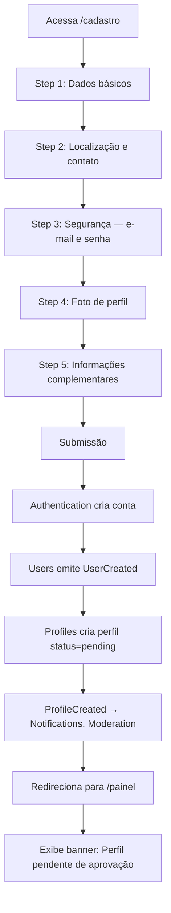
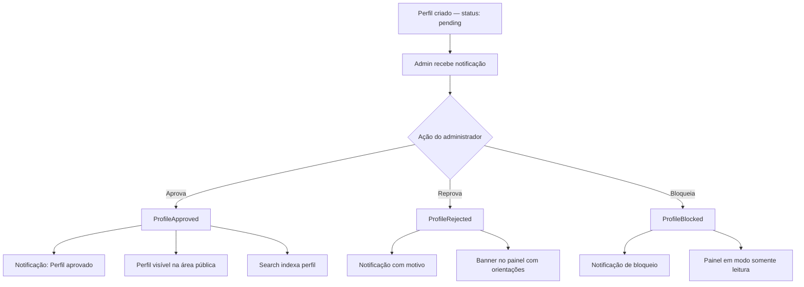
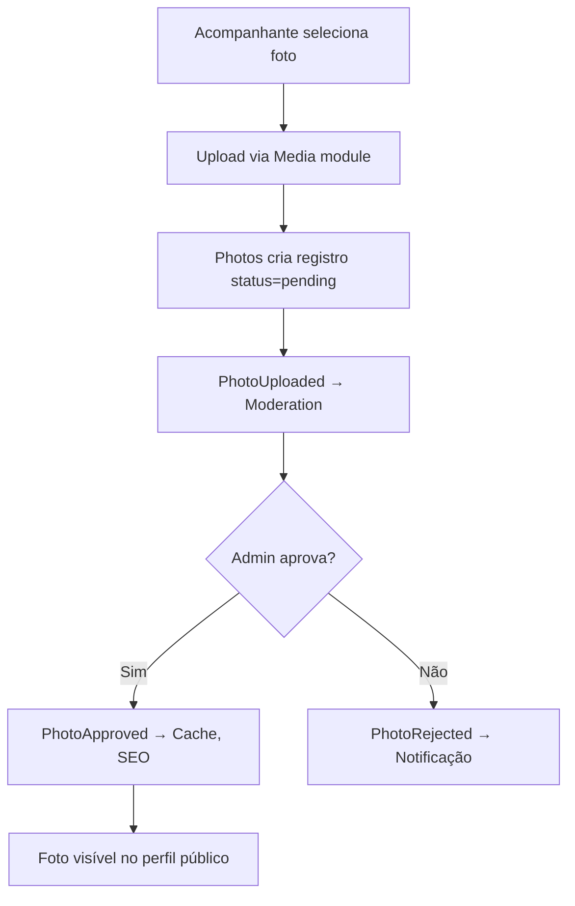
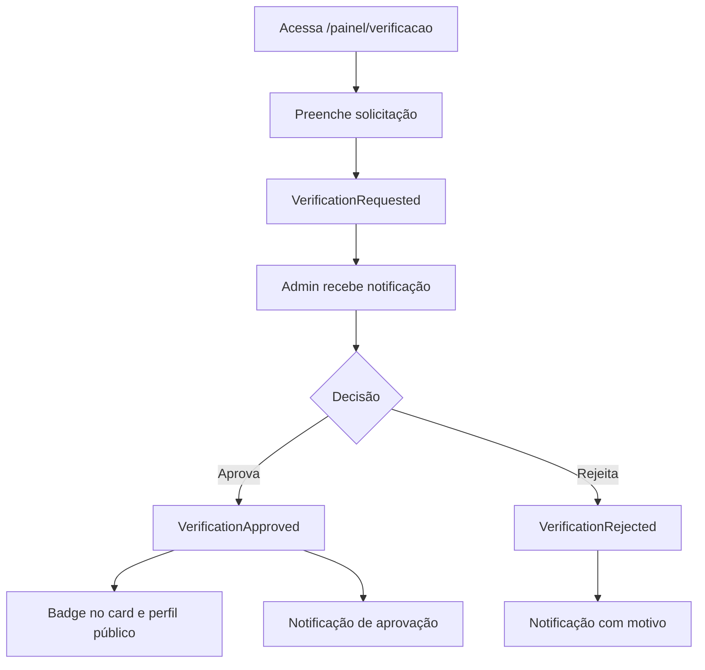
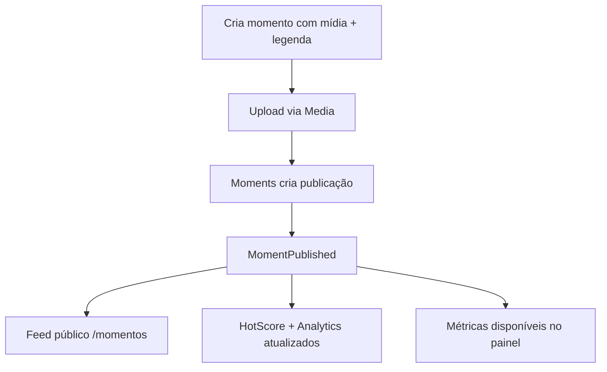
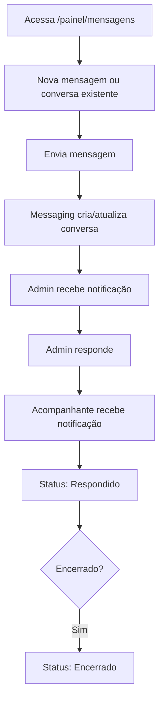

# Documento 3 — Área do Acompanhante

**Versão:** 1.0.0  
**Status:** Especificação Oficial  
**Última atualização:** 2026-07-08  
**Dependências:**
- [Documento 1 — Arquitetura da Plataforma](../arquitetura/DOCUMENTO-01-ARQUITETURA-DA-PLATAFORMA.md)
- [Documento 2 — Área Pública da Plataforma](./DOCUMENTO-02-AREA-PUBLICA.md)  
**Escopo:** Funcionalidades, telas, componentes e regras de negócio para acompanhantes autenticados

---

## Sumário

1. [Visão Geral e Princípios](#1-visão-geral-e-princípios)
2. [Mapa de Telas](#2-mapa-de-telas)
3. [Fluxos do Usuário](#3-fluxos-do-usuário)
4. [Componentes Necessários](#4-componentes-necessários)
5. [Especificação por Tela](#5-especificação-por-tela)
6. [Regras de Negócio](#6-regras-de-negócio)
7. [Eventos Gerados e Consumidos](#7-eventos-gerados-e-consumidos)
8. [Integrações com Módulos](#8-integrações-com-módulos)
9. [Requisitos de UX e Design](#9-requisitos-de-ux-e-design)
10. [Requisitos de Segurança](#10-requisitos-de-segurança)
11. [Critérios de Aceitação](#11-critérios-de-aceitação)

---

## 1. Visão Geral e Princípios

### 1.1 Objetivo

A Área do Acompanhante é o **painel autenticado** onde o usuário gerencia sua presença na plataforma. Ela deve permitir:

| Capacidade | Descrição |
|---|---|
| **Criar e gerenciar perfil** | Cadastro, edição, aprovação e publicação |
| **Publicar conteúdo** | Fotos, vídeos e momentos |
| **Acompanhar desempenho** | Dashboard, analytics e Hot Score |
| **Receber notificações** | Central de alertas e preferências |
| **Solicitar verificação** | Fluxo de badge verificado |
| **Administrar presença** | Valores, horários, tags e status |

A experiência deve ser **simples, premium e orientada a resultados** — cada tela deve ajudar a acompanhante a entender e melhorar seu desempenho na plataforma.

### 1.2 Posicionamento Arquitetural

A Área do Acompanhante é uma **camada de apresentação autenticada**. Ela:

- Consome dados via **interfaces públicas** dos módulos de domínio.
- Dispara **ações** via BFF → módulo responsável → **eventos de domínio**.
- **Não contém** regras de negócio, cálculos de score, moderação ou lógica de aprovação.
- Reside em `apps/web/app/(companion)/` conforme Documento 1.
- Reutiliza tokens visuais e componentes base do Design System definido no Documento 2.

```
┌──────────────────────────────────────────────────────────────────┐
│              ÁREA DO ACOMPANHANTE (apps/web)                   │
│  Páginas │ Componentes │ Hooks │ Formulários │ Event triggers  │
│         ★ SEM repositories │ SEM regras de negócio ★             │
└────────────────────────────┬─────────────────────────────────────┘
                             │ BFF autenticado (/api/companion/*)
              ┌──────────────┼──────────────┐
              ▼              ▼              ▼
         Profiles       Photos         Dashboard
         Videos         Moments        HotScore
         Tags           Verification   Notifications
         Analytics      Messaging      Audit
         GeoLocation    Settings       Authentication
```

### 1.3 Restrições Obrigatórias (Documento 1)

| Restrição | Aplicação na Área do Acompanhante |
|---|---|
| Sem regra de negócio em componentes | Validação de formulário no client; regras nos módulos |
| Sem acesso direto a repositories | Toda leitura/escrita via `I*Service` ou BFF |
| Efeitos colaterais via eventos | Aprovação, upload, alteração → evento no módulo |
| Autorização via guards | Toda rota protegida; escopo limitado ao próprio perfil |
| Configurações dinâmicas | Limites, status e pesos via Settings |
| Auditoria obrigatória | Toda alteração sensível gera registro no módulo Audit |

### 1.4 Relação com a Área Pública (Documento 2)

| Dado configurado aqui | Refletido publicamente em |
|---|---|
| Perfil aprovado | `/perfil/[slug]` |
| Fotos aprovadas | Card e galeria do perfil |
| Tags (3 primeiras ordenadas) | `CompanionCard` |
| Tabela de valores | Seção de preços do perfil |
| Horários | Seção de disponibilidade |
| Vídeos com flag pública | Perfil + `/videos` |
| Momentos publicados | Perfil + `/momentos` |
| Badge verificado / Premium / Destaque | Card e perfil público |

---

## 2. Mapa de Telas

### 2.1 Inventário de Rotas

| Rota | Tela | Acesso | Módulos principais |
|---|---|---|---|
| `/cadastro` | Cadastro de acompanhante | Público (pré-auth) | Authentication, Users, Profiles, GeoLocation |
| `/login` | Login | Público | Authentication |
| `/painel` | Dashboard | Autenticado | Dashboard, Analytics, HotScore, Rankings |
| `/painel/perfil` | Editar Perfil | Autenticado | Profiles, Tags, GeoLocation |
| `/painel/fotos` | Foto e Galeria | Autenticado | Photos, Media |
| `/painel/videos` | Gerenciar Vídeos | Autenticado | Videos, Media, Video Gallery |
| `/painel/momentos` | Gerenciar Momentos | Autenticado | Moments, Media |
| `/painel/tags` | Gerenciar Tags | Autenticado | Tags, Profiles |
| `/painel/popularidade` | Minha Popularidade | Autenticado | HotScore, Analytics |
| `/painel/valores` | Tabela de Valores | Autenticado | Profiles |
| `/painel/horarios` | Horários de Atendimento | Autenticado | Profiles, GeoLocation |
| `/painel/verificacao` | Solicitar Verificação | Autenticado | Verification |
| `/painel/status` | Premium e Destaque | Autenticado | Profiles, Settings |
| `/painel/notificacoes` | Central de Notificações | Autenticado | Notifications |
| `/painel/mensagens` | Falar com Administração | Autenticado | Messaging |
| `/painel/insights` | Insights do Perfil | Autenticado | Analytics, Dashboard |
| `/painel/seguranca` | Segurança da Conta | Autenticado | Authentication, Users, Audit |
| `/painel/configuracoes` | Preferências | Autenticado | Settings, Notifications |

### 2.2 Estrutura de Arquivos (Apresentação)

```
apps/web/app/(companion)/
├── layout.tsx                         # Layout autenticado (sidebar, header)
├── cadastro/
│   └── page.tsx                       # Fluxo de cadastro multi-step
├── login/
│   └── page.tsx
└── painel/
    ├── page.tsx                       # Dashboard
    ├── perfil/page.tsx
    ├── fotos/page.tsx
    ├── videos/page.tsx
    ├── momentos/page.tsx
    ├── tags/page.tsx
    ├── popularidade/page.tsx
    ├── valores/page.tsx
    ├── horarios/page.tsx
    ├── verificacao/page.tsx
    ├── status/page.tsx
    ├── notificacoes/page.tsx
    ├── mensagens/
    │   ├── page.tsx                   # Lista de conversas
    │   └── [id]/page.tsx              # Conversa individual
    ├── insights/page.tsx
    ├── seguranca/page.tsx
    └── configuracoes/page.tsx
```

### 2.3 Layout Autenticado

| Elemento | Descrição |
|---|---|
| **Sidebar** | Navegação principal com ícones + labels; colapsável em mobile |
| **Header** | Nome da acompanhante, avatar, sino de notificações, menu de conta |
| **Breadcrumb** | Caminho atual (exceto dashboard) |
| **Status Banner** | Alerta contextual quando perfil pendente/reprovado/bloqueado |
| **Preview Link** | Link "Ver meu perfil público" (quando aprovado) |

### 2.4 Menu de Navegação

| Item | Rota | Ícone sugerido |
|---|---|---|
| Dashboard | `/painel` | Grid |
| Editar Perfil | `/painel/perfil` | User |
| Fotos | `/painel/fotos` | Image |
| Vídeos | `/painel/videos` | Video |
| Momentos | `/painel/momentos` | Zap |
| Tags | `/painel/tags` | Tag |
| Popularidade | `/painel/popularidade` | Flame |
| Valores | `/painel/valores` | DollarSign |
| Horários | `/painel/horarios` | Clock |
| Verificação | `/painel/verificacao` | ShieldCheck |
| Status | `/painel/status` | Crown |
| Notificações | `/painel/notificacoes` | Bell |
| Mensagens | `/painel/mensagens` | MessageCircle |
| Insights | `/painel/insights` | BarChart |
| Segurança | `/painel/seguranca` | Lock |
| Configurações | `/painel/configuracoes` | Settings |

### 2.5 Estados de Acesso por Status do Perfil

| Status | Dashboard | Edição | Publicação | Perfil público |
|---|---|---|---|---|
| `pending` | Parcial (sem métricas públicas) | Permitido | Permitido (fila moderação) | Oculto |
| `approved` | Completo | Permitido | Permitido | Visível |
| `rejected` | Parcial + motivo | Permitido (correção) | Permitido | Oculto |
| `blocked` | Somente leitura | Bloqueado | Bloqueado | Oculto |

---

## 3. Fluxos do Usuário

### 3.1 Fluxo de Cadastro



### 3.2 Fluxo de Aprovação do Perfil



### 3.3 Fluxo de Upload de Foto



### 3.4 Fluxo de Solicitação de Verificação



### 3.5 Fluxo de Publicação de Momento



### 3.6 Fluxo de Mensagem com Administração



---

## 4. Componentes Necessários

### 4.1 Layout e Navegação

| Componente | Responsabilidade | Módulo de dados |
|---|---|---|
| `CompanionLayout` | Sidebar + header + content area | — |
| `CompanionSidebar` | Menu de navegação | — |
| `CompanionHeader` | Avatar, nome, notificações | Profiles, Notifications |
| `StatusBanner` | Alerta de status do perfil | Profiles |
| `Breadcrumb` | Navegação contextual | — |
| `PageHeader` | Título + descrição + ação primária | — |

### 4.2 Dashboard e Métricas

| Componente | Responsabilidade | Módulo de dados |
|---|---|---|
| `MetricCard` | KPI com valor, variação e ícone | Dashboard |
| `MetricGrid` | Grid responsivo de MetricCards | Dashboard |
| `TrendChart` | Gráfico de linha com período | Analytics, HotScore |
| `PeriodSelector` | Seletor: 7d / 30d / 90d / custom | — |
| `ComparisonBadge` | Variação % vs período anterior | Dashboard |
| `RankingPosition` | Posição atual no ranking | Rankings |
| `EmptyMetrics` | Estado sem dados suficientes | — |

### 4.3 Formulários e Edição

| Componente | Responsabilidade | Módulo de dados |
|---|---|---|
| `ProfileForm` | Edição de dados do perfil | Profiles |
| `RegistrationWizard` | Cadastro multi-step | Profiles, Users, Auth |
| `TagSelector` | Seleção e ordenação de tags | Tags |
| `PricingForm` | Tabela de valores | Profiles |
| `AvailabilityGrid` | Grade semanal de horários | Profiles |
| `WhatsAppInput` | Input formatado de telefone | Profiles |
| `CepInput` | Input com autocomplete de endereço | GeoLocation |
| `BioEditor` | Textarea com contador de caracteres | Profiles |
| `DisplayModeToggle` | Toggle show/consult/hidden para valores | Profiles |

### 4.4 Mídia

| Componente | Responsabilidade | Módulo de dados |
|---|---|---|
| `PhotoUploader` | Upload com drag-and-drop | Media, Photos |
| `PhotoGalleryManager` | Grid com reordenação (drag) | Photos |
| `PhotoCard` | Preview com status de moderação | Photos |
| `VideoUploader` | Upload com barra de progresso | Media, Videos |
| `VideoCard` | Preview com thumbnail e status | Videos |
| `VideoPublishOptions` | Checkboxes de visibilidade | Videos |
| `MomentCreator` | Criação de momento (mídia + legenda) | Moments, Media |
| `MomentCard` | Card com métricas no painel | Moments |
| `MediaStatusBadge` | Badge: pendente / aprovado / rejeitado | Moderation |

### 4.5 Popularidade e Insights

| Componente | Responsabilidade | Módulo de dados |
|---|---|---|
| `HotScoreGauge` | Gauge visual 0–100 | HotScore |
| `HotScoreHistory` | Gráfico de evolução | HotScore |
| `ScoreFactorList` | Lista de fatores e contribuição | HotScore |
| `InsightsChart` | Gráficos de analytics pessoal | Analytics |
| `TopContentList` | Conteúdos mais acessados | Analytics |
| `VisitorMapChart` | Mapa de localizações (agregado) | Analytics, GeoLocation |

### 4.6 Notificações e Mensagens

| Componente | Responsabilidade | Módulo de dados |
|---|---|---|
| `NotificationBell` | Ícone com contador de não lidas | Notifications |
| `NotificationList` | Lista com mark-as-read | Notifications |
| `NotificationItem` | Item individual com tipo e data | Notifications |
| `ConversationList` | Lista de conversas com admin | Messaging |
| `MessageThread` | Thread de mensagens | Messaging |
| `MessageComposer` | Input de nova mensagem | Messaging |
| `ConversationStatus` | Badge: aberto / respondido / encerrado | Messaging |

### 4.7 Verificação e Status

| Componente | Responsabilidade | Módulo de dados |
|---|---|---|
| `VerificationRequestForm` | Formulário de solicitação | Verification |
| `VerificationStatus` | Status atual da verificação | Verification |
| `PremiumStatusCard` | Exibição de status Premium | Profiles |
| `FeaturedStatusCard` | Exibição de status Destaque | Profiles |
| `BadgePreview` | Preview de como badges aparecem publicamente | Profiles, Verification |

### 4.8 Segurança

| Componente | Responsabilidade | Módulo de dados |
|---|---|---|
| `ChangePasswordForm` | Alteração de senha | Authentication |
| `SessionList` | Sessões ativas com encerrar | Authentication |
| `AccessHistory` | Histórico de acessos | Audit |
| `AuditLogList` | Alterações no perfil | Audit |

---

## 5. Especificação por Tela

### 5.1 Cadastro do Acompanhante (`/cadastro`)

#### 5.1.1 Estrutura Multi-Step

| Step | Título | Campos |
|---|---|---|
| 1 | Dados básicos | Nome, Nome público, Data de nascimento |
| 2 | Localização | Cidade, Estado, CEP |
| 3 | Contato e acesso | WhatsApp, E-mail, Senha, Confirmar senha |
| 4 | Foto | Foto de perfil (upload) |
| 5 | Perfil | Bio, Preferência sexual, Posição, Tags, Características |

#### 5.1.2 Campos Detalhados

| Campo | Tipo | Obrigatório | Validação (módulo) | Observação |
|---|---|---|---|---|
| Nome | text | Sim | min 2 chars | Nome real (privado) |
| Nome público | text | Sim | único, slug gerado | Exibido publicamente |
| Data de nascimento | date | Sim | idade ≥ 18 | Idade calculada automaticamente |
| Cidade | autocomplete | Sim | — | Via GeoLocation |
| Estado | select | Sim | — | UF brasileira |
| CEP | text (mask) | Sim | formato válido | Convertido em coordenadas pelo GeoLocation |
| WhatsApp | tel (mask) | Sim | formato BR | Nunca exibido publicamente em texto |
| E-mail | email | Sim | único, formato | Login da conta |
| Senha | password | Sim | min 8, complexidade | Módulo Authentication |
| Foto de perfil | file | Sim | MIME, tamanho máx. | Via Media → Photos |
| Bio | textarea | Não | máx. 1000 chars | — |
| Preferência sexual | select | Não | lista configurável | Settings |
| Posição | radio | Não | Ativo / Passivo / Versátil | — |
| Tags | multi-select | Não | máx. configurável | Tags ativas do admin |
| Características | multi-select | Não | lista configurável | Settings |

#### 5.1.3 Comportamento Pós-Cadastro

1. Conta criada no módulo Authentication.
2. User criado no módulo Users com role `companion`.
3. Perfil criado no módulo Profiles com `status = pending`.
4. Eventos: `UserCreated` → `ProfileCreated`.
5. Redirecionamento para `/painel` com banner de status pendente.
6. E-mail de boas-vindas enviado (Notifications).

---

### 5.2 Dashboard (`/painel`)

#### 5.2.1 Métricas Exibidas

| Métrica | Fonte | Período padrão | Comparação |
|---|---|---|---|
| Visualizações do perfil | Analytics | 30 dias | vs 30 dias anteriores |
| Cliques no WhatsApp | Analytics | 30 dias | vs período anterior |
| Aparições nas buscas | Analytics | 30 dias | vs período anterior |
| Hot Score atual | HotScore | Atual | Variação 7 dias |
| Evolução do Hot Score | HotScore | 30 dias | Gráfico de linha |
| Comentários recebidos | Reviews | 30 dias | vs período anterior |
| Média de avaliação | Reviews | Atual | Variação |
| Visualizações de vídeos | Analytics | 30 dias | vs período anterior |
| Curtidas nos Momentos | Moments | 30 dias | vs período anterior |
| Compartilhamentos | Analytics | 30 dias | vs período anterior |
| Ranking atual | Rankings | Atual | Posição + variação |

#### 5.2.2 Layout

| Zona | Conteúdo |
|---|---|
| Topo | Status do perfil + saudação + PeriodSelector |
| Linha 1 | 4 MetricCards principais (views, WhatsApp, Hot Score, avaliação) |
| Linha 2 | Gráfico de evolução do Hot Score (TrendChart) |
| Linha 3 | 4 MetricCards secundários (buscas, comentários, vídeos, momentos) |
| Linha 4 | RankingPosition + compartilhamentos |
| Rodapé | Link para Insights detalhados |

#### 5.2.3 Regras de Exibição

- Perfil `pending`: métricas públicas ocultas; exibir checklist de completude do perfil.
- Perfil `rejected`: banner com motivo + ações sugeridas.
- Perfil `blocked`: dashboard somente leitura com mensagem explicativa.
- Dados carregados via `IDashboardService.getCompanionDashboard(userId, period)`.

---

### 5.3 Editar Perfil (`/painel/perfil`)

#### 5.3.1 Campos Editáveis

| Campo | Editável | Gera evento | Gera auditoria |
|---|---|---|---|
| Nome (real) | Sim | — | Sim |
| Nome público | Sim | `ProfileUpdated` | Sim |
| Bio | Sim | `ProfileUpdated` | Sim |
| Cidade | Sim | `ProfileUpdated` | Sim |
| CEP | Sim | `ProfileUpdated` | Sim |
| Preferência sexual | Sim | `ProfileUpdated` | Sim |
| Posição | Sim | `ProfileUpdated` | Sim |
| Características | Sim | `ProfileUpdated` | Sim |
| WhatsApp | Sim | `ProfileUpdated` | Sim |
| Idade | Não (derivada) | — | — |

> Alteração de nome público pode exigir re-aprovação (configurável via Settings `profiles.rename_requires_moderation`).

#### 5.3.2 Comportamento

- Salvamento com feedback visual (toast de sucesso/erro).
- Alterações disparam `ProfileUpdated` com diff de campos.
- Cache da área pública invalidado via evento.
- SEO atualizado via handler do módulo SEO.

---

### 5.4 Foto de Perfil e Galeria (`/painel/fotos`)

#### 5.4.1 Funcionalidades

| Ação | Descrição | Módulo |
|---|---|---|
| Alterar foto principal | Selecionar foto existente ou upload novo | Photos |
| Adicionar fotos | Upload múltiplo com drag-and-drop | Photos, Media |
| Remover fotos | Soft delete com confirmação | Photos |
| Reordenar fotos | Drag-and-drop na galeria | Photos |
| Definir foto principal | Marcar uma foto como capa | Photos |
| Ativar/desativar | Toggle de visibilidade por foto | Photos |

#### 5.4.2 Regras de Galeria

| Regra | Valor (Settings) |
|---|---|
| Máximo de fotos | `profiles.photos.max` (default: 20) |
| Tamanho máximo por foto | `media.photos.max_size_mb` (default: 10) |
| Formatos aceitos | JPEG, PNG, WebP |
| Status após upload | `pending` (aguarda moderação) |
| Foto principal | Apenas fotos `approved` podem ser capa |

#### 5.4.3 Exibição no Painel

Cada foto exibe:

| Elemento | Descrição |
|---|---|
| Thumbnail | Preview otimizado |
| Badge de status | Pendente / Aprovada / Rejeitada |
| Ícone de capa | Estrela na foto principal |
| Ações | Reordenar, definir capa, remover, ativar/desativar |
| Motivo de rejeição | Texto quando `rejected` |

---

### 5.5 Vídeos (`/painel/videos`)

#### 5.5.1 Campos por Vídeo

| Campo | Obrigatório | Descrição |
|---|---|---|
| Arquivo | Sim | Upload via Media |
| Thumbnail | Auto | Gerada na transcodificação |
| Título | Não | Texto livre |
| Descrição | Não | Texto livre |
| Data | Auto | Timestamp de upload |
| Status | Auto | pending → approved/rejected |

#### 5.5.2 Opções de Publicação

| Opção | Campo | Efeito |
|---|---|---|
| Exibir apenas no perfil | `showInProfile: true` | Vídeo na página do perfil |
| Exibir na Galeria pública | `showInGallery: true` | Vídeo também em `/videos` |

Ambas podem estar ativas simultaneamente.

#### 5.5.3 Fluxo de Upload

1. Upload do arquivo → Media module (progress bar).
2. Registro criado em Videos com `status = pending`.
3. Evento `VideoUploaded` → Moderation + transcodificação.
4. Após transcodificação: `VideoTranscoded` → thumbnail disponível.
5. Após aprovação: `VideoApproved` → visível conforme flags.

#### 5.5.4 Limites

| Regra | Valor (Settings) |
|---|---|
| Máximo de vídeos | `profiles.videos.max` (default: 10) |
| Tamanho máximo | `media.videos.max_size_mb` (default: 100) |
| Duração máxima | `media.videos.max_duration_sec` (default: 300) |

---

### 5.6 Momentos (`/painel/momentos`)

#### 5.6.1 Funcionalidades

| Ação | Descrição |
|---|---|
| Criar publicação | Foto ou vídeo + legenda |
| Visualizar métricas | Views, curtidas, comentários, compartilhamentos |
| Excluir publicação | Soft delete com confirmação |

#### 5.6.2 Campos de Criação

| Campo | Obrigatório | Limite |
|---|---|---|
| Mídia (foto ou vídeo) | Sim | 1 por momento |
| Legenda | Não | 300 caracteres |

#### 5.6.3 Métricas por Momento

| Métrica | Fonte |
|---|---|
| Visualizações | Analytics |
| Curtidas | Moments |
| Comentários | Comments (aprovados) |
| Compartilhamentos | Analytics |

#### 5.6.4 Listagem no Painel

Grid de `MomentCard` com:

- Thumbnail da mídia.
- Legenda truncada.
- Data de publicação.
- 4 mini MetricCards (views, likes, comments, shares).
- Ação de excluir.

---

### 5.7 Tags (`/painel/tags`)

#### 5.7.1 Funcionalidades

- Exibir tags disponíveis (configuradas pelo admin via módulo Tags).
- Seleção múltipla com busca.
- **Ordenação por drag-and-drop** — as 3 primeiras são exibidas nos cards públicos (Documento 2).
- Todas as tags selecionadas aparecem no perfil completo.

#### 5.7.2 Regras

| Regra | Valor (Settings) |
|---|---|
| Máximo de tags selecionáveis | `profiles.tags.max` (default: 15) |
| Tags visíveis no card | 3 primeiras por ordem definida |
| Tags no perfil completo | Todas, sem limite de exibição |

#### 5.7.3 Comportamento

- Salvar ordem dispara `ProfileUpdated` com `tags` e `tagOrder`.
- Search reindexa via handler de `ProfileUpdated`.

---

### 5.8 Minha Popularidade (`/painel/popularidade`)

#### 5.8.1 Exibição

| Elemento | Descrição |
|---|---|
| Score atual | Gauge 0–100 com nível visual (Frio → Em chamas) |
| Tendência | Variação % últimos 7 dias |
| Gráfico histórico | Linha dos últimos 30/90 dias |
| Fatores de contribuição | Lista com peso de cada fator |

#### 5.8.2 Fatores Exibidos (somente leitura)

| Fator | Descrição para a acompanhante |
|---|---|
| Visualizações do perfil | "Quantas vezes seu perfil foi visitado" |
| Comentários aprovados | "Comentários que recebeu" |
| Curtidas em momentos | "Curtidas nos seus momentos" |
| Cliques no WhatsApp | "Interessados que clicaram para conversar" |
| Compartilhamentos | "Vezes que seu perfil foi compartilhado" |
| Avaliações | "Nota média das suas avaliações" |

> Os pesos e o cálculo real ficam no módulo HotScore. Esta tela **apenas consome** `IHotScoreService.getByProfileId()` e `getHistory()`.

#### 5.8.3 Níveis Visuais

| Faixa | Label | Cor |
|---|---|---|
| 0–25 | Frio | Cinza |
| 26–50 | Morno | Azul |
| 51–75 | Quente | Laranja |
| 76–100 | Em chamas | Gradiente laranja → dourado |

Thresholds configuráveis via Settings (`hotscore.levels.*`).

---

### 5.9 Solicitar Verificação (`/painel/verificacao`)

#### 5.9.1 Fluxo

| Etapa | Ator | Ação |
|---|---|---|
| 1 | Acompanhante | Preenche solicitação (documentos, informações) |
| 2 | Sistema | Emite `VerificationRequested` |
| 3 | Admin | Recebe notificação e analisa |
| 4 | Admin | Aprova ou rejeita |
| 5 | Sistema | Emite `VerificationApproved` ou `VerificationRejected` |
| 6 | Acompanhante | Recebe notificação com resultado |

#### 5.9.2 Estados da Verificação

| Estado | Exibição no painel |
|---|---|
| `not_requested` | Botão "Solicitar Verificação" |
| `pending` | Badge "Em análise" + data da solicitação |
| `approved` | Badge "Verificado" + data de aprovação |
| `rejected` | Badge "Não aprovado" + motivo + botão "Solicitar novamente" |

#### 5.9.3 Regras

- Perfil deve estar `approved` para solicitar verificação.
- Intervalo mínimo entre solicitações: configurável via Settings (`verification.retry_days`, default: 30).
- Documentos enviados via Media module (armazenamento criptografado).
- Badge exibido no card e perfil público após aprovação (Documento 2).

---

### 5.10 Premium e Destaque (`/painel/status`)

#### 5.10.1 Exibição

Tela **somente leitura** — acompanhante visualiza status concedido pelo administrador.

| Card | Campos |
|---|---|
| Premium | Ativo/Inativo, data de início, data de expiração (se aplicável) |
| Destaque | Ativo/Inativo, data de início, data de expiração (se aplicável) |

#### 5.10.2 Regras

- Status controlado exclusivamente pelo admin (módulo Profiles + Settings).
- Acompanhante não pode ativar/desativar Premium ou Destaque.
- Exibir preview de como os badges aparecem no perfil público (`BadgePreview`).
- Quando expirado: card exibe "Expirado" com CTA "Fale com a administração".

---

### 5.11 Tabela de Valores (`/painel/valores`)

#### 5.11.1 Campos

| Duração | Campo | Obrigatório |
|---|---|---|
| 30 minutos | `pricing.thirtyMin` | Não |
| 1 hora | `pricing.oneHour` | Não |
| 2 horas | `pricing.twoHours` | Não |
| Pernoite | `pricing.overnight` | Não |
| Personalizado | `pricing.custom[]` → `{ label, value }` | Não |

#### 5.11.2 Modo de Exibição Pública

| Modo | Comportamento na área pública |
|---|---|
| `show` | Tabela com valores formatados (R$) |
| `consult` | Texto "Consultar valores" |
| `hidden` | Seção não exibida |

Selecionado via `DisplayModeToggle` nesta tela.

#### 5.11.3 Regras

- Valores em centavos (inteiro) no backend; formatados no frontend.
- Pelo menos 1 valor preenchido para modo `show`.
- Alteração dispara `ProfileUpdated` + auditoria.

---

### 5.12 Horários de Atendimento (`/painel/horarios`)

#### 5.12.1 Estrutura

Grade semanal com 7 linhas (Segunda a Domingo):

| Campo por dia | Tipo |
|---|---|
| Disponível | toggle |
| Horário início | time picker |
| Horário fim | time picker |

#### 5.12.2 Regras

- Horários exibidos no fuso da cidade do perfil (GeoLocation).
- Dia marcado como indisponível oculta horários.
- Horário fim deve ser posterior ao início (validação no módulo Profiles).
- Se todos os dias indisponíveis: seção oculta na área pública.
- Alteração dispara `ProfileUpdated`.

---

### 5.13 Central de Notificações (`/painel/notificacoes`)

#### 5.13.1 Tipos de Notificação

| Tipo | Trigger | Exemplo |
|---|---|---|
| `profile_approved` | ProfileApproved | "Seu perfil foi aprovado!" |
| `profile_rejected` | ProfileRejected | "Seu perfil precisa de ajustes" |
| `profile_blocked` | ProfileBlocked | "Seu perfil foi bloqueado" |
| `comment_approved` | CommentApproved | "Novo comentário no seu perfil" |
| `review_approved` | ReviewApproved | "Nova avaliação: 5 estrelas" |
| `verification_approved` | VerificationApproved | "Perfil verificado com sucesso!" |
| `verification_rejected` | VerificationRejected | "Verificação não aprovada" |
| `photo_approved` | PhotoApproved | "Foto aprovada" |
| `photo_rejected` | PhotoRejected | "Foto não aprovada" |
| `video_approved` | VideoApproved | "Vídeo aprovado" |
| `admin_message` | Messaging | "Mensagem da administração" |
| `premium_activated` | ProfileUpdated | "Status Premium ativado" |
| `featured_activated` | ProfileUpdated | "Destaque ativado" |
| `hotscore_milestone` | HotScoreUpdated | "Seu Hot Score atingiu 75!" |

#### 5.13.2 Funcionalidades

| Ação | Descrição |
|---|---|
| Listar notificações | Ordenadas por data (mais recente primeiro) |
| Marcar como lida | Individual ou "marcar todas" |
| Histórico | Todas as notificações (paginação) |
| Preferências | Configurar quais tipos receber (via `/painel/configuracoes`) |

---

### 5.14 Falar com Administração (`/painel/mensagens`)

#### 5.14.1 Funcionalidades

| Ação | Descrição |
|---|---|
| Nova mensagem | Criar conversa com assunto + corpo |
| Visualizar histórico | Lista de conversas anteriores |
| Responder | Continuar conversa existente |
| Acompanhar status | Badge visual do estado |

#### 5.14.2 Estados da Conversa

| Estado | Descrição | Ações disponíveis |
|---|---|---|
| `open` | Aguardando resposta do admin | Enviar mensagem |
| `answered` | Admin respondeu | Enviar mensagem |
| `closed` | Encerrada pelo admin | Somente leitura |

#### 5.14.3 Campos de Nova Mensagem

| Campo | Obrigatório | Limite |
|---|---|---|
| Assunto | Sim | 100 caracteres |
| Mensagem | Sim | 2000 caracteres |

---

### 5.15 Insights do Perfil (`/painel/insights`)

#### 5.15.1 Métricas Detalhadas

| Insight | Visualização | Fonte |
|---|---|---|
| Visualizações | Gráfico de linha + total | Analytics |
| Cliques WhatsApp | Gráfico de barras por dia | Analytics |
| Buscas onde apareceu | Lista de termos/filtros | Analytics |
| Localizações dos visitantes | Mapa ou lista por cidade | Analytics, GeoLocation |
| Conteúdos mais acessados | Ranking de fotos/vídeos | Analytics |
| Melhor horário de acesso | Heatmap dia × hora | Analytics |
| Evolução mensal | Gráfico comparativo 6 meses | Analytics |

#### 5.15.2 Regras de Privacidade

- Localizações exibidas apenas em nível de **cidade** (nunca endereço).
- Dados agregados — nunca dados individuais de visitantes.
- Analytics do escopo do próprio perfil (autorização por `profileId`).

---

### 5.16 Segurança da Conta (`/painel/seguranca`)

#### 5.16.1 Funcionalidades

| Seção | Descrição | Módulo |
|---|---|---|
| Alterar senha | Senha atual + nova + confirmação | Authentication |
| Sessões ativas | Lista de dispositivos com encerrar | Authentication |
| Histórico de acessos | Data, IP (mascarado), dispositivo | Audit |
| Auditoria de alterações | Log de mudanças no perfil | Audit |

#### 5.16.2 Regras

- Alteração de senha exige senha atual.
- Nova senha: mín. 8 chars, 1 maiúscula, 1 número (configurável via Settings).
- Encerrar sessão emite evento de auditoria.
- Histórico de acessos: últimos 90 dias (configurável).

---

## 6. Regras de Negócio

> Todas as regras são implementadas nos **módulos de domínio**. A Área do Acompanhante consome e exibe resultados.

### 6.1 Cadastro e Perfil

| ID | Regra | Módulo |
|---|---|---|
| RN-COMP-001 | Idade mínima para cadastro: 18 anos | Profiles |
| RN-COMP-002 | Nome público deve ser único na plataforma | Profiles |
| RN-COMP-003 | Slug gerado automaticamente a partir do nome público | Profiles |
| RN-COMP-004 | Todo cadastro inicia com `status = pending` | Profiles |
| RN-COMP-005 | Perfil pendente não é exibido na área pública | Profiles |
| RN-COMP-006 | E-mail deve ser único na plataforma | Users |
| RN-COMP-007 | CEP convertido em coordenadas pelo GeoLocation (nunca exposto) | GeoLocation |
| RN-COMP-008 | WhatsApp armazenado mas nunca exibido em texto público | Profiles |
| RN-COMP-009 | Alteração de nome público pode exigir re-moderação (configurável) | Profiles, Moderation |

### 6.2 Estados do Perfil

| ID | Regra | Módulo |
|---|---|---|
| RN-COMP-010 | Estados válidos: `pending`, `approved`, `rejected`, `blocked` | Profiles |
| RN-COMP-011 | Transição para `approved` apenas pelo admin | Moderation |
| RN-COMP-012 | Perfil `rejected` pode ser reeditado e reenviado para análise | Profiles |
| RN-COMP-013 | Perfil `blocked` não permite edição | Profiles |
| RN-COMP-014 | Toda mudança de status gera notificação à acompanhante | Notifications |
| RN-COMP-015 | Toda mudança de status gera registro de auditoria | Audit |

### 6.3 Mídia e Conteúdo

| ID | Regra | Módulo |
|---|---|---|
| RN-COMP-020 | Todo upload inicia com `moderationStatus = pending` | Photos, Videos, Moments |
| RN-COMP-021 | Conteúdo pendente não é exibido publicamente | Moderation |
| RN-COMP-022 | Foto principal deve ser uma foto aprovada | Photos |
| RN-COMP-023 | Reordenação de fotos não reinicia moderação | Photos |
| RN-COMP-024 | Vídeo com `showInGallery = true` aparece em `/videos` após aprovação | Videos, Video Gallery |
| RN-COMP-025 | Exclusão de momento é soft delete | Moments |
| RN-COMP-026 | Limites de upload configuráveis via Settings | Media, Settings |

### 6.4 Tags

| ID | Regra | Módulo |
|---|---|---|
| RN-COMP-030 | Tags disponíveis definidas pelo administrador | Tags |
| RN-COMP-031 | Acompanhante pode selecionar múltiplas tags (até limite) | Tags, Profiles |
| RN-COMP-032 | Ordem das tags definida pela acompanhante via drag-and-drop | Profiles |
| RN-COMP-033 | 3 primeiras tags (por ordem) exibidas nos cards públicos | Tags, Profiles |
| RN-COMP-034 | Todas as tags exibidas no perfil completo | Tags |

### 6.5 Verificação

| ID | Regra | Módulo |
|---|---|---|
| RN-COMP-040 | Verificação exige perfil `approved` | Verification |
| RN-COMP-041 | Intervalo mínimo entre solicitações: configurável (default 30 dias) | Verification, Settings |
| RN-COMP-042 | Documentos armazenados com criptografia | Media, Verification |
| RN-COMP-043 | Badge de verificado exibido após `VerificationApproved` | Verification, Profiles |

### 6.6 Premium e Destaque

| ID | Regra | Módulo |
|---|---|---|
| RN-COMP-050 | Status Premium concedido apenas pelo admin | Profiles, Settings |
| RN-COMP-051 | Status Destaque concedido apenas pelo admin | Profiles, Settings |
| RN-COMP-052 | Acompanhante visualiza status mas não pode alterá-lo | Profiles |
| RN-COMP-053 | Expiração automática quando período configurado termina | Profiles, Settings |

### 6.7 Valores e Horários

| ID | Regra | Módulo |
|---|---|---|
| RN-COMP-060 | Modo de exibição de valores: `show`, `consult`, `hidden` | Profiles |
| RN-COMP-061 | Modo `show` exige ao menos 1 valor preenchido | Profiles |
| RN-COMP-062 | Horários no fuso da cidade do perfil | Profiles, GeoLocation |
| RN-COMP-063 | Horário fim > horário início por dia | Profiles |

### 6.8 Notificações e Mensagens

| ID | Regra | Módulo |
|---|---|---|
| RN-COMP-070 | Toda ação relevante gera notificação in-app | Notifications |
| RN-COMP-071 | Acompanhante pode configurar preferências de notificação | Notifications, Settings |
| RN-COMP-072 | Mensagens com admin: uma conversa ativa por assunto | Messaging |
| RN-COMP-073 | Conversa encerrada pelo admin não aceita novas mensagens | Messaging |

### 6.9 Segurança

| ID | Regra | Módulo |
|---|---|---|
| RN-COMP-080 | Toda rota do painel exige autenticação | Authentication |
| RN-COMP-081 | Acompanhante acessa apenas dados do próprio perfil | Authorization (Shared Core) |
| RN-COMP-082 | Alteração de senha exige senha atual | Authentication |
| RN-COMP-083 | Toda alteração de perfil gera auditoria | Audit |
| RN-COMP-084 | Sessões expiram após inatividade (configurável) | Authentication, Settings |

---

## 7. Eventos Gerados e Consumidos

### 7.1 Eventos Emitidos (via ações da acompanhante)

| Evento | Trigger | Payload | Módulos receptores |
|---|---|---|---|
| `UserCreated` | Cadastro concluído | `{ userId, email, role }` | Profiles, Notifications, Analytics, Audit |
| `ProfileCreated` | Perfil criado no cadastro | `{ profileId, userId, slug }` | Moderation, Notifications, Audit |
| `ProfileUpdated` | Edição de perfil/valores/horários/tags | `{ profileId, changes }` | Search, SEO, Cache, Audit |
| `ProfileResubmitted` | Reenvio após reprovação | `{ profileId }` | Moderation, Notifications |
| `PhotoUploaded` | Upload de foto | `{ photoId, profileId, url }` | Moderation, Analytics |
| `PhotoReordered` | Reordenação da galeria | `{ profileId, photoOrder[] }` | — |
| `PhotoDeleted` | Remoção de foto | `{ photoId, profileId }` | Cache, SEO |
| `VideoUploaded` | Upload de vídeo | `{ videoId, profileId, showInGallery }` | Moderation, Media |
| `MomentPublished` | Publicação de momento | `{ momentId, profileId }` | Analytics, HotScore, Cache |
| `MomentDeleted` | Exclusão de momento | `{ momentId, profileId }` | Cache, Analytics |
| `VerificationRequested` | Solicitação de verificação | `{ verificationId, profileId }` | Moderation, Notifications, Audit |
| `PasswordChanged` | Alteração de senha | `{ userId }` | Audit, Notifications |
| `SessionTerminated` | Encerramento de sessão | `{ userId, sessionId }` | Audit |
| `MessageSent` | Mensagem para administração | `{ conversationId, profileId }` | Messaging, Notifications |
| `DashboardViewed` | Acesso ao dashboard | `{ profileId, userId }` | Analytics |

### 7.2 Eventos Consumidos (reação no painel)

A Área do Acompanhante reage a eventos via **atualização de UI** (notificações, banners, refresh de dados):

| Evento | Ação na Área do Acompanhante |
|---|---|
| `ProfileApproved` | Banner de sucesso; habilita preview público; dashboard completo |
| `ProfileRejected` | Banner com motivo; destaca campos a corrigir |
| `ProfileBlocked` | Banner de bloqueio; modo somente leitura |
| `PhotoApproved` | Atualiza status na galeria |
| `PhotoRejected` | Exibe motivo na galeria |
| `VideoApproved` | Atualiza status no gerenciador de vídeos |
| `VideoTranscoded` | Thumbnail disponível no card de vídeo |
| `VerificationApproved` | Badge de verificado na tela de verificação |
| `VerificationRejected` | Motivo + opção de reenviar |
| `CommentApproved` | Notificação + incremento no dashboard |
| `ReviewApproved` | Notificação + atualização de média |
| `HotScoreUpdated` | Atualização do gauge e gráfico |
| `NotificationCreated` | Incremento no sino + lista |
| `SettingChanged` | Refresh de limites e configurações |

---

## 8. Integrações com Módulos

### 8.1 Mapa de Integração — Leitura

| Tela | Interface | Método |
|---|---|---|
| Dashboard | `IDashboardService` | `getCompanionDashboard(userId, period)` |
| Editar Perfil | `IProfilesService` | `getByUserId(userId)` |
| Fotos | `IPhotosService` | `getByProfileId(profileId)` |
| Vídeos | `IVideosService` | `getByProfileId(profileId)` |
| Momentos | `IMomentsService` | `getByProfileId(profileId)` |
| Tags | `ITagsService` | `getAvailable()` + `getByProfileId(profileId)` |
| Popularidade | `IHotScoreService` | `getByProfileId(id)` + `getHistory(id, period)` + `getFactors(id)` |
| Valores | `IProfilesService` | `getByUserId(userId)` → `pricing` |
| Horários | `IProfilesService` | `getByUserId(userId)` → `availabilitySchedule` |
| Verificação | `IVerificationService` | `getByProfileId(profileId)` |
| Status | `IProfilesService` | `getByUserId(userId)` → `isPremium`, `isFeatured` |
| Notificações | `INotificationsService` | `getByUserId(userId, cursor)` |
| Mensagens | `IMessagingService` | `getConversations(userId)` |
| Insights | `IAnalyticsService` | `getProfileInsights(profileId, period)` |
| Segurança | `IAuthenticationService` | `getSessions(userId)` |
| Segurança | `IAuditService` | `getByUserId(userId)` + `getAccessHistory(userId)` |
| Configurações | `ISettingsService` | `getUserPreferences(userId)` |

### 8.2 Mapa de Integração — Escrita (Via BFF)

| Ação | Endpoint BFF | Módulo | Evento |
|---|---|---|---|
| Cadastro | `POST /api/companion/register` | Auth + Users + Profiles | `UserCreated`, `ProfileCreated` |
| Salvar perfil | `PUT /api/companion/profile` | Profiles | `ProfileUpdated` |
| Upload foto | `POST /api/companion/photos` | Media + Photos | `PhotoUploaded` |
| Reordenar fotos | `PUT /api/companion/photos/order` | Photos | `PhotoReordered` |
| Remover foto | `DELETE /api/companion/photos/[id]` | Photos | `PhotoDeleted` |
| Upload vídeo | `POST /api/companion/videos` | Media + Videos | `VideoUploaded` |
| Atualizar vídeo | `PUT /api/companion/videos/[id]` | Videos | — |
| Criar momento | `POST /api/companion/moments` | Media + Moments | `MomentPublished` |
| Excluir momento | `DELETE /api/companion/moments/[id]` | Moments | `MomentDeleted` |
| Salvar tags | `PUT /api/companion/tags` | Tags + Profiles | `ProfileUpdated` |
| Salvar valores | `PUT /api/companion/pricing` | Profiles | `ProfileUpdated` |
| Salvar horários | `PUT /api/companion/availability` | Profiles | `ProfileUpdated` |
| Solicitar verificação | `POST /api/companion/verification` | Verification | `VerificationRequested` |
| Enviar mensagem | `POST /api/companion/messages` | Messaging | `MessageSent` |
| Marcar notificação lida | `PUT /api/companion/notifications/[id]/read` | Notifications | — |
| Alterar senha | `PUT /api/companion/security/password` | Authentication | `PasswordChanged` |
| Encerrar sessão | `DELETE /api/companion/security/sessions/[id]` | Authentication | `SessionTerminated` |
| Salvar preferências | `PUT /api/companion/settings` | Settings + Notifications | — |

### 8.3 Autorização

Toda rota BFF do companion:

1. Valida JWT via guard de Authentication.
2. Verifica role `companion`.
3. Garante que `userId` do token corresponde ao recurso acessado.
4. Aplica rate limiting por usuário.
5. Valida input com Zod.

```
Request → Auth Guard → Role Guard → Ownership Guard → Zod Validation → Service → Event
```

---

## 9. Requisitos de UX e Design

### 9.1 Princípios de UX

| Princípio | Aplicação |
|---|---|
| **Orientado a resultados** | Dashboard como tela principal; métricas em destaque |
| **Progressive disclosure** | Cadastro em steps; configurações avançadas em sub-telas |
| **Feedback imediato** | Toasts, badges de status, barras de progresso em uploads |
| **Consistência** | Mesmo Design System da Área Pública (Documento 2) |
| **Mobile-first** | Painel funcional em smartphone (sidebar como drawer) |

### 9.2 Design System (herdado do Documento 2)

| Token | Valor | Uso no painel |
|---|---|---|
| `--bg-primary` | `#0A0A0F` | Fundo |
| `--bg-secondary` | `#14141F` | Cards de métricas, formulários |
| `--purple-deep` | `#6B21A8` | Ações primárias, item ativo na sidebar |
| `--gold` | `#F59E0B` | Premium, destaques |
| `--success` | `#22C55E` | Aprovado, verificado |
| `--error` | `#EF4444` | Reprovado, erro |
| `--warning` | `#EAB308` | Pendente, atenção |

### 9.3 Padrões de Interação

| Padrão | Aplicação |
|---|---|
| Drag-and-drop | Reordenação de fotos e tags |
| Auto-save | Não utilizado — salvamento explícito com botão |
| Confirmação | Exclusões e ações destrutivas |
| Upload | Drag-and-drop + click; barra de progresso; preview imediato |
| Status visual | Badges coloridos em todo conteúdo (pendente/aprovado/rejeitado) |

### 9.4 Responsividade do Painel

| Breakpoint | Sidebar | Dashboard grid |
|---|---|---|
| Mobile (< 640px) | Drawer (hamburger) | 1 coluna |
| Tablet (640–1024px) | Ícones only (colapsada) | 2 colunas |
| Desktop (> 1024px) | Completa com labels | 4 colunas |

### 9.5 Acessibilidade

- WCAG AA em contraste e navegação por teclado.
- Labels em todos os campos de formulário.
- ARIA em badges de status e métricas.
- Focus visible em sidebar e formulários.

---

## 10. Requisitos de Segurança

### 10.1 Autenticação e Sessão

| Requisito | Implementação |
|---|---|
| Login | E-mail + senha via Authentication |
| Sessão | JWT access (15 min) + refresh (7 dias) em Redis |
| Inatividade | Logout automático após 30 min (configurável) |
| Multi-sessão | Permitido; listagem e encerramento individual |

### 10.2 Autorização

| Requisito | Implementação |
|---|---|
| Role | `companion` obrigatório |
| Ownership | Toda operação escopada ao `profileId` do usuário |
| Perfil bloqueado | Rotas de escrita retornam 403 |
| Upload | Validado por MIME real, tamanho e antivírus (Media) |

### 10.3 Proteção de Dados

| Dado | Proteção |
|---|---|
| Senha | Hash bcrypt; nunca logada |
| WhatsApp | Armazenado criptografado; não exibido em texto |
| Documentos de verificação | Criptografia AES-256; acesso restrito |
| CEP / coordenadas | Coordenadas nunca expostas ao frontend |
| IP nos logs | Mascarado (últimos octetos) |

### 10.4 Rate Limiting (BFF Companion)

| Ação | Limite |
|---|---|
| Login | 5 tentativas / 15 min |
| Upload de mídia | 10 / hora |
| Alteração de perfil | 20 / hora |
| Envio de mensagem | 5 / hora |
| Solicitação de verificação | 1 / 30 dias |

---

## 11. Critérios de Aceitação

### 11.1 Cadastro

| ID | Critério | Prioridade |
|---|---|---|
| CA-CAD-01 | Fluxo multi-step com 5 etapas funcional | Must |
| CA-CAD-02 | Idade calculada automaticamente; mínimo 18 anos | Must |
| CA-CAD-03 | Perfil criado com status `pending` | Must |
| CA-CAD-04 | Eventos `UserCreated` e `ProfileCreated` emitidos | Must |
| CA-CAD-05 | Redirecionamento para dashboard com banner pendente | Must |
| CA-CAD-06 | CEP convertido em coordenadas (não expostas) | Must |

### 11.2 Dashboard

| ID | Critério | Prioridade |
|---|---|---|
| CA-DASH-01 | 11 métricas exibidas com dados reais dos módulos | Must |
| CA-DASH-02 | Comparação com período anterior em cada métrica | Must |
| CA-DASH-03 | Gráfico de evolução do Hot Score | Must |
| CA-DASH-04 | PeriodSelector funcional (7d / 30d / 90d) | Should |
| CA-DASH-05 | Dashboard parcial quando perfil pendente (checklist) | Must |
| CA-DASH-06 | Emite `DashboardViewed` ao acessar | Should |

### 11.3 Gerenciamento de Perfil

| ID | Critério | Prioridade |
|---|---|---|
| CA-PERF-01 | Todos os campos editáveis funcionais | Must |
| CA-PERF-02 | Alterações disparam `ProfileUpdated` + auditoria | Must |
| CA-PERF-03 | Idade não editável (derivada de birthDate) | Must |
| CA-PERF-04 | Cache da área pública invalidado após edição | Must |

### 11.4 Fotos e Vídeos

| ID | Critério | Prioridade |
|---|---|---|
| CA-MID-01 | Upload, remoção, reordenação e capa de fotos | Must |
| CA-MID-02 | Status de moderação visível por foto/vídeo | Must |
| CA-MID-03 | Upload de vídeo com opções de visibilidade | Must |
| CA-MID-04 | Limites de upload respeitados (Settings) | Must |
| CA-MID-05 | Barra de progresso no upload | Should |

### 11.5 Momentos

| ID | Critério | Prioridade |
|---|---|---|
| CA-MOM-01 | Criar momento com foto/vídeo + legenda | Must |
| CA-MOM-02 | Métricas (views, likes, comments, shares) por momento | Must |
| CA-MOM-03 | Exclusão com confirmação | Must |
| CA-MOM-04 | Evento `MomentPublished` emitido | Must |

### 11.6 Tags

| ID | Critério | Prioridade |
|---|---|---|
| CA-TAG-01 | Seleção múltipla de tags disponíveis | Must |
| CA-TAG-02 | Ordenação por drag-and-drop | Must |
| CA-TAG-03 | 3 primeiras refletidas nos cards públicos | Must |

### 11.7 Popularidade

| ID | Critério | Prioridade |
|---|---|---|
| CA-HOT-01 | Score 0–100 com gauge visual | Must |
| CA-HOT-02 | Histórico em gráfico | Must |
| CA-HOT-03 | Fatores de contribuição listados | Should |
| CA-HOT-04 | Cálculo real no módulo HotScore (não no frontend) | Must |

### 11.8 Verificação

| ID | Critério | Prioridade |
|---|---|---|
| CA-VER-01 | Fluxo de solicitação funcional | Must |
| CA-VER-02 | Estados: not_requested, pending, approved, rejected | Must |
| CA-VER-03 | Badge exibido após aprovação | Must |
| CA-VER-04 | Intervalo mínimo entre solicitações respeitado | Must |

### 11.9 Valores e Horários

| ID | Critério | Prioridade |
|---|---|---|
| CA-VAL-01 | Campos de valores opcionais funcionais | Must |
| CA-VAL-02 | 3 modos de exibição (show / consult / hidden) | Must |
| CA-VAL-03 | Grade semanal de horários funcional | Must |
| CA-VAL-04 | Refletido corretamente na área pública | Must |

### 11.10 Notificações e Mensagens

| ID | Critério | Prioridade |
|---|---|---|
| CA-NOT-01 | Central de notificações com todos os tipos | Must |
| CA-NOT-02 | Marcar como lida (individual e todas) | Must |
| CA-NOT-03 | Preferências de notificação configuráveis | Should |
| CA-MSG-01 | Enviar mensagem para administração | Must |
| CA-MSG-02 | Histórico de conversas com status | Must |
| CA-MSG-03 | Estados: open, answered, closed | Must |

### 11.11 Insights

| ID | Critério | Prioridade |
|---|---|---|
| CA-INS-01 | 7 insights exibidos com gráficos | Must |
| CA-INS-02 | Dados apenas do próprio perfil | Must |
| CA-INS-03 | Localizações em nível de cidade (nunca endereço) | Must |

### 11.12 Segurança

| ID | Critério | Prioridade |
|---|---|---|
| CA-SEG-01 | Alteração de senha com senha atual obrigatória | Must |
| CA-SEG-02 | Listagem e encerramento de sessões | Must |
| CA-SEG-03 | Histórico de acessos visível | Should |
| CA-SEG-04 | Auditoria de alterações no perfil | Must |
| CA-SEG-05 | Todas as rotas protegidas por autenticação + role | Must |
| CA-SEG-06 | Ownership: acesso apenas ao próprio perfil | Must |

### 11.13 Arquitetura

| ID | Critério | Prioridade |
|---|---|---|
| CA-ARQ-01 | Zero regra de negócio em componentes React | Must |
| CA-ARQ-02 | Toda leitura via interfaces públicas dos módulos | Must |
| CA-ARQ-03 | Toda escrita via BFF com validação Zod | Must |
| CA-ARQ-04 | Efeitos colaterais via eventos de domínio | Must |
| CA-ARQ-05 | Configurações via Settings (não hardcoded) | Must |

---

## Apêndice A — Configurações (Settings)

| Chave | Tipo | Default | Descrição |
|---|---|---|---|
| `profiles.photos.max` | number | 20 | Máximo de fotos |
| `profiles.videos.max` | number | 10 | Máximo de vídeos |
| `profiles.tags.max` | number | 15 | Máximo de tags selecionáveis |
| `profiles.rename_requires_moderation` | boolean | true | Re-moderação ao alterar nome público |
| `media.photos.max_size_mb` | number | 10 | Tamanho máximo de foto |
| `media.videos.max_size_mb` | number | 100 | Tamanho máximo de vídeo |
| `media.videos.max_duration_sec` | number | 300 | Duração máxima de vídeo |
| `verification.retry_days` | number | 30 | Dias entre solicitações de verificação |
| `auth.session_inactivity_min` | number | 30 | Minutos para logout por inatividade |
| `auth.password.min_length` | number | 8 | Tamanho mínimo da senha |
| `companion.dashboard.default_period` | string | `30d` | Período padrão do dashboard |
| `companion.upload.rate_limit_hour` | number | 10 | Uploads por hora |
| `hotscore.levels.*` | json | `{...}` | Thresholds de níveis visuais |

---

## Apêndice B — DTOs de Apresentação

| DTO | Módulo | Uso na Área do Acompanhante |
|---|---|---|
| `ProfileDTO` | Profiles | Edição de perfil |
| `ProfileStatusDTO` | Profiles | Banner de status |
| `PhotoDTO` | Photos | Galeria |
| `VideoDTO` | Videos | Gerenciador de vídeos |
| `MomentDTO` | Moments | Lista de momentos |
| `MomentMetricsDTO` | Moments + Analytics | Métricas por momento |
| `TagDTO` | Tags | Seletor de tags |
| `HotScoreDTO` | HotScore | Gauge de popularidade |
| `HotScoreFactorDTO` | HotScore | Fatores de contribuição |
| `HotScoreHistoryDTO` | HotScore | Gráfico histórico |
| `DashboardCompanionDTO` | Dashboard | Dashboard completo |
| `MetricDTO` | Dashboard | Card de métrica |
| `ReviewSummaryDTO` | Reviews | Média e contagem |
| `VerificationStatusDTO` | Verification | Tela de verificação |
| `NotificationDTO` | Notifications | Central de notificações |
| `ConversationDTO` | Messaging | Lista de conversas |
| `MessageDTO` | Messaging | Thread de mensagens |
| `ProfileInsightsDTO` | Analytics | Página de insights |
| `SessionDTO` | Authentication | Sessões ativas |
| `AuditEntryDTO` | Audit | Histórico de alterações |
| `PricingDTO` | Profiles | Tabela de valores |
| `AvailabilityDTO` | Profiles | Horários |

---

## Apêndice C — Referências Cruzadas

| Documento | Relação |
|---|---|
| [Documento 1 — Arquitetura](../arquitetura/DOCUMENTO-01-ARQUITETURA-DA-PLATAFORMA.md) | Base arquitetural obrigatória |
| [Documento 2 — Área Pública](./DOCUMENTO-02-AREA-PUBLICA.md) | Superfície pública que exibe dados configurados aqui |
| Documento 4 — Área Administrativa (futuro) | Moderação, aprovação e concessão de Premium/Destaque |
| `docs/eventos/CATALOGO.md` (futuro) | Catálogo completo de eventos |

### Mapeamento Documento 2 ↔ Documento 3

| Configurado no Doc 3 | Exibido no Doc 2 |
|---|---|
| Perfil aprovado | `/perfil/[slug]` |
| Tags (ordem) | 3 primeiras no `CompanionCard` |
| Tabela de valores | Seção de preços |
| Horários | Seção de disponibilidade |
| Fotos aprovadas | Galeria e hover do card |
| Vídeos com `showInGallery` | `/videos` + perfil |
| Momentos publicados | `/momentos` + strip no perfil |
| Badge verificado | Card + perfil |
| Premium / Destaque | Card + perfil |
| Hot Score | Indicador no card + histórico no perfil |

---

> **Este documento é a especificação oficial da Área do Acompanhante.**  
> Todo desenvolvimento de telas, componentes e integrações autenticadas deve seguir estas definições.  
> Desvios exigem atualização formal deste documento e validação contra o Documento 1.
