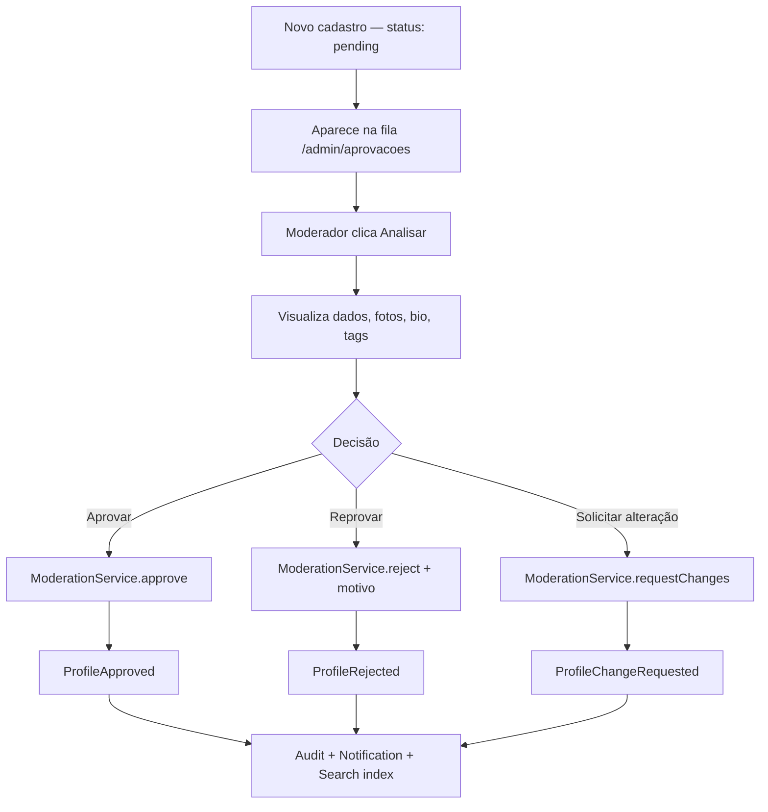
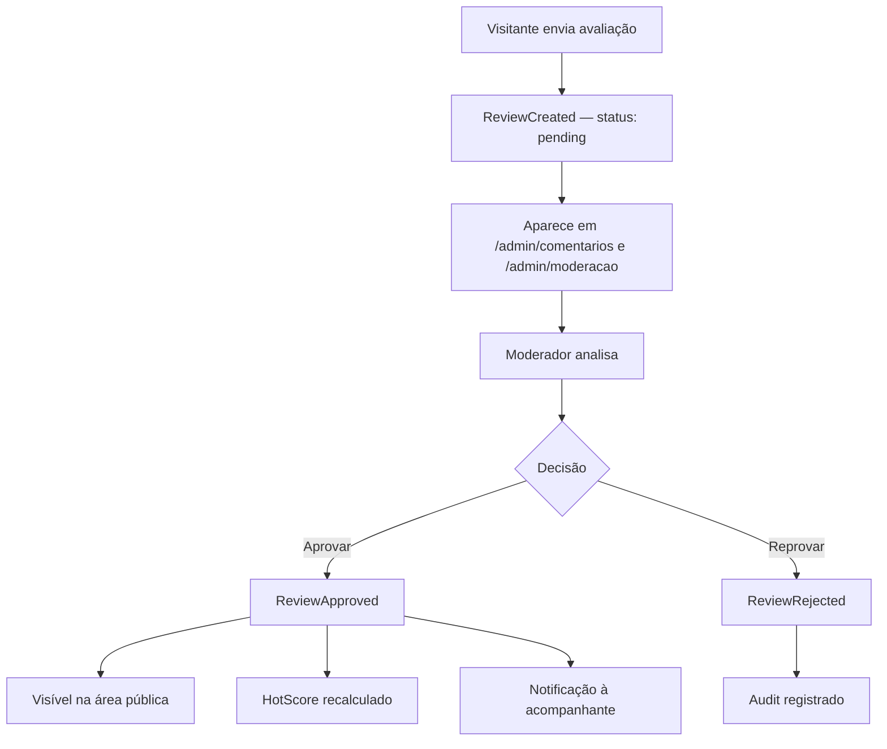
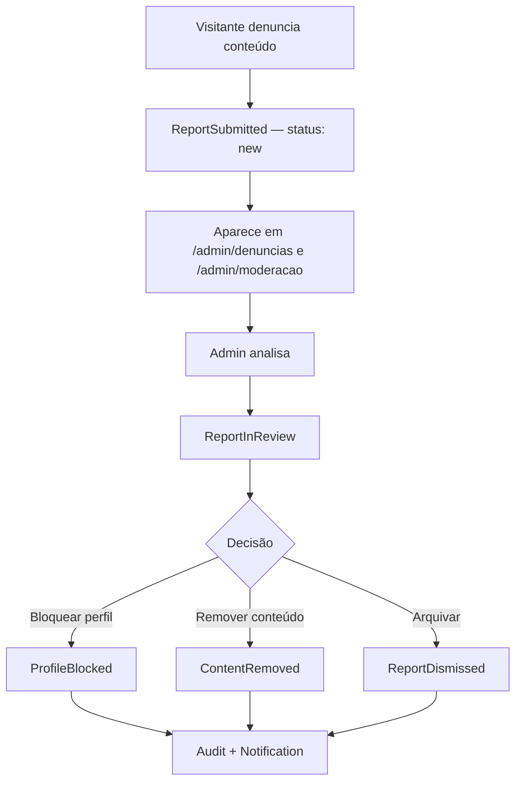
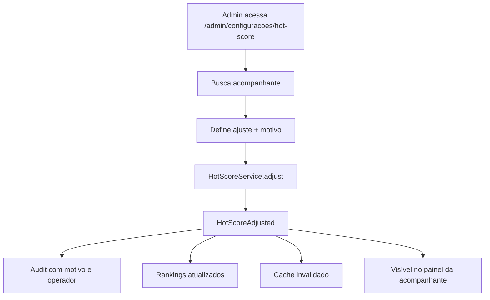
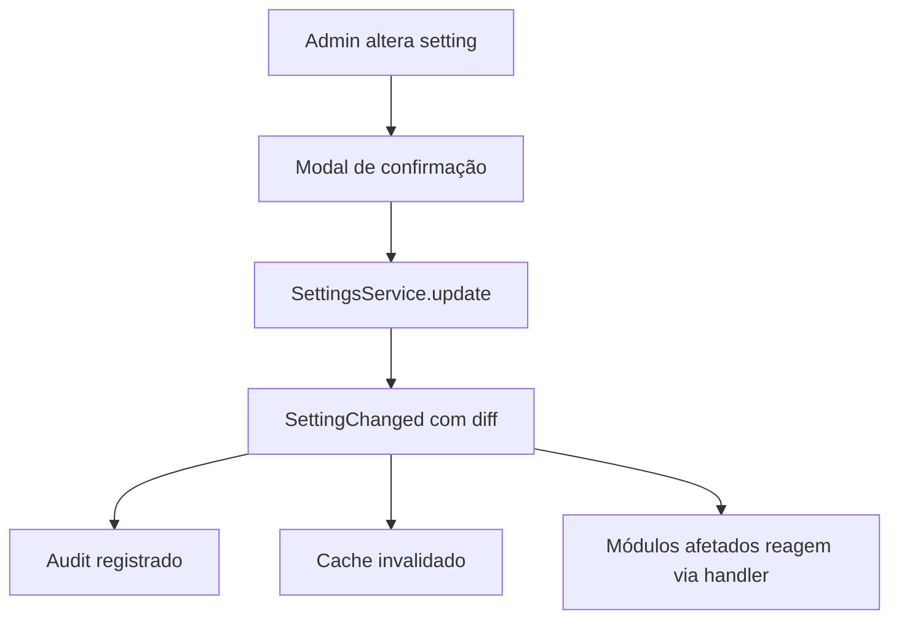
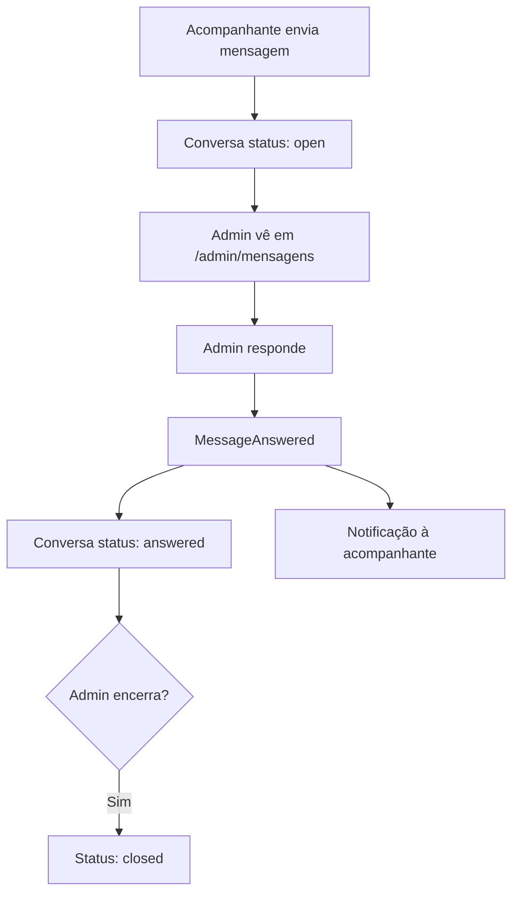

# Documento 4 — Área Administrativa

**Versão:** 1.0.0  
**Status:** Especificação Oficial  
**Última atualização:** 2026-07-08  
**Dependências:**
- [Documento 1 — Arquitetura da Plataforma](../arquitetura/DOCUMENTO-01-ARQUITETURA-DA-PLATAFORMA.md)
- [Documento 2 — Área Pública da Plataforma](./DOCUMENTO-02-AREA-PUBLICA.md)
- [Documento 3 — Área do Acompanhante](./DOCUMENTO-03-AREA-DO-ACOMPANHANTE.md)  
**Escopo:** Funcionalidades, telas, permissões, componentes e regras de negócio do painel administrativo

---

## Sumário

1. [Visão Geral e Princípios](#1-visão-geral-e-princípios)
2. [Mapa do Painel](#2-mapa-do-painel)
3. [Telas Administrativas](#3-telas-administrativas)
4. [Sistema de Permissões](#4-sistema-de-permissões)
5. [Fluxos Operacionais](#5-fluxos-operacionais)
6. [Componentes Necessários](#6-componentes-necessários)
7. [Regras de Negócio](#7-regras-de-negócio)
8. [Eventos Gerados e Consumidos](#8-eventos-gerados-e-consumidos)
9. [Integrações com Módulos](#9-integrações-com-módulos)
10. [Requisitos de UX e Design](#10-requisitos-de-ux-e-design)
11. [Requisitos de Segurança](#11-requisitos-de-segurança)
12. [Critérios de Aceitação](#12-critérios-de-aceitação)

---

## 1. Visão Geral e Princípios

### 1.1 Objetivo

A Área Administrativa é o **centro de gestão e operação** da plataforma. Ela permite que operadores controlem todos os aspectos do negócio:

| Capacidade | Descrição |
|---|---|
| **Gerenciar usuários** | Listagem, busca, edição, bloqueio e exclusão de acompanhantes |
| **Aprovar perfis** | Fluxo de análise e decisão sobre novos cadastros |
| **Moderar conteúdos** | Comentários, fotos, vídeos, momentos e denúncias |
| **Configurar regras** | Settings, Hot Score, limites, SEO e notificações |
| **Acompanhar métricas** | Analytics, rankings e dashboards operacionais |
| **Controlar popularidade** | Pesos do Hot Score e ajustes manuais |
| **Gerenciar comunicação** | Caixa de entrada com acompanhantes |
| **Monitorar saúde** | Erros, performance, storage e integrações |

O painel deve ser construído para **operação profissional e escalável** — priorizando eficiência operacional, rastreabilidade e controle granular.

### 1.2 Posicionamento Arquitetural

A Área Administrativa é uma **camada de apresentação autenticada com RBAC**. Ela:

- Consome dados via **interfaces públicas** dos módulos de domínio.
- Executa **ações operacionais** via BFF → módulo responsável → **eventos de domínio**.
- **Não duplica** regras de negócio dos módulos (aprovação, score, moderação ficam nos módulos).
- Reside em `apps/web/app/(admin)/` conforme Documento 1.
- Compartilha Design System com as demais superfícies (Documento 2).

```
┌──────────────────────────────────────────────────────────────────┐
│               ÁREA ADMINISTRATIVA (apps/web)                   │
│  Páginas │ Componentes │ Tabelas │ Filtros │ Ações em lote      │
│         ★ SEM repositories │ SEM regras de negócio ★             │
└────────────────────────────┬─────────────────────────────────────┘
                             │ BFF autenticado (/api/admin/*)
              ┌──────────────┼──────────────┐
              ▼              ▼              ▼
         Moderation      Profiles        Settings
         Reports         Dashboard       HotScore
         Verification    Analytics       Rankings
         Comments         Messaging       Audit
         Reviews          CMS             Health Monitor
         Users            Notifications   Search
```

### 1.3 Restrições Obrigatórias (Documento 1)

| Restrição | Aplicação na Área Administrativa |
|---|---|
| Sem regra de negócio em componentes | Decisões delegadas aos módulos via services |
| Sem acesso direto a repositories | Toda leitura/escrita via `I*Service` ou BFF |
| Efeitos colaterais via eventos | Aprovação, bloqueio, config → evento no módulo |
| RBAC obrigatório | Toda rota e ação verificada por permissão |
| Auditoria em toda ação sensível | Módulo Audit registra quem, quando, o quê |
| Configurações via Settings | Nenhuma regra hardcoded no painel |

### 1.4 Relação com Outras Superfícies

| Ação no Admin | Impacto no Doc 2 (Público) | Impacto no Doc 3 (Acompanhante) |
|---|---|---|
| Aprovar perfil | Perfil visível em `/perfil/[slug]` | Banner de aprovação; dashboard completo |
| Reprovar perfil | Perfil oculto | Banner com motivo; orientações |
| Aprovar comentário | Comentário visível no perfil | Notificação de novo comentário |
| Ativar Premium | Badge no card e perfil | Card de status Premium |
| Ajustar Hot Score | Score atualizado no card | Gauge atualizado no painel |
| Alterar Settings | Comportamento da área pública | Limites e regras atualizados |
| Responder mensagem | — | Notificação + conversa atualizada |

---

## 2. Mapa do Painel

### 2.1 Inventário de Rotas

| Rota | Tela | Permissão mínima | Módulos principais |
|---|---|---|---|
| `/admin/login` | Login administrativo | Público | Authentication |
| `/admin` | Dashboard | `dashboard:read` | Dashboard, Analytics |
| `/admin/acompanhantes` | Gestão de Acompanhantes | `profiles:read` | Profiles, Users, GeoLocation |
| `/admin/acompanhantes/[id]` | Detalhe do Acompanhante | `profiles:read` | Profiles, Photos, Videos, Tags |
| `/admin/aprovacoes` | Aprovação de Perfis | `profiles:moderate` | Profiles, Moderation, Photos |
| `/admin/aprovacoes/[id]` | Análise de Perfil | `profiles:moderate` | Profiles, Photos, Videos, Tags |
| `/admin/verificacoes` | Perfil Verificado | `verification:moderate` | Verification |
| `/admin/verificacoes/[id]` | Análise de Verificação | `verification:moderate` | Verification, Profiles |
| `/admin/premium` | Premium e Destaque | `profiles:manage_status` | Profiles, Settings |
| `/admin/comentarios` | Comentários e Avaliações | `comments:moderate` | Comments, Reviews, Moderation |
| `/admin/moderacao` | Central de Moderação | `moderation:read` | Moderation (agregador) |
| `/admin/denuncias` | Gestão de Denúncias | `reports:manage` | Reports, Moderation |
| `/admin/denuncias/[id]` | Análise de Denúncia | `reports:manage` | Reports, Profiles |
| `/admin/configuracoes` | Configurações Gerais | `settings:manage` | Settings |
| `/admin/configuracoes/hot-score` | Configuração Hot Score | `hotscore:manage` | HotScore, Settings |
| `/admin/analytics` | Analytics Administrativo | `analytics:read` | Analytics, Dashboard |
| `/admin/rankings` | Ranking Administrativo | `rankings:read` | Rankings, HotScore |
| `/admin/cms` | Gerenciamento de Conteúdo | `cms:manage` | CMS |
| `/admin/cms/[page]` | Editar Página CMS | `cms:manage` | CMS |
| `/admin/mensagens` | Caixa de Entrada | `messaging:manage` | Messaging |
| `/admin/mensagens/[id]` | Conversa | `messaging:manage` | Messaging |
| `/admin/saude` | Saúde da Plataforma | `health:read` | Health Monitor |
| `/admin/auditoria` | Auditoria | `audit:read` | Audit |
| `/admin/equipe` | Gestão de Equipe | `users:manage_admin` | Users, Authentication |
| `/admin/equipe/[id]` | Editar Operador | `users:manage_admin` | Users |

### 2.2 Estrutura de Arquivos (Apresentação)

```
apps/web/app/(admin)/
├── layout.tsx                          # Layout admin (sidebar, header, RBAC)
├── login/page.tsx
└── admin/
    ├── page.tsx                        # Dashboard
    ├── acompanhantes/
    │   ├── page.tsx
    │   └── [id]/page.tsx
    ├── aprovacoes/
    │   ├── page.tsx
    │   └── [id]/page.tsx
    ├── verificacoes/
    │   ├── page.tsx
    │   └── [id]/page.tsx
    ├── premium/page.tsx
    ├── comentarios/page.tsx
    ├── moderacao/page.tsx
    ├── denuncias/
    │   ├── page.tsx
    │   └── [id]/page.tsx
    ├── configuracoes/
    │   ├── page.tsx
    │   └── hot-score/page.tsx
    ├── analytics/page.tsx
    ├── rankings/page.tsx
    ├── cms/
    │   ├── page.tsx
    │   └── [page]/page.tsx
    ├── mensagens/
    │   ├── page.tsx
    │   └── [id]/page.tsx
    ├── saude/page.tsx
    ├── auditoria/page.tsx
    └── equipe/
        ├── page.tsx
        └── [id]/page.tsx
```

### 2.3 Layout Administrativo

| Elemento | Descrição |
|---|---|
| **Sidebar** | Navegação com ícones; itens filtrados por permissão do operador |
| **Header** | Nome do operador, role, notificações operacionais, logout |
| **Breadcrumb** | Caminho atual |
| **Alertas operacionais** | Banner com pendências críticas (ex.: 15 perfis aguardando) |
| **Content area** | Área principal com padding consistente |

### 2.4 Menu de Navegação

| Item | Rota | Permissão | Badge |
|---|---|---|---|
| Dashboard | `/admin` | `dashboard:read` | — |
| Acompanhantes | `/admin/acompanhantes` | `profiles:read` | — |
| Aprovações | `/admin/aprovacoes` | `profiles:moderate` | Contagem pendente |
| Verificações | `/admin/verificacoes` | `verification:moderate` | Contagem pendente |
| Premium / Destaque | `/admin/premium` | `profiles:manage_status` | — |
| Comentários | `/admin/comentarios` | `comments:moderate` | Contagem pendente |
| Moderação | `/admin/moderacao` | `moderation:read` | Contagem total |
| Denúncias | `/admin/denuncias` | `reports:manage` | Contagem nova |
| Configurações | `/admin/configuracoes` | `settings:manage` | — |
| Hot Score | `/admin/configuracoes/hot-score` | `hotscore:manage` | — |
| Analytics | `/admin/analytics` | `analytics:read` | — |
| Rankings | `/admin/rankings` | `rankings:read` | — |
| CMS | `/admin/cms` | `cms:manage` | — |
| Mensagens | `/admin/mensagens` | `messaging:manage` | Contagem nova |
| Saúde | `/admin/saude` | `health:read` | Alertas ativos |
| Auditoria | `/admin/auditoria` | `audit:read` | — |
| Equipe | `/admin/equipe` | `users:manage_admin` | — |

---

## 3. Telas Administrativas

### 3.1 Dashboard Administrativo (`/admin`)

#### 3.1.1 Indicadores — Usuários

| Métrica | Fonte | Comparação |
|---|---|---|
| Total de acompanhantes | Profiles | vs período anterior |
| Novos cadastros | Profiles | vs período anterior |
| Cadastros pendentes | Profiles (`status=pending`) | Valor absoluto |
| Perfis aprovados | Profiles (`status=approved`) | vs período anterior |
| Perfis bloqueados | Profiles (`status=blocked`) | Valor absoluto |
| Perfis verificados | Verification | vs período anterior |
| Perfis Premium | Profiles (`isPremium=true`) | Valor absoluto |
| Perfis Destaque | Profiles (`isFeatured=true`) | Valor absoluto |

#### 3.1.2 Indicadores — Engajamento

| Métrica | Fonte | Comparação |
|---|---|---|
| Visitantes online | Analytics (real-time) | Valor absoluto |
| Visualizações de perfis | Analytics | vs período anterior |
| Cliques no WhatsApp | Analytics | vs período anterior |
| Comentários enviados | Reviews + Comments | vs período anterior |
| Comentários aprovados | Reviews + Comments | vs período anterior |
| Vídeos visualizados | Analytics | vs período anterior |
| Momentos publicados | Moments | vs período anterior |
| Curtidas | Analytics | vs período anterior |
| Compartilhamentos | Analytics | vs período anterior |

#### 3.1.3 Indicadores — Operação

| Métrica | Fonte | Tipo |
|---|---|---|
| Denúncias pendentes | Reports (`status=new`) | Alerta |
| Mensagens aguardando resposta | Messaging (`status=open`) | Alerta |
| Solicitações de verificação | Verification (`status=pending`) | Alerta |
| Conteúdos aguardando moderação | Moderation (fila total) | Alerta |
| Erros da plataforma | Health Monitor | Alerta |

#### 3.1.4 Layout do Dashboard

| Zona | Conteúdo |
|---|---|
| Topo | PeriodSelector (hoje / 7d / 30d / 90d / custom) |
| Alertas | Cards vermelhos/amarelos para pendências operacionais |
| Linha 1 | 4 MetricCards de usuários |
| Linha 2 | 4 MetricCards de engajamento |
| Linha 3 | Gráfico de evolução (cadastros + visualizações) |
| Linha 4 | 5 MetricCards operacionais (clicáveis → tela correspondente) |
| Linha 5 | Gráfico comparativo de engajamento |

Dados via `IDashboardService.getAdminDashboard(period)`.

---

### 3.2 Gestão de Acompanhantes (`/admin/acompanhantes`)

#### 3.2.1 Listagem

Tabela paginada com colunas:

| Coluna | Origem |
|---|---|
| Foto | Photos (principal) |
| Nome público | Profiles |
| Cidade | GeoLocation |
| Status | Profiles |
| Verificado | Verification |
| Premium | Profiles |
| Destaque | Profiles |
| Hot Score | HotScore |
| Data de cadastro | Profiles |
| Ações | — |

#### 3.2.2 Filtros

| Filtro | Tipo | Param |
|---|---|---|
| Busca textual | Input | `q` (nome, e-mail, slug) |
| Status | Multi-select | `status[]` |
| Cidade | Autocomplete | `cidade` |
| Verificado | Toggle | `verificado` |
| Premium | Toggle | `premium` |
| Destaque | Toggle | `destaque` |
| Hot Score | Range | `hotscore_min`, `hotscore_max` |
| Data de cadastro | Date range | `data_inicio`, `data_fim` |

#### 3.2.3 Ações por Acompanhante

| Ação | Permissão | Evento |
|---|---|---|
| Visualizar perfil | `profiles:read` | — |
| Editar dados | `profiles:write` | `ProfileUpdated` |
| Aprovar | `profiles:moderate` | `ProfileApproved` |
| Reprovar | `profiles:moderate` | `ProfileRejected` |
| Bloquear | `profiles:moderate` | `ProfileBlocked` |
| Desbloquear | `profiles:moderate` | `ProfileUnblocked` |
| Excluir (soft) | `profiles:delete` | `ProfileDeleted` |

#### 3.2.4 Detalhe do Acompanhante (`/admin/acompanhantes/[id]`)

Painel completo com abas:

| Aba | Conteúdo |
|---|---|
| Dados | Informações cadastrais completas |
| Fotos | Galeria com status de moderação |
| Vídeos | Lista com status e opções de visibilidade |
| Momentos | Publicações com métricas |
| Avaliações | Reviews aprovadas e pendentes |
| Hot Score | Score atual, histórico, ajustes manuais |
| Auditoria | Log de alterações deste perfil |
| Ações | Botões de aprovar/reprovar/bloquear/premium |

---

### 3.3 Aprovação de Perfis (`/admin/aprovacoes`)

#### 3.3.1 Fila de Aprovação

Listagem de perfis com `status = pending`, ordenados por data de cadastro (mais antigo primeiro).

| Coluna | Descrição |
|---|---|
| Nome | Nome público |
| Data cadastro | Timestamp |
| Cidade | GeoLocation |
| Fotos | Contagem de fotos enviadas |
| Tempo na fila | Dias desde o cadastro |
| Prioridade | Normal / Alta (configurável) |
| Ação | Botão "Analisar" |

#### 3.3.2 Tela de Análise (`/admin/aprovacoes/[id]`)

Exibição completa para decisão:

| Seção | Conteúdo |
|---|---|
| Dados cadastrados | Todos os campos do perfil |
| Fotos | Galeria com zoom |
| Vídeos | Lista com preview |
| Bio | Texto completo |
| Tags | Tags selecionadas |
| Informações adicionais | Características, preferências, posição |
| Histórico | Tentativas anteriores de aprovação (se houver) |

#### 3.3.3 Ações de Decisão

| Ação | Campo obrigatório | Evento | Notificação |
|---|---|---|---|---|
| Aprovar | — | `ProfileApproved` | "Perfil aprovado" |
| Reprovar | Motivo (texto) | `ProfileRejected` | "Perfil reprovado" + motivo |
| Solicitar alteração | Descrição das alterações | `ProfileChangeRequested` | "Alterações solicitadas" + detalhes |

Toda decisão gera:
1. Registro no módulo Audit (quem, quando, ação, motivo).
2. Evento de domínio.
3. Notificação à acompanhante.

---

### 3.4 Perfil Verificado (`/admin/verificacoes`)

#### 3.4.1 Fila de Verificações

| Coluna | Descrição |
|---|---|
| Acompanhante | Nome + foto |
| Data solicitação | Timestamp |
| Documentos | Link para visualização segura |
| Status | pending |
| Ação | "Analisar" |

#### 3.4.2 Tela de Análise (`/admin/verificacoes/[id]`)

| Seção | Conteúdo |
|---|---|
| Dados do perfil | Resumo do acompanhante |
| Documentos enviados | Visualização segura (criptografados) |
| Histórico | Solicitações anteriores |
| Observações internas | Campo de notas (visível apenas para admins) |

#### 3.4.3 Ações

| Ação | Evento | Efeito |
|---|---|---|
| Aprovar | `VerificationApproved` | Badge no card e perfil; notificação |
| Reprovar | `VerificationRejected` | Motivo registrado; notificação |

---

### 3.5 Controle Premium e Destaque (`/admin/premium`)

#### 3.5.1 Funcionalidades

Busca de acompanhante + ações individuais:

| Ação | Evento | Efeito |
|---|---|---|
| Ativar Premium | `PremiumActivated` | Badge no card/perfil; prioridade em rankings |
| Remover Premium | `PremiumDeactivated` | Remove badge |
| Ativar Destaque | `FeaturedActivated` | Badge destaque; posição em destaques da home |
| Remover Destaque | `FeaturedDeactivated` | Remove badge |

#### 3.5.2 Campos por Ativação

| Campo | Obrigatório | Descrição |
|---|---|---|
| Acompanhante | Sim | Busca por nome/slug |
| Tipo | Sim | Premium / Destaque |
| Data de início | Sim | Quando ativa |
| Data de expiração | Não | Se vazio, sem expiração |
| Observação interna | Não | Nota para auditoria |

Toda ação gera auditoria + evento + atualização de cards públicos e rankings.

---

### 3.6 Gestão de Comentários e Avaliações (`/admin/comentarios`)

#### 3.6.1 Fila de Moderação

| Coluna | Descrição |
|---|---|
| Tipo | Comentário / Avaliação |
| Perfil relacionado | Link para perfil |
| Autor | Nome informado |
| Nota | 1–5 estrelas (se avaliação) |
| Conteúdo | Texto truncado |
| Data | Timestamp |
| Status | pending / approved / rejected |
| Ações | Aprovar / Reprovar / Excluir |

#### 3.6.2 Filtros

| Filtro | Tipo |
|---|---|
| Status | Multi-select |
| Tipo | Comentário / Avaliação |
| Perfil | Autocomplete |
| Data | Date range |
| Busca textual | Input (conteúdo, autor) |

#### 3.6.3 Ações

| Ação | Permissão | Evento |
|---|---|---|
| Aprovar | `comments:moderate` | `CommentApproved` / `ReviewApproved` |
| Reprovar | `comments:moderate` | `CommentRejected` / `ReviewRejected` |
| Excluir | `comments:delete` | `CommentDeleted` / `ReviewDeleted` |

Toda alteração gera histórico no módulo Moderation + Audit.

---

### 3.7 Central de Moderação (`/admin/moderacao`)

#### 3.7.1 Conceito

Área **agregadora** que unifica todas as pendências em uma única fila operacional.

#### 3.7.2 Tipos de Item na Fila

| Tipo | Origem | Ícone |
|---|---|---|
| Novo cadastro | Profiles (`pending`) | User |
| Comentário pendente | Comments / Reviews | MessageSquare |
| Denúncia | Reports (`new`) | Flag |
| Verificação pendente | Verification | ShieldCheck |
| Conteúdo reportado | Reports (foto/vídeo/momento) | AlertTriangle |
| Foto pendente | Photos (`pending`) | Image |
| Vídeo pendente | Videos (`pending`) | Video |

#### 3.7.3 Recursos

| Recurso | Descrição |
|---|---|
| Filtros | Por tipo, prioridade, data, status |
| Busca | Texto livre cross-type |
| Prioridade | Alta / Normal / Baixa (automática ou manual) |
| Aprovação em lote | Selecionar múltiplos → aprovar/reprovar |
| Histórico | Tab com itens já processados |
| Ordenação | Prioridade → data (mais antigo primeiro) |

#### 3.7.4 Priorização Automática

| Condição | Prioridade |
|---|---|
| Denúncia com múltiplos reports | Alta |
| Perfil na fila > 7 dias | Alta |
| Conteúdo reportado | Alta |
| Cadastro novo (< 48h) | Normal |
| Comentário pendente | Normal |
| Verificação pendente | Baixa |

Regras configuráveis via Settings (`moderation.priority.*`).

---

### 3.8 Gestão de Denúncias (`/admin/denuncias`)

#### 3.8.1 Listagem

| Coluna | Descrição |
|---|---|
| ID | Identificador |
| Tipo | Perfil / Foto / Vídeo / Comentário / Momento |
| Alvo | Nome/link do conteúdo denunciado |
| Motivo | Categoria da denúncia |
| Denunciante | Anônimo ou identificado |
| Data | Timestamp |
| Status | new / in_review / resolved / dismissed |
| Ação | "Analisar" |

#### 3.8.2 Tela de Análise (`/admin/denuncias/[id]`)

| Seção | Conteúdo |
|---|---|
| Detalhes da denúncia | Motivo, descrição, data |
| Conteúdo denunciado | Preview do perfil/foto/vídeo/comentário |
| Histórico do alvo | Denúncias anteriores contra o mesmo alvo |
| Denúncias do denunciante | Padrão de denúncias (se identificado) |

#### 3.8.3 Ações de Resolução

| Ação | Resultado | Evento |
|---|---|---|
| Bloquear perfil | Perfil → `blocked` | `ProfileBlocked` |
| Remover conteúdo | Soft delete do conteúdo | `ContentRemoved` |
| Arquivar (ignorar) | Denúncia → `dismissed` | `ReportDismissed` |
| Marcar em análise | Denúncia → `in_review` | `ReportInReview` |

---

### 3.9 Configurações da Plataforma (`/admin/configuracoes`)

#### 3.9.1 Categorias

| Categoria | Configurações | Chaves (exemplos) |
|---|---|---|
| **Geral** | Nome, logo, identidade visual, institucional | `site.name`, `site.logo`, `site.theme` |
| **Usuários** | Regras de cadastro, aprovação, limites | `profiles.auto_approve`, `profiles.photos.max` |
| **Conteúdo** | Limites de mídia, regras de comentários | `media.photos.max_size_mb`, `reviews.rate_limit_hours` |
| **Hot Score** | Pesos, expiração, regras | `hotscore.weights.*`, `hotscore.decay.*` |
| **Notificações** | Eventos, canais, retenção | `notifications.channels.*`, `notifications.retention_days` |
| **SEO** | Metadados, indexação, sitemap | `seo.index.*`, `seo.default_meta` |

#### 3.9.2 Comportamento

- Cada alteração dispara `SettingChanged` com diff (oldValue → newValue).
- Invalidação de cache automática via handler.
- Snapshot versionado no módulo Settings.
- Confirmação obrigatória para alterações críticas (modal).

---

### 3.10 Configuração do Hot Score (`/admin/configuracoes/hot-score`)

#### 3.10.1 Pesos por Ação

| Ação | Chave Settings | Peso padrão |
|---|---|---|
| Visualização de perfil | `hotscore.weights.profile_view` | +1 |
| Comentário aprovado | `hotscore.weights.comment_approved` | +5 |
| Clique WhatsApp | `hotscore.weights.whatsapp_click` | +3 |
| Compartilhamento | `hotscore.weights.share` | +10 |
| Curtida em momento | `hotscore.weights.moment_like` | +2 |
| Avaliação aprovada (5★) | `hotscore.weights.review_5star` | +8 |
| Avaliação aprovada (1★) | `hotscore.weights.review_1star` | -3 |

#### 3.10.2 Regras de Expiração

| Configuração | Chave | Default |
|---|---|---|
| Expiração ativa | `hotscore.decay.enabled` | true |
| Taxa de decay diário | `hotscore.decay.rate` | 0.5% |
| Score mínimo | `hotscore.decay.floor` | 0 |

#### 3.10.3 Ajuste Manual

| Campo | Descrição |
|---|---|
| Acompanhante | Busca por nome/slug |
| Ajuste | Valor positivo ou negativo (ex.: +15) |
| Motivo | Texto obrigatório |
| Expiração do ajuste | Opcional (se temporário) |

Gera: `HotScoreAdjusted` + registro em Audit com motivo.

Painel exibe histórico de ajustes manuais por perfil.

---

### 3.11 Analytics Administrativo (`/admin/analytics`)

#### 3.11.1 Métricas

| Métrica | Visualização |
|---|---|
| Usuários ativos | Gráfico de linha |
| Crescimento de cadastros | Gráfico de barras |
| Visualizações totais | MetricCard + gráfico |
| Pesquisas realizadas | Gráfico + top termos |
| Filtros mais utilizados | Ranking horizontal |
| Cidades mais acessadas | Mapa ou tabela |
| Tags mais buscadas | Ranking |
| Perfis mais acessados | Tabela top 20 |
| Vídeos mais vistos | Tabela top 20 |
| Momentos mais engajados | Tabela top 20 |

#### 3.11.2 Filtros de Período

| Opção | Param |
|---|---|
| Hoje | `period=today` |
| Semana | `period=7d` |
| Mês | `period=30d` |
| Personalizado | `start_date` + `end_date` |

Dados via `IAnalyticsService.getAdminAnalytics(period, filters)`.

---

### 3.12 Ranking Administrativo (`/admin/rankings`)

#### 3.12.1 Visualizações

| Visão | Descrição |
|---|---|
| Ranking geral | Top perfis por Hot Score |
| Por cidade | Ranking filtrado por localização |
| Por período | Hoje / Semana / Mês / Todos |

#### 3.12.2 Dados por Entrada

| Campo | Origem |
|---|---|
| Posição | Rankings |
| Perfil (foto + nome) | Profiles |
| Hot Score | HotScore |
| Visualizações | Analytics |
| Engajamento (composto) | Analytics |
| Crescimento (%) | Rankings (`positionChange`) |

---

### 3.13 CMS (`/admin/cms`)

#### 3.13.1 Páginas Editáveis

| Página | Rota pública | Módulo |
|---|---|---|
| Página inicial (seções editáveis) | `/` | CMS |
| Sobre | `/sobre` | CMS |
| FAQ | `/faq` | CMS |
| Termos de uso | `/termos` | CMS |
| Política de Privacidade | `/privacidade` | CMS |
| LGPD | `/privacidade#lgpd` | CMS |
| Contato | `/contato` | CMS |

#### 3.13.2 Editor

- Editor rich text (WYSIWYG) com preview.
- Campos: título, slug, conteúdo, meta title, meta description.
- Status: rascunho / publicado.
- Versionamento de conteúdo (histórico de versões).
- Alteração dispara `CmsPageUpdated` → invalidação de cache + SEO.

---

### 3.14 Caixa de Entrada Administrativa (`/admin/mensagens`)

#### 3.14.1 Listagem

| Coluna | Descrição |
|---|---|
| Acompanhante | Nome + foto |
| Assunto | Título da conversa |
| Última mensagem | Preview truncado |
| Data | Timestamp da última mensagem |
| Status | open / answered / closed |
| Badge | Nova (não lida pelo admin) |

#### 3.14.2 Filtros

| Filtro | Valores |
|---|---|
| Status | Novas / Pendentes / Resolvidas |
| Data | Date range |
| Busca | Por nome ou assunto |

#### 3.14.3 Tela de Conversa (`/admin/mensagens/[id]`)

| Elemento | Descrição |
|---|---|
| Thread | Mensagens em ordem cronológica |
| Composer | Campo de resposta |
| Ações | Responder, Encerrar |
| Info lateral | Dados do perfil da acompanhante |

Resposta gera `MessageAnswered` + notificação à acompanhante.

---

### 3.15 Painel de Saúde da Plataforma (`/admin/saude`)

#### 3.15.1 Monitoramento

| Indicador | Fonte | Alerta |
|---|---|---|
| Erros (últimas 24h) | Health Monitor / Sentry | > 10 erros |
| Falhas de upload | Media + Health Monitor | > 5 falhas |
| Conteúdos quebrados | Health Monitor (links/mídia) | Qualquer |
| API response time (p95) | Health Monitor | > 500ms |
| Database query time (p95) | Health Monitor | > 100ms |
| Uso de armazenamento | Media / S3 | > 80% capacidade |
| Cache hit rate | Cache | < 80% |
| Event processing lag | Event Bus | > 30s |
| Integrações | Health Monitor | Status down |

#### 3.15.2 Layout

| Zona | Conteúdo |
|---|---|
| Status geral | Semáforo: verde / amarelo / vermelho |
| Serviços | Cards por serviço (API, DB, Redis, Search, Storage) |
| Erros recentes | Tabela com timestamp, tipo, mensagem, stack |
| Gráficos | Performance ao longo do tempo |
| Ações | Links para logs detalhados |

---

### 3.16 Auditoria Administrativa (`/admin/auditoria`)

#### 3.16.1 Registros

| Campo | Descrição |
|---|---|
| Quem | Nome e role do operador |
| Quando | Timestamp |
| Ação | Tipo (approve, block, config_change, etc.) |
| Recurso | Entidade afetada (perfil, config, comentário) |
| Valor anterior | Estado antes da ação |
| Novo valor | Estado após a ação |
| Motivo | Texto (quando aplicável) |
| IP | IP mascarado do operador |

#### 3.16.2 Filtros

| Filtro | Tipo |
|---|---|
| Operador | Select |
| Ação | Multi-select |
| Recurso | Multi-select |
| Data | Date range |
| Busca | Texto livre |

#### 3.16.3 Ações Auditadas

- Aprovação / reprovação / bloqueio de perfil.
- Ativação / remoção de Premium e Destaque.
- Aprovação / reprovação de comentários e conteúdos.
- Alteração de configurações (Settings).
- Ajuste manual de Hot Score.
- Exclusões (perfis, conteúdos).
- Resolução de denúncias.
- Alteração de permissões de operadores.
- Respostas a mensagens.

---

### 3.17 Gestão de Equipe (`/admin/equipe`)

#### 3.17.1 Funcionalidades

| Ação | Permissão necessária |
|---|---|
| Listar operadores | `users:manage_admin` |
| Criar operador | `users:manage_admin` |
| Editar role/permissões | `users:manage_admin` |
| Desativar operador | `users:manage_admin` |

#### 3.17.2 Campos do Operador

| Campo | Descrição |
|---|---|
| Nome | Nome completo |
| E-mail | Login |
| Role | super_admin / admin / moderator / analyst |
| Permissões | Override granular (opcional) |
| Status | ativo / inativo |
| Último acesso | Timestamp |

---

## 4. Sistema de Permissões

### 4.1 Roles (Papéis)

| Role | Descrição | Escopo |
|---|---|---|
| `super_admin` | Acesso total; gestão de equipe e configurações críticas | Plataforma inteira |
| `admin` | Gestão operacional completa exceto equipe e configs críticas | Operação |
| `moderator` | Moderação de perfis, conteúdos e denúncias | Moderação |
| `analyst` | Visualização de analytics, rankings e auditoria (somente leitura) | Dados |

### 4.2 Matriz de Permissões

| Permissão | super_admin | admin | moderator | analyst |
|---|---|---|---|---|
| `dashboard:read` | ✅ | ✅ | ✅ | ✅ |
| `profiles:read` | ✅ | ✅ | ✅ | ✅ |
| `profiles:write` | ✅ | ✅ | ❌ | ❌ |
| `profiles:moderate` | ✅ | ✅ | ✅ | ❌ |
| `profiles:delete` | ✅ | ✅ | ❌ | ❌ |
| `profiles:manage_status` | ✅ | ✅ | ❌ | ❌ |
| `verification:moderate` | ✅ | ✅ | ✅ | ❌ |
| `comments:moderate` | ✅ | ✅ | ✅ | ❌ |
| `comments:delete` | ✅ | ✅ | ✅ | ❌ |
| `moderation:read` | ✅ | ✅ | ✅ | ❌ |
| `moderation:batch` | ✅ | ✅ | ❌ | ❌ |
| `reports:manage` | ✅ | ✅ | ✅ | ❌ |
| `settings:manage` | ✅ | ❌ | ❌ | ❌ |
| `hotscore:manage` | ✅ | ✅ | ❌ | ❌ |
| `analytics:read` | ✅ | ✅ | ❌ | ✅ |
| `rankings:read` | ✅ | ✅ | ❌ | ✅ |
| `cms:manage` | ✅ | ✅ | ❌ | ❌ |
| `messaging:manage` | ✅ | ✅ | ✅ | ❌ |
| `health:read` | ✅ | ✅ | ❌ | ❌ |
| `audit:read` | ✅ | ✅ | ❌ | ✅ |
| `users:manage_admin` | ✅ | ❌ | ❌ | ❌ |

### 4.3 Implementação

```
Request → Auth Guard → Admin Role Guard → Permission Guard → Ownership (se aplicável) → Service
```

| Aspecto | Decisão |
|---|---|
| Formato | `<recurso>:<ação>` (ex.: `profiles:moderate`) |
| Armazenamento | Role com permissões padrão; override por operador |
| Configurável | Permissões de cada role editáveis via Settings (`admin.roles.*`) |
| Sidebar | Itens renderizados conforme permissões do operador logado |
| Ações | Botões desabilitados/ocultos sem permissão |
| API | 403 Forbidden para ações não autorizadas |

### 4.4 Princípio do Menor Privilégio

- Default deny — sem permissão explícita, acesso negado.
- Moderador não acessa configurações, analytics administrativo ou equipe.
- Analista tem acesso somente leitura a dados.
- Super admin é o único que gerencia equipe e settings críticos.

---

## 5. Fluxos Operacionais

### 5.1 Fluxo — Aprovação de Perfil



### 5.2 Fluxo — Moderação de Comentário



### 5.3 Fluxo — Denúncia



### 5.4 Fluxo — Ajuste Manual de Hot Score



### 5.5 Fluxo — Alteração de Configuração



### 5.6 Fluxo — Resposta a Mensagem



---

## 6. Componentes Necessários

### 6.1 Layout e Navegação

| Componente | Responsabilidade |
|---|---|
| `AdminLayout` | Sidebar + header + RBAC |
| `AdminSidebar` | Menu filtrado por permissão |
| `AdminHeader` | Operador, role, alertas |
| `PermissionGate` | Renderiza children apenas com permissão |
| `OperationalAlert` | Banner de pendências críticas |
| `Breadcrumb` | Navegação contextual |

### 6.2 Dashboard e Métricas

| Componente | Responsabilidade |
|---|---|
| `AdminMetricCard` | KPI com valor, tendência, link |
| `AdminMetricGrid` | Grid responsivo |
| `TrendChart` | Gráfico de linha multi-série |
| `ComparisonChart` | Barras comparativas |
| `PeriodSelector` | Hoje / 7d / 30d / 90d / custom |
| `AlertCard` | Card clicável de pendência operacional |
| `RealTimeCounter` | Visitantes online (polling/WebSocket) |

### 6.3 Tabelas e Listagens

| Componente | Responsabilidade |
|---|---|
| `DataTable` | Tabela com sort, paginação, seleção |
| `FilterPanel` | Painel de filtros colapsável |
| `SearchInput` | Busca com debounce |
| `StatusBadge` | Badge colorido por status |
| `PriorityBadge` | Alta / Normal / Baixa |
| `BulkActionBar` | Barra de ações em lote |
| `DateRangePicker` | Seletor de intervalo de datas |
| `EmptyTable` | Estado vazio com ilustração |

### 6.4 Moderação e Aprovação

| Componente | Responsabilidade |
|---|---|
| `ModerationQueue` | Fila unificada da central |
| `ProfileReviewPanel` | Painel de análise de perfil |
| `ContentPreview` | Preview de foto/vídeo/comentário |
| `DecisionModal` | Modal de aprovar/reprovar com motivo |
| `ModerationHistory` | Histórico de decisões |
| `DocumentViewer` | Visualizador seguro de documentos |
| `InternalNotes` | Campo de observações internas |

### 6.5 Configurações

| Componente | Responsabilidade |
|---|---|
| `SettingsForm` | Formulário por categoria |
| `SettingsCategory` | Tab de categoria |
| `WeightEditor` | Editor de pesos do Hot Score |
| `HotScoreAdjustForm` | Formulário de ajuste manual |
| `ConfirmCriticalChange` | Modal de confirmação |
| `SettingsDiff` | Exibição de valor anterior → novo |

### 6.6 CMS

| Componente | Responsabilidade |
|---|---|
| `RichTextEditor` | Editor WYSIWYG |
| `CmsPageList` | Lista de páginas |
| `CmsPageEditor` | Editor com preview |
| `CmsVersionHistory` | Histórico de versões |

### 6.7 Comunicação

| Componente | Responsabilidade |
|---|---|
| `InboxList` | Lista de conversas |
| `AdminMessageThread` | Thread com ações de responder/encerrar |
| `MessageComposer` | Input de resposta |

### 6.8 Saúde e Auditoria

| Componente | Responsabilidade |
|---|---|
| `HealthDashboard` | Status geral + serviços |
| `ServiceStatusCard` | Card por serviço (up/down/degraded) |
| `ErrorLogTable` | Tabela de erros recentes |
| `AuditLogTable` | Tabela de auditoria com filtros |
| `AuditDiffView` | Visualização old → new |

---

## 7. Regras de Negócio

> Todas as regras são implementadas nos **módulos de domínio**. O painel administrativo invoca services e exibe resultados.

### 7.1 Gestão de Perfis

| ID | Regra | Módulo |
|---|---|---|
| RN-ADM-001 | Apenas operadores com `profiles:moderate` podem aprovar/reprovar | Authorization |
| RN-ADM-002 | Reprovação exige motivo (mín. 10 caracteres) | Moderation |
| RN-ADM-003 | Bloqueio notifica a acompanhante imediatamente | Notifications |
| RN-ADM-004 | Exclusão é soft delete (nunca física) | Profiles |
| RN-ADM-005 | Perfil bloqueado não pode ser re-aprovado sem desbloqueio | Profiles |
| RN-ADM-006 | Solicitar alteração mantém status `pending` | Profiles |
| RN-ADM-007 | Edição de dados pelo admin gera auditoria com diff | Audit |

### 7.2 Moderação de Conteúdo

| ID | Regra | Módulo |
|---|---|---|
| RN-ADM-010 | Comentário só visível publicamente após `approved` | Comments, Reviews |
| RN-ADM-011 | Aprovação em lote limitada a 50 itens por operação | Moderation |
| RN-ADM-012 | Moderador não pode aprovar conteúdo do próprio perfil (se aplicável) | Moderation |
| RN-ADM-013 | Reprovação de conteúdo exige motivo | Moderation |
| RN-ADM-014 | Fila ordenada por prioridade → data | Moderation |
| RN-ADM-015 | Conteúdo rejeitado 3+ vezes gera alerta no perfil | Moderation |

### 7.3 Verificação

| ID | Regra | Módulo |
|---|---|---|
| RN-ADM-020 | Documentos acessíveis apenas com `verification:moderate` | Verification |
| RN-ADM-021 | Aprovação adiciona badge imediatamente | Verification, Profiles |
| RN-ADM-022 | Observações internas visíveis apenas para admins | Verification |

### 7.4 Premium e Destaque

| ID | Regra | Módulo |
|---|---|---|
| RN-ADM-030 | Apenas `profiles:manage_status` pode alterar Premium/Destaque | Authorization |
| RN-ADM-031 | Ativação exige perfil `approved` | Profiles |
| RN-ADM-032 | Expiração automática processada por job agendado | Profiles, Settings |
| RN-ADM-033 | Remoção de Premium não afeta dados do perfil | Profiles |

### 7.5 Denúncias

| ID | Regra | Módulo |
|---|---|---|
| RN-ADM-040 | Denúncia nova deve ser analisada em até 48h (SLA configurável) | Reports, Settings |
| RN-ADM-041 | Bloqueio por denúncia exige confirmação dupla | Reports, Moderation |
| RN-ADM-042 | Mesmo conteúdo com 3+ denúncias recebe prioridade alta | Reports |
| RN-ADM-043 | Denúncia arquivada não pode ser reaberta | Reports |

### 7.6 Configurações e Hot Score

| ID | Regra | Módulo |
|---|---|---|
| RN-ADM-050 | Alteração de Settings exige `settings:manage` (super_admin) | Authorization |
| RN-ADM-051 | Toda alteração de setting gera snapshot versionado | Settings |
| RN-ADM-052 | Ajuste manual de Hot Score exige motivo | HotScore, Audit |
| RN-ADM-053 | Pesos do Hot Score aplicam-se apenas a eventos futuros | HotScore |
| RN-ADM-054 | Ajuste manual temporário expira conforme configurado | HotScore |

### 7.7 Comunicação e Equipe

| ID | Regra | Módulo |
|---|---|---|
| RN-ADM-060 | Resposta a mensagem gera notificação à acompanhante | Messaging, Notifications |
| RN-ADM-061 | Conversa encerrada não aceita novas mensagens | Messaging |
| RN-ADM-062 | Criação de operador exige `users:manage_admin` | Users |
| RN-ADM-063 | Operador não pode alterar próprio role | Users |
| RN-ADM-064 | Desativação de operador encerra sessões ativas | Authentication |

### 7.8 Auditoria

| ID | Regra | Módulo |
|---|---|---|
| RN-ADM-070 | Toda ação administrativa sensível gera AuditEntry | Audit |
| RN-ADM-071 | Logs de auditoria são imutáveis | Audit |
| RN-ADM-072 | Retenção de auditoria: 2 anos (configurável) | Audit, Settings |
| RN-ADM-073 | Audit inclui: actorId, action, resource, oldValue, newValue, timestamp | Audit |

---

## 8. Eventos Gerados e Consumidos

### 8.1 Eventos Emitidos (via ações do administrador)

| Evento | Trigger | Payload | Módulos receptores |
|---|---|---|---|
| `ProfileApproved` | Aprovação de perfil | `{ profileId, approvedBy }` | Search, Notifications, HotScore, Analytics, Audit |
| `ProfileRejected` | Reprovação de perfil | `{ profileId, reason, rejectedBy }` | Notifications, Audit |
| `ProfileBlocked` | Bloqueio de perfil | `{ profileId, reason, blockedBy }` | Search, Notifications, Cache, Audit |
| `ProfileUnblocked` | Desbloqueio | `{ profileId, unblockedBy }` | Search, Notifications, Audit |
| `ProfileChangeRequested` | Solicitar alterações | `{ profileId, changes, requestedBy }` | Notifications, Audit |
| `ProfileDeleted` | Exclusão (soft) | `{ profileId, deletedBy }` | Search, Cache, Audit |
| `ProfileUpdated` | Edição pelo admin | `{ profileId, changes, updatedBy }` | Search, SEO, Cache, Audit |
| `VerificationApproved` | Verificação aprovada | `{ verificationId, profileId, approvedBy }` | Profiles, Notifications, Cache, Audit |
| `VerificationRejected` | Verificação rejeitada | `{ verificationId, profileId, reason }` | Notifications, Audit |
| `CommentApproved` | Comentário aprovado | `{ commentId, profileId, approvedBy }` | HotScore, Notifications, Analytics, Dashboard |
| `CommentRejected` | Comentário rejeitado | `{ commentId, reason }` | Audit |
| `ReviewApproved` | Avaliação aprovada | `{ reviewId, profileId, rating, approvedBy }` | HotScore, Rankings, Notifications, Analytics |
| `ReviewRejected` | Avaliação rejeitada | `{ reviewId, reason }` | Audit |
| `ContentRemoved` | Remoção de conteúdo | `{ contentType, contentId, removedBy }` | Cache, Audit |
| `PremiumActivated` | Premium ativado | `{ profileId, expiresAt?, activatedBy }` | Rankings, Cache, Notifications, Audit |
| `PremiumDeactivated` | Premium removido | `{ profileId, deactivatedBy }` | Rankings, Cache, Audit |
| `FeaturedActivated` | Destaque ativado | `{ profileId, expiresAt?, activatedBy }` | Rankings, Cache, Audit |
| `FeaturedDeactivated` | Destaque removido | `{ profileId, deactivatedBy }` | Rankings, Cache, Audit |
| `HotScoreAdjusted` | Ajuste manual de score | `{ profileId, adjustment, reason, adjustedBy }` | Rankings, Cache, Dashboard, Audit |
| `SettingChanged` | Alteração de configuração | `{ key, oldValue, newValue, changedBy }` | Cache, Audit, módulos afetados |
| `ReportResolved` | Denúncia resolvida | `{ reportId, resolution, resolvedBy }` | Audit |
| `ReportDismissed` | Denúncia arquivada | `{ reportId, dismissedBy }` | Audit |
| `MessageAnswered` | Resposta a mensagem | `{ conversationId, answeredBy }` | Messaging, Notifications |
| `ConversationClosed` | Conversa encerrada | `{ conversationId, closedBy }` | Messaging, Notifications |
| `CmsPageUpdated` | Página CMS editada | `{ pageId, slug, updatedBy }` | Cache, SEO |
| `AdminUserCreated` | Operador criado | `{ userId, role, createdBy }` | Audit |
| `AdminUserDeactivated` | Operador desativado | `{ userId, deactivatedBy }` | Authentication, Audit |

### 8.2 Eventos Consumidos (atualização da UI admin)

| Evento | Ação no painel admin |
|---|---|
| `ProfileCreated` | Incrementa contador de pendentes no dashboard |
| `ReviewCreated` | Novo item na fila de moderação |
| `CommentCreated` | Novo item na fila de moderação |
| `ReportSubmitted` | Nova denúncia na fila |
| `VerificationRequested` | Nova solicitação na fila |
| `PhotoUploaded` | Novo item na fila de moderação |
| `VideoUploaded` | Novo item na fila de moderação |
| `MessageSent` | Nova mensagem na caixa de entrada |

---

## 9. Integrações com Módulos

### 9.1 Mapa de Integração — Leitura

| Tela | Interface | Método |
|---|---|---|
| Dashboard | `IDashboardService` | `getAdminDashboard(period)` |
| Acompanhantes | `IProfilesService` | `list(filters, pagination)` |
| Acompanhante detalhe | `IProfilesService` | `getById(id)` + services relacionados |
| Aprovações | `IModerationService` | `getPendingProfiles(cursor)` |
| Verificações | `IVerificationService` | `getPending(cursor)` |
| Comentários | `IModerationService` | `getPendingComments(filters)` |
| Moderação | `IModerationService` | `getQueue(filters, cursor)` |
| Denúncias | `IReportsService` | `list(filters, pagination)` |
| Configurações | `ISettingsService` | `getAll()` / `getByCategory(cat)` |
| Hot Score config | `IHotScoreService` | `getWeights()` + `getAdjustments(profileId)` |
| Analytics | `IAnalyticsService` | `getAdminAnalytics(period, filters)` |
| Rankings | `IRankingsService` | `getRanking(type, filters)` |
| CMS | `ICmsService` | `listPages()` / `getPage(slug)` |
| Mensagens | `IMessagingService` | `getAdminInbox(filters)` |
| Saúde | `IHealthMonitorService` | `getStatus()` + `getErrors(period)` |
| Auditoria | `IAuditService` | `list(filters, pagination)` |
| Equipe | `IUsersService` | `listAdmins()` |

### 9.2 Mapa de Integração — Escrita (Via BFF)

| Ação | Endpoint BFF | Módulo | Evento |
|---|---|---|---|
| Aprovar perfil | `POST /api/admin/profiles/[id]/approve` | Moderation | `ProfileApproved` |
| Reprovar perfil | `POST /api/admin/profiles/[id]/reject` | Moderation | `ProfileRejected` |
| Bloquear perfil | `POST /api/admin/profiles/[id]/block` | Moderation | `ProfileBlocked` |
| Desbloquear | `POST /api/admin/profiles/[id]/unblock` | Moderation | `ProfileUnblocked` |
| Editar perfil | `PUT /api/admin/profiles/[id]` | Profiles | `ProfileUpdated` |
| Excluir perfil | `DELETE /api/admin/profiles/[id]` | Profiles | `ProfileDeleted` |
| Aprovar verificação | `POST /api/admin/verification/[id]/approve` | Verification | `VerificationApproved` |
| Reprovar verificação | `POST /api/admin/verification/[id]/reject` | Verification | `VerificationRejected` |
| Ativar Premium | `POST /api/admin/premium/activate` | Profiles | `PremiumActivated` |
| Remover Premium | `POST /api/admin/premium/deactivate` | Profiles | `PremiumDeactivated` |
| Ativar Destaque | `POST /api/admin/featured/activate` | Profiles | `FeaturedActivated` |
| Remover Destaque | `POST /api/admin/featured/deactivate` | Profiles | `FeaturedDeactivated` |
| Aprovar comentário | `POST /api/admin/comments/[id]/approve` | Moderation | `CommentApproved` |
| Reprovar comentário | `POST /api/admin/comments/[id]/reject` | Moderation | `CommentRejected` |
| Aprovação em lote | `POST /api/admin/moderation/batch` | Moderation | Múltiplos eventos |
| Resolver denúncia | `POST /api/admin/reports/[id]/resolve` | Reports | `ReportResolved` |
| Arquivar denúncia | `POST /api/admin/reports/[id]/dismiss` | Reports | `ReportDismissed` |
| Atualizar setting | `PUT /api/admin/settings/[key]` | Settings | `SettingChanged` |
| Ajustar Hot Score | `POST /api/admin/hot-score/adjust` | HotScore | `HotScoreAdjusted` |
| Atualizar pesos | `PUT /api/admin/hot-score/weights` | HotScore + Settings | `SettingChanged` |
| Salvar página CMS | `PUT /api/admin/cms/[page]` | CMS | `CmsPageUpdated` |
| Responder mensagem | `POST /api/admin/messages/[id]/reply` | Messaging | `MessageAnswered` |
| Encerrar conversa | `POST /api/admin/messages/[id]/close` | Messaging | `ConversationClosed` |
| Criar operador | `POST /api/admin/team` | Users + Auth | `AdminUserCreated` |
| Desativar operador | `DELETE /api/admin/team/[id]` | Users | `AdminUserDeactivated` |

### 9.3 Autorização do BFF Admin

Toda rota em `/api/admin/*`:

1. Valida JWT via Authentication guard.
2. Verifica role administrativo (`super_admin`, `admin`, `moderator`, `analyst`).
3. Verifica permissão específica da ação.
4. Valida input com Zod.
5. Registra operador (`actorId`) em todo request para auditoria.
6. Rate limiting por operador.

---

## 10. Requisitos de UX e Design

### 10.1 Princípios de UX

| Princípio | Aplicação |
|---|---|
| **Eficiência operacional** | Ações frequentes a 1–2 cliques; atalhos de teclado |
| **Informação densa** | Tabelas com dados relevantes; sem espaço desperdiçado |
| **Feedback de decisão** | Toda ação destrutiva com confirmação + motivo |
| **Priorização visual** | Pendências críticas em destaque (cores de alerta) |
| **Consistência** | Mesmo Design System; variação de densidade (mais compacto) |

### 10.2 Design System (Admin)

| Token | Valor | Uso |
|---|---|---|
| `--bg-primary` | `#0A0A0F` | Fundo |
| `--bg-secondary` | `#14141F` | Cards, tabelas |
| `--bg-tertiary` | `#1E1E2E` | Inputs, hover de linha |
| `--purple-deep` | `#6B21A8` | Ações primárias |
| `--success` | `#22C55E` | Aprovado, saudável |
| `--warning` | `#EAB308` | Pendente, atenção |
| `--error` | `#EF4444` | Reprovado, erro, crítico |
| `--info` | `#3B82F6` | Informativo, em análise |

### 10.3 Densidade e Layout

| Aspecto | Admin | Acompanhante | Público |
|---|---|---|---|
| Densidade | Alta (compacto) | Média | Espaçosa |
| Sidebar | Sempre visível (desktop) | Colapsável | Header only |
| Tabelas | Principais listagens | Raro | Não |
| Gráficos | Dashboard + Analytics | Dashboard + Insights | Não |

### 10.4 Padrões de Interação

| Padrão | Uso |
|---|---|
| Confirmação com motivo | Reprovar, bloquear, excluir |
| Aprovação em lote | Checkbox + barra de ações |
| Preview inline | Conteúdo na fila de moderação |
| Link para perfil público | Abre em nova aba |
| Atalhos | `A` = aprovar, `R` = reprovar (na tela de análise) |

---

## 11. Requisitos de Segurança

### 11.1 Autenticação

| Requisito | Implementação |
|---|---|
| Login separado | `/admin/login` (não compartilha sessão com companion) |
| 2FA | Obrigatório para `super_admin` (configurável para demais) |
| Sessão | JWT access (15 min) + refresh (4h, menor que companion) |
| Inatividade | Logout após 15 min (configurável) |
| IP allowlist | Opcional para super_admin (Settings) |

### 11.2 Autorização

| Requisito | Implementação |
|---|---|
| RBAC | 4 roles + permissões granulares |
| Permission guard | Em toda rota e ação |
| Audit trail | Toda ação registra operador |
| Separação | Operadores admin não possuem perfil de acompanhante |

### 11.3 Proteção de Dados

| Dado | Proteção |
|---|---|
| Documentos de verificação | Criptografia + acesso auditado |
| Dados pessoais (nome real, e-mail) | Visíveis apenas com `profiles:read` |
| Logs de auditoria | Imutáveis; sem DELETE |
| Exportação de dados | Requer `super_admin` + auditoria |

### 11.4 Rate Limiting (BFF Admin)

| Ação | Limite |
|---|---|
| Login | 3 tentativas / 15 min |
| Aprovação em lote | 5 / minuto |
| Alteração de settings | 10 / hora |
| Ajuste Hot Score | 20 / hora |

---

## 12. Critérios de Aceitação

### 12.1 Dashboard

| ID | Critério | Prioridade |
|---|---|---|
| CA-ADM-01 | 22 indicadores exibidos com dados reais | Must |
| CA-ADM-02 | Pendências operacionais clicáveis (redirecionam) | Must |
| CA-ADM-03 | Gráficos de evolução por período | Must |
| CA-ADM-04 | Comparação com período anterior | Must |
| CA-ADM-05 | Visitantes online em tempo real | Should |

### 12.2 Gestão de Acompanhantes

| ID | Critério | Prioridade |
|---|---|---|
| CA-ADM-10 | Listagem com todos os filtros funcionais | Must |
| CA-ADM-11 | Ações: aprovar, reprovar, bloquear, desbloquear, excluir | Must |
| CA-ADM-12 | Detalhe com abas completas | Must |
| CA-ADM-13 | Toda ação gera auditoria + evento + notificação | Must |

### 12.3 Aprovação e Moderação

| ID | Critério | Prioridade |
|---|---|---|
| CA-ADM-20 | Fila de aprovação com análise completa | Must |
| CA-ADM-21 | 3 ações: aprovar, reprovar, solicitar alteração | Must |
| CA-ADM-22 | Central de moderação unificada com 7 tipos | Must |
| CA-ADM-23 | Aprovação em lote funcional | Should |
| CA-ADM-24 | Priorização automática configurável | Should |

### 12.4 Verificação e Status

| ID | Critério | Prioridade |
|---|---|---|
| CA-ADM-30 | Fluxo de verificação com documentos seguros | Must |
| CA-ADM-31 | Premium/Destaque ativável com expiração | Must |
| CA-ADM-32 | Badge refletido na área pública após aprovação | Must |

### 12.5 Comentários e Denúncias

| ID | Critério | Prioridade |
|---|---|---|
| CA-ADM-40 | Moderação de comentários e avaliações | Must |
| CA-ADM-41 | Gestão de denúncias com 4 status | Must |
| CA-ADM-42 | 3 ações de resolução (bloquear, remover, arquivar) | Must |

### 12.6 Configurações e Hot Score

| ID | Critério | Prioridade |
|---|---|---|
| CA-ADM-50 | 6 categorias de configuração editáveis | Must |
| CA-ADM-51 | Pesos do Hot Score configuráveis | Must |
| CA-ADM-52 | Ajuste manual com motivo e auditoria | Must |
| CA-ADM-53 | Toda alteração de setting gera snapshot | Must |

### 12.7 Analytics, Rankings e CMS

| ID | Critério | Prioridade |
|---|---|---|
| CA-ADM-60 | 10 métricas de analytics com filtros de período | Must |
| CA-ADM-61 | Rankings por cidade e período | Must |
| CA-ADM-62 | CMS com 7 páginas editáveis e versionamento | Must |

### 12.8 Comunicação e Saúde

| ID | Critério | Prioridade |
|---|---|---|
| CA-ADM-70 | Caixa de entrada com responder e encerrar | Must |
| CA-ADM-71 | Painel de saúde com 9 indicadores | Must |
| CA-ADM-72 | Alertas visuais para serviços degradados | Should |

### 12.9 Auditoria e Equipe

| ID | Critério | Prioridade |
|---|---|---|
| CA-ADM-80 | Log de auditoria com filtros e diff | Must |
| CA-ADM-81 | Gestão de equipe com 4 roles | Must |
| CA-ADM-82 | Permissões configuráveis por role | Should |

### 12.10 Permissões e Arquitetura

| ID | Critério | Prioridade |
|---|---|---|
| CA-ADM-90 | RBAC com 4 roles e 20+ permissões | Must |
| CA-ADM-91 | Sidebar filtrada por permissão | Must |
| CA-ADM-92 | Zero regra de negócio em componentes | Must |
| CA-ADM-93 | Toda escrita via BFF com auditoria | Must |
| CA-ADM-94 | Efeitos colaterais via eventos de domínio | Must |
| CA-ADM-95 | Ações sem permissão retornam 403 | Must |

---

## Apêndice A — Configurações Administráveis (Settings)

| Chave | Tipo | Default | Categoria |
|---|---|---|---|
| `site.name` | string | — | Geral |
| `site.logo` | string (URL) | — | Geral |
| `profiles.auto_approve` | boolean | false | Usuários |
| `profiles.photos.max` | number | 20 | Conteúdo |
| `profiles.videos.max` | number | 10 | Conteúdo |
| `reviews.rate_limit_hours` | number | 24 | Conteúdo |
| `hotscore.weights.*` | json | `{...}` | Hot Score |
| `hotscore.decay.enabled` | boolean | true | Hot Score |
| `hotscore.decay.rate` | number | 0.005 | Hot Score |
| `moderation.priority.*` | json | `{...}` | Moderação |
| `moderation.batch.max` | number | 50 | Moderação |
| `reports.sla_hours` | number | 48 | Denúncias |
| `notifications.channels.*` | json | `{...}` | Notificações |
| `notifications.retention_days` | number | 90 | Notificações |
| `seo.index.*` | json | `{...}` | SEO |
| `admin.roles.*` | json | `{...}` | Permissões |
| `admin.session_inactivity_min` | number | 15 | Segurança |
| `admin.2fa.required_roles` | json | `["super_admin"]` | Segurança |
| `audit.retention_days` | number | 730 | Auditoria |

---

## Apêndice B — DTOs de Apresentação

| DTO | Módulo | Uso no Admin |
|---|---|---|
| `AdminDashboardDTO` | Dashboard | Dashboard principal |
| `MetricDTO` | Dashboard | Cards de métricas |
| `ProfileAdminDTO` | Profiles | Listagem e detalhe |
| `ProfileReviewDTO` | Moderation | Tela de análise |
| `ModerationQueueItemDTO` | Moderation | Central de moderação |
| `VerificationReviewDTO` | Verification | Análise de verificação |
| `CommentModerationDTO` | Comments / Reviews | Fila de comentários |
| `ReportDTO` | Reports | Denúncias |
| `SettingDTO` | Settings | Configurações |
| `HotScoreWeightDTO` | HotScore | Pesos configuráveis |
| `HotScoreAdjustmentDTO` | HotScore | Ajustes manuais |
| `AdminAnalyticsDTO` | Analytics | Analytics administrativo |
| `RankingEntryDTO` | Rankings | Rankings |
| `CmsPageDTO` | CMS | Editor de páginas |
| `ConversationAdminDTO` | Messaging | Caixa de entrada |
| `HealthStatusDTO` | Health Monitor | Saúde da plataforma |
| `AuditEntryDTO` | Audit | Log de auditoria |
| `AdminUserDTO` | Users | Gestão de equipe |

---

## Apêndice C — Referências Cruzadas

| Documento | Relação |
|---|---|
| [Documento 1 — Arquitetura](../arquitetura/DOCUMENTO-01-ARQUITETURA-DA-PLATAFORMA.md) | Base arquitetural obrigatória |
| [Documento 2 — Área Pública](./DOCUMENTO-02-AREA-PUBLICA.md) | Superfície afetada por aprovações e moderação |
| [Documento 3 — Área do Acompanhante](./DOCUMENTO-03-AREA-DO-ACOMPANHANTE.md) | Superfície afetada por decisões administrativas |
| `docs/eventos/CATALOGO.md` (futuro) | Catálogo completo de eventos |

### Mapeamento Admin → Outras Superfícies

| Ação Admin | Efeito Doc 2 (Público) | Efeito Doc 3 (Acompanhante) |
|---|---|---|
| Aprovar perfil | Perfil visível | Dashboard completo + notificação |
| Aprovar comentário | Comentário no perfil | Notificação |
| Ativar Premium | Badge no card | Status card atualizado |
| Ajustar Hot Score | Score no card | Gauge atualizado |
| Alterar Settings | Comportamento público | Limites atualizados |
| Aprovar verificação | Badge verificado | Selo no painel |
| Responder mensagem | — | Conversa atualizada |
| Editar CMS | Páginas institucionais | — |
| Bloquear perfil | Perfil oculto (410) | Modo somente leitura |

---

> **Este documento é a especificação oficial da Área Administrativa.**  
> Todo desenvolvimento de telas, permissões e integrações administrativas deve seguir estas definições.  
> Desvios exigem atualização formal deste documento e validação contra o Documento 1.
