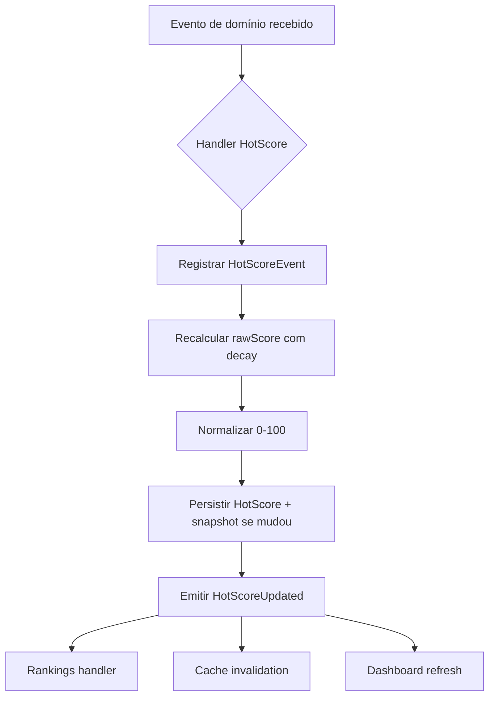
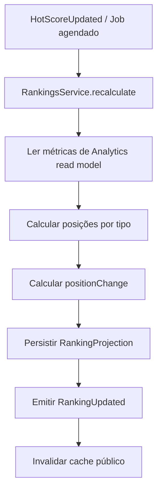
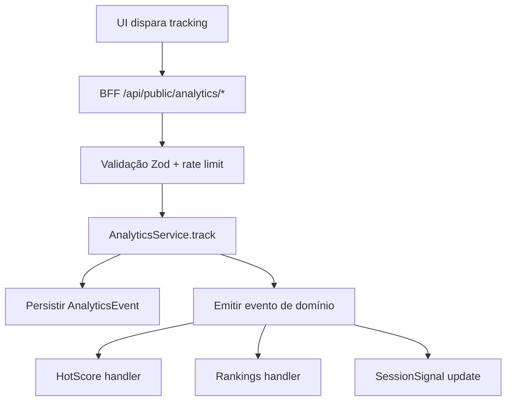
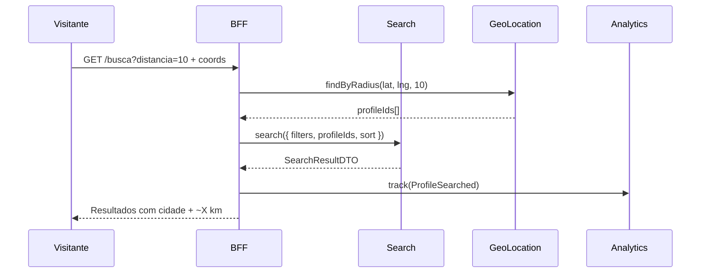
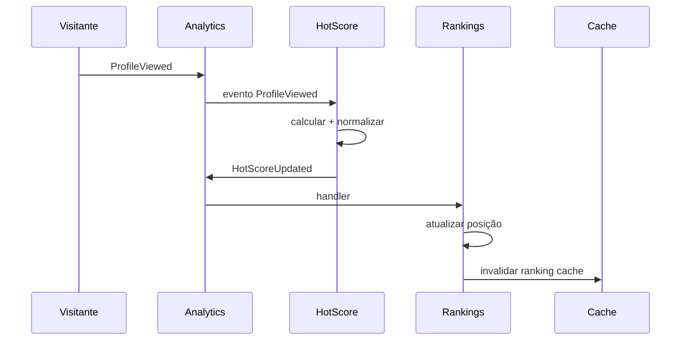

# Documento 5 — Módulos de Engajamento, Inteligência e Descoberta

**Versão:** 1.0.0  
**Status:** Especificação Oficial  
**Última atualização:** 2026-07-08  
**Dependências:**
- [Documento 1 — Arquitetura da Plataforma](../arquitetura/DOCUMENTO-01-ARQUITETURA-DA-PLATAFORMA.md)
- [Documento 2 — Área Pública da Plataforma](./DOCUMENTO-02-AREA-PUBLICA.md)
- [Documento 3 — Área do Acompanhante](./DOCUMENTO-03-AREA-DO-ACOMPANHANTE.md)
- [Documento 4 — Área Administrativa](./DOCUMENTO-04-AREA-ADMINISTRATIVA.md)  
**Escopo:** Especificação dos módulos Hot Score, Rankings, Recomendação, Search, GeoLocation e Analytics

---

## Sumário

1. [Visão Geral e Princípios](#1-visão-geral-e-princípios)
2. [Arquitetura dos Módulos](#2-arquitetura-dos-módulos)
3. [Módulo Hot Score](#3-módulo-hot-score)
4. [Módulo Rankings](#4-módulo-rankings)
5. [Módulo de Recomendação](#5-módulo-de-recomendação)
6. [Módulo de Busca Inteligente (Search)](#6-módulo-de-busca-inteligente-search)
7. [Módulo GeoLocation](#7-módulo-geolocation)
8. [Módulo Analytics](#8-módulo-analytics)
9. [Catálogo Unificado de Eventos](#9-catálogo-unificado-de-eventos)
10. [Interfaces Entre Módulos](#10-interfaces-entre-módulos)
11. [Estratégia de Performance](#11-estratégia-de-performance)
12. [Critérios de Aceitação](#12-critérios-de-aceitação)

---

## 1. Visão Geral e Princípios

### 1.1 Objetivo

A camada de **Engajamento, Inteligência e Descoberta** transforma dados de utilização da plataforma em valor para todas as superfícies:

| Beneficiário | Valor entregue |
|---|---|
| **Visitantes** | Melhor descoberta, busca relevante, recomendações precisas |
| **Acompanhantes** | Métricas de desempenho, visibilidade, insights de engajamento |
| **Administradores** | Inteligência operacional, configuração de regras, rankings globais |

### 1.2 Módulos deste Documento

| Módulo | Pacote | Responsabilidade central |
|---|---|---|
| **Hot Score** | `packages/modules/hot-score/` | Cálculo de popularidade (0–100) |
| **Rankings** | `packages/modules/rankings/` | Listas ranqueadas dinâmicas |
| **Recomendação** | `packages/modules/search/recommendation/` | Perfis semelhantes e sugestões |
| **Search** | `packages/modules/search/` | Busca inteligente e indexação |
| **GeoLocation** | `packages/modules/geo-location/` | Localização, proximidade e privacidade |
| **Analytics** | `packages/modules/analytics/` | Coleta, agregação e relatórios |

> **Nota:** O subdomínio de Recomendação reside dentro do módulo Search (bounded context de descoberta), mas possui interface e lógica independentes, preparados para extração futura.

### 1.3 Princípios Arquiteturais Obrigatórios

| Princípio | Aplicação |
|---|---|
| **Desacoplamento total** | Nenhum módulo importa repositories de outro |
| **Comunicação por eventos** | Atualizações assíncronas via Event Bus |
| **Contratos explícitos** | Toda integração via `interfaces/` públicas |
| **Configuração over code** | Pesos, limites e regras via Settings |
| **Read Models** | Projeções otimizadas para consulta (search index, rankings) |
| **Processamento assíncrono** | Cálculos pesados em filas (BullMQ) |
| **Idempotência** | Handlers de eventos são idempotentes |
| **Preparado para IA** | Interfaces estáveis; implementação evoluível |

### 1.4 Diagrama de Contexto

```
                    ┌─────────────────────────────────────┐
                    │         CAMADA DE APRESENTAÇÃO       │
                    │  Público │ Acompanhante │ Admin      │
                    └──────────────────┬──────────────────┘
                                       │ BFF (leitura/escrita leve)
          ┌────────────────────────────┼────────────────────────────┐
          │                            │                            │
   ┌──────▼──────┐              ┌──────▼──────┐              ┌──────▼──────┐
   │   Search    │◄────────────►│ GeoLocation │              │  Analytics  │
   │ (+ Recom.)  │  coordenadas │             │              │  (coleta)   │
   └──────┬──────┘              └─────────────┘              └──────┬──────┘
          │                                                           │
          │ indexação                                          eventos│
          ▼                                                           ▼
   ┌─────────────┐    HotScoreUpdated    ┌─────────────┐    ┌─────────────┐
   │  Hot Score  │◄──────────────────────│  Rankings   │◄───│  Event Bus  │
   │  (cálculo)  │──────────────────────►│ (projeção)  │    └──────▲──────┘
   └─────────────┘    RankingUpdated     └─────────────┘           │
          ▲                                                        │
          └──────────────── ProfileViewed, WhatsAppClicked, etc. ───┘
```

### 1.5 Schema de Banco (Ownership)

```
PostgreSQL
├── schema: analytics     → Analytics (eventos, agregações)
├── schema: analytics     → HotScore (scores, histórico, ajustes)
├── schema: analytics     → Rankings (projeções de ranking)
└── (Search Index)        → Meilisearch (índice externo, não PostgreSQL)
└── (Geo cache)           → Redis (coordenadas, distâncias cacheadas)

GeoLocation:
├── schema: profiles      → Referência por profileId (coordenadas derivadas de CEP)
```

---

## 2. Arquitetura dos Módulos

### 2.1 Estrutura Interna Padrão (Documento 1)

Cada módulo segue:

```
<module-name>/
├── index.ts                  # API pública
├── module.ts                 # Registro NestJS
├── interfaces/               # Contratos
├── services/                 # Lógica de aplicação
├── repositories/             # Acesso a dados (interno)
├── events/
│   ├── emitters/
│   └── handlers/
├── schemas/                  # Zod
├── types/
├── constants/
├── configs/
└── tests/
```

### 2.2 Padrão de Processamento

| Tipo de operação | Padrão | Exemplo |
|---|---|---|
| Coleta de evento | Síncrono leve → fila | Analytics.track() |
| Cálculo de score | Assíncrono (handler) | HotScore.onProfileViewed() |
| Atualização de ranking | Job agendado + evento | Rankings.recalculate() |
| Busca | Síncrono (índice) | Search.search() |
| Recomendação | Síncrono (cache) | Search.getSimilarProfiles() |
| Geocodificação | Síncrono com cache | GeoLocation.resolveCep() |

### 2.3 Read Models e Projeções

| Read Model | Alimentado por | Consumido por |
|---|---|---|
| `SearchIndex` | Profile*, Tag*, Geo* events | Search |
| `RankingProjection` | HotScoreUpdated, Analytics aggregates | Rankings |
| `ProfileAnalyticsSummary` | Analytics events | Dashboard, Insights |
| `HotScoreSnapshot` | HotScore calculation | HotScore, Rankings, UI |
| `GeoCoordinateCache` | CEP resolution | GeoLocation, Search |

---

## 3. Módulo Hot Score

### 3.1 Responsabilidade

Calcular e manter a **pontuação de popularidade** (0–100) de cada perfil aprovado, representando relevância e engajamento na plataforma.

### 3.2 Entidades

| Entidade | Descrição |
|---|---|
| `HotScore` | Score atual, nível, tendência, última atualização |
| `HotScoreEvent` | Evento individual que contribuiu pontos |
| `HotScoreHistory` | Snapshot diário do score |
| `HotScoreAdjustment` | Ajuste manual do administrador |
| `ScoreFactor` | Contribuição por tipo de evento |

### 3.3 Fontes de Pontuação

| Evento de origem | Chave Settings | Peso padrão | Expiração padrão |
|---|---|---|---|
| Visualização de perfil | `hotscore.weights.profile_view` | +1 | 30 dias |
| Visualização única de perfil | `hotscore.weights.unique_view` | +2 | 30 dias |
| Clique WhatsApp | `hotscore.weights.whatsapp_click` | +3 | 60 dias |
| Comentário aprovado | `hotscore.weights.comment_approved` | +5 | 90 dias |
| Avaliação aprovada (5★) | `hotscore.weights.review_5star` | +8 | 90 dias |
| Avaliação aprovada (4★) | `hotscore.weights.review_4star` | +5 | 90 dias |
| Avaliação aprovada (3★) | `hotscore.weights.review_3star` | +2 | 90 dias |
| Avaliação aprovada (2★) | `hotscore.weights.review_2star` | +0 | 90 dias |
| Avaliação aprovada (1★) | `hotscore.weights.review_1star` | -3 | 90 dias |
| Curtida em momento | `hotscore.weights.moment_like` | +2 | 45 dias |
| Compartilhamento | `hotscore.weights.share` | +10 | 90 dias |
| Visualização de vídeo (≥5s) | `hotscore.weights.video_view` | +1 | 30 dias |
| Interação em momento (view) | `hotscore.weights.moment_view` | +0.5 | 30 dias |
| Aparição em busca + clique | `hotscore.weights.search_click` | +1.5 | 30 dias |
| Perfil Premium (bônus fixo) | `hotscore.weights.premium_bonus` | +5 | — (enquanto ativo) |
| Perfil Destaque (bônus fixo) | `hotscore.weights.featured_bonus` | +3 | — (enquanto ativo) |
| Perfil verificado (bônus fixo) | `hotscore.weights.verified_bonus` | +2 | — (enquanto ativo) |

> Todos os pesos são configuráveis pelo administrador (Documento 4, §3.10).

### 3.4 Fórmula de Cálculo

#### 3.4.1 Score Bruto

```
rawScore = Σ (evento.peso × evento.multiplicador) + Σ ajustes_manuais + bônus_status
```

Onde:
- `evento.peso` = peso configurado para o tipo de evento.
- `evento.multiplicador` = 1.0 (padrão); pode variar por recência (decay).
- `ajustes_manuais` = soma de ajustes ativos (não expirados).
- `bônus_status` = premium + featured + verified (se aplicável).

#### 3.4.2 Normalização (0–100)

```
normalizedScore = min(100, max(0, (rawScore / referenceMax) × 100))
```

| Parâmetro | Chave Settings | Default |
|---|---|---|
| Referência máxima | `hotscore.normalization.reference_max` | 500 |
| Score mínimo | `hotscore.normalization.floor` | 0 |
| Score máximo | `hotscore.normalization.ceiling` | 100 |

A referência máxima é recalibrada periodicamente (job mensal) com base no percentil 95 dos scores brutos da plataforma.

#### 3.4.3 Decay (Expiração de Pontos)

```
decayedWeight = originalWeight × (1 - decayRate) ^ diasDesdeEvento
```

| Configuração | Chave | Default |
|---|---|---|
| Decay global ativo | `hotscore.decay.enabled` | true |
| Taxa diária global | `hotscore.decay.rate` | 0.005 (0.5%/dia) |
| Decay por tipo | `hotscore.decay.by_type.{event}` | Sobrescreve global |
| Remoção após expiração | `hotscore.decay.hard_expire_days` | Remove evento do cálculo |

**Exemplo de expiração por tipo:**

| Tipo | Dias até expiração hard |
|---|---|
| Visualização | 30 |
| Clique WhatsApp | 60 |
| Comentário aprovado | 90 |
| Compartilhamento | 90 |
| Curtida | 45 |

### 3.5 Termômetro Visual

#### 3.5.1 Níveis Padrão

| Faixa | Label padrão | Cor padrão | Ícone |
|---|---|---|---|
| 0–20 | Baixa popularidade | `#64748B` (cinza) | Neutro |
| 21–50 | Popularidade média | `#3B82F6` (azul) | Barra |
| 51–80 | Alta popularidade | `#EA580C` (laranja) | Chama |
| 81–100 | Muito popular | Gradiente `#EA580C` → `#F59E0B` | Fogo |

#### 3.5.2 Configuração Administrável

| Chave Settings | Tipo | Descrição |
|---|---|---|
| `hotscore.levels` | json | Array de `{ min, max, label, color, icon }` |
| `hotscore.display.mode` | string | `thermometer` / `bar` / `flame` / `gauge` |

O módulo Hot Score expõe `level` e `visualConfig` no DTO — a apresentação renderiza conforme Documentos 2 e 3.

### 3.6 Ajuste Manual

| Regra | Descrição |
|---|---|
| RN-HS-001 | Apenas operadores com `hotscore:manage` podem ajustar |
| RN-HS-002 | Motivo obrigatório (mín. 10 caracteres) |
| RN-HS-003 | Ajuste armazenado separado de eventos automáticos |
| RN-HS-004 | Ajuste pode ser positivo ou negativo |
| RN-HS-005 | Ajuste temporário com `expiresAt` opcional |
| RN-HS-006 | Toda alteração gera `HotScoreAdjusted` + Audit |
| RN-HS-007 | Histórico de ajustes consultável por perfil |

**Entidade `HotScoreAdjustment`:**

| Campo | Tipo |
|---|---|
| id | UUID |
| profileId | UUID |
| adjustment | number (+/-) |
| reason | string |
| adjustedBy | UUID (operador) |
| expiresAt | datetime? |
| createdAt | datetime |

### 3.7 Histórico

| Granularidade | Retenção | Uso |
|---|---|---|
| Snapshot diário | 2 anos | Gráficos de evolução |
| Eventos individuais | 90 dias | Debug e fatores de contribuição |
| Ajustes manuais | Permanente | Auditoria |

**DTOs expostos:**

| Método | Escopo | Consumidor |
|---|---|---|
| `getByProfileId(id)` | Público (score + level) | Doc 2 — Card, Perfil |
| `getHistory(id, period)` | Companion (próprio) / Admin (todos) | Doc 3, Doc 4 |
| `getFactors(id)` | Companion (próprio) / Admin (todos) | Doc 3 — Minha Popularidade |
| `getInfluencingEvents(id, limit)` | Admin only | Doc 4 |

### 3.8 Fluxo de Atualização



### 3.9 Regras de Negócio — Hot Score

| ID | Regra |
|---|---|
| RN-HS-010 | Apenas perfis `approved` possuem Hot Score |
| RN-HS-011 | Perfil bloqueado congela score (não recalcula) |
| RN-HS-012 | Visualização deduplicada: 1 por sessão/hora por perfil |
| RN-HS-013 | Recálculo máximo: 1x por perfil a cada 5 minutos (debounce) |
| RN-HS-014 | Job noturno recalcula todos os scores (decay batch) |
| RN-HS-015 | Score nunca exibido com mais de 1 casa decimal |

---

## 4. Módulo Rankings

### 4.1 Responsabilidade

Gerar e servir **listas ranqueadas dinâmicas** de perfis com base em métricas de popularidade, engajamento e tendência.

### 4.2 Entidades

| Entidade | Descrição |
|---|---|
| `Ranking` | Definição de um ranking (tipo, período, filtros) |
| `RankingEntry` | Entrada: posição, perfil, métrica, variação |
| `RankingSnapshot` | Snapshot histórico de um ranking |

### 4.3 Tipos de Ranking Público

| Tipo | ID interno | Métrica principal | Período default |
|---|---|---|---|
| Mais populares | `popularity` | Score composto (views + interactions) | 30 dias |
| Maior Hot Score | `hotscore` | `hotScore DESC` | Atual |
| Mais visualizados | `views` | `profileViews` | 30 dias |
| Melhor avaliados | `rating` | `averageRating DESC` | Atual |
| Mais comentados | `comments` | `approvedComments` | 30 dias |
| Mais curtidos | `likes` | `totalLikes` | 30 dias |
| Mais compartilhados | `shares` | `totalShares` | 30 dias |
| Tendências da semana | `trending` | `scoreDelta7d DESC` | 7 dias |
| Novos destaques | `new_highlights` | Perfis novos com score > threshold | 14 dias |

### 4.4 Rankings Administrativos

| Capacidade | Descrição |
|---|---|
| Ranking geral | Todos os tipos com dados completos |
| Por cidade | Filtro `cityId` |
| Por período | Hoje / 7d / 30d / 90d / custom |
| Comparação de crescimento | `positionChange` vs snapshot anterior |
| Exportação | CSV/JSON (admin only) |

### 4.5 Fórmula de Tendência (Trending)

```
trendingScore = (scoreAtual - score7dAtras) / max(score7dAtras, 1) × 100
```

Perfis com `trendingScore > threshold` (Settings: `rankings.trending.threshold`, default: 20%) entram no ranking de tendências.

### 4.6 Atualização

| Mecanismo | Frequência | Descrição |
|---|---|---|
| Event-driven | Em `HotScoreUpdated` | Atualiza entrada no ranking `hotscore` |
| Job agendado | A cada 15 min | Recalcula rankings compostos |
| Job diário | 00:00 UTC-3 | Snapshot histórico + trending |
| Cache warming | Pós-job | Pré-carrega top 50 de cada tipo |

### 4.7 Fluxo



### 4.8 Regras de Negócio — Rankings

| ID | Regra |
|---|---|
| RN-RK-001 | Apenas perfis `approved` e `isPublic` entram em rankings |
| RN-RK-002 | Mínimo de 3 perfis para exibir ranking (senão ocultar) |
| RN-RK-003 | Empate: desempate por `hotScore`, depois `viewCount`, depois `createdAt` |
| RN-RK-004 | Perfis Premium não recebem boost artificial no ranking (posição orgânica) |
| RN-RK-005 | Posição máxima exibida publicamente: top 100 |
| RN-RK-006 | `positionChange` calculado vs snapshot do período anterior |

---

## 5. Módulo de Recomendação

### 5.1 Responsabilidade

Recomendar perfis relevantes com base em similaridade e comportamento, sem dependência de IA na fase inicial.

### 5.2 Localização Arquitetural

```
packages/modules/search/
├── interfaces/
│   ├── ISearchService.ts
│   └── IRecommendationService.ts    # Contrato dedicado
├── services/
│   ├── SearchService.ts
│   └── RecommendationService.ts     # Implementação desacoplada
└── recommendation/
    ├── similarity.calculator.ts
    ├── weights.config.ts
    └── types/
```

### 5.3 Critérios de Similaridade

| Fator | Peso padrão | Cálculo |
|---|---|---|
| Mesma cidade | 30 | 1.0 se igual, 0 se diferente |
| Proximidade (distância) | 15 | `1 - (distância / maxDistância)` se mesma região |
| Tags em comum | 25 | `tagsComuns / max(tagsA, tagsB)` |
| Faixa de idade | 15 | `1 - (|idadeA - idadeB| / 10)`, mín. 0 |
| Preferência sexual | 10 | 1.0 se igual, 0.5 se compatível, 0 se diferente |
| Posição | 5 | 1.0 se igual, 0.5 se versátil envolvido |
| Hot Score próximo | 10 | `1 - (|scoreA - scoreB| / 100)` |
| Avaliação similar | 10 | `1 - (|médiaA - médiaB| / 5)` |
| Engajamento similar | 5 | Comparar percentil de engajamento |

**Fórmula:**

```
similarityScore = Σ (fator.normalizado × fator.peso) / Σ pesos × 100
```

Pesos configuráveis via `search.recommendation.weights.*` (Settings).

### 5.4 Histórico de Navegação (Opcional)

Quando visitante possui `sessionId` com histórico:

| Sinal | Peso adicional |
|---|---|
| Perfil visualizado na sessão | +10 se similar |
| Tags buscadas na sessão | +15 se match |
| Cidade buscada na sessão | +20 se match |

Dados consumidos via `IAnalyticsService.getSessionSignals(sessionId)` — **sem acesso direto ao módulo Analytics internamente**.

### 5.5 Regras de Recomendação

| ID | Regra |
|---|---|
| RN-REC-001 | Excluir o próprio perfil e perfis não aprovados |
| RN-REC-002 | Mínimo 4 resultados para retornar (senão array vazio) |
| RN-REC-003 | Máximo 8 recomendações por request |
| RN-REC-004 | Cache de 15 minutos por `profileId` |
| RN-REC-005 | Interface `IRecommendationService` estável para futura troca por ML |
| RN-REC-006 | Implementação ML futura: mesmo contrato, novo provider |

### 5.6 Evolução para IA (Preparação)

| Fase | Implementação |
|---|---|
| **Fase 1 (atual)** | Regras + pesos configuráveis |
| **Fase 2** | Collaborative filtering (matriz perfil × comportamento) |
| **Fase 3** | Modelo ML externo via API (interface inalterada) |

```
IRecommendationService
├── RuleBasedRecommendationProvider   ← Fase 1
├── CollaborativeFilteringProvider    ← Fase 2
└── MLRecommendationProvider            ← Fase 3
```

### 5.7 Interface Pública

```typescript
interface IRecommendationService {
  getSimilarProfiles(profileId: string, options?: RecommendationOptions): Promise<SimilarProfileDTO[]>;
  getForVisitor(sessionId: string, options?: RecommendationOptions): Promise<SimilarProfileDTO[]>;
}

interface RecommendationOptions {
  limit?: number;          // default: 8
  excludeIds?: string[];
  visitorCoords?: CoordinatesDTO;
}
```

---

## 6. Módulo de Busca Inteligente (Search)

### 6.1 Responsabilidade

Indexar perfis e fornecer **busca avançada** por texto, filtros, ordenação e relevância.

### 6.2 Motor de Busca

| Aspecto | Decisão |
|---|---|
| Engine | Meilisearch (primário) |
| Índice | `profiles` |
| Atualização | Event-driven + job de reconciliação diária |
| Fallback | PostgreSQL full-text (se Meilisearch indisponível) |

### 6.3 Documento de Índice (SearchIndex)

| Campo | Tipo | Indexado | Filtro | Ordenável |
|---|---|---|---|---|
| id | string | — | ✅ | — |
| slug | string | ✅ | — | — |
| displayName | string | ✅ | — | — |
| bio | string | ✅ | — | — |
| city | string | ✅ | ✅ | — |
| state | string | ✅ | ✅ | — |
| latitude | float | — | ✅ (geo) | — |
| longitude | float | — | ✅ (geo) | — |
| age | int | — | ✅ | ✅ |
| tags | string[] | ✅ | ✅ | — |
| sexualPreference | string | — | ✅ | — |
| position | string | — | ✅ | — |
| isPremium | bool | — | ✅ | ✅ |
| isFeatured | bool | — | ✅ | ✅ |
| isVerified | bool | — | ✅ | — |
| hasVideos | bool | — | ✅ | — |
| hasMoments | bool | — | ✅ | — |
| averageRating | float | — | ✅ | ✅ |
| hotScore | float | — | ✅ | ✅ |
| viewCount | int | — | — | ✅ |
| createdAt | datetime | — | — | ✅ |
| status | string | — | ✅ | — |

### 6.4 Busca por Texto

Suporta consultas em linguagem natural parcial:

| Consulta exemplo | Interpretação |
|---|---|
| `"ativo tatuado"` | Texto: "ativo" AND "tatuado" em bio, tags, características |
| `"versátil zona sul"` | Filtro posição=versátil + texto "zona sul" em bio/cidade |
| `"perfil verificado"` | Filtro `isVerified=true` |
| `"são paulo premium"` | Filtro cidade + `isPremium=true` |

**Pipeline:**

```
query → tokenizer → spell correction (opcional) → Meilisearch → pós-filtros → ranking
```

### 6.5 Filtros

| Filtro | Param | Tipo | Módulo auxiliar |
|---|---|---|---|
| Texto livre | `q` | string | — |
| Cidade | `cidade` | string | GeoLocation |
| Distância | `distancia` | 2/5/10/20/50 km | GeoLocation |
| Idade mín/máx | `idade_min`, `idade_max` | int | — |
| Tags | `tags[]` | string[] | Tags (IDs) |
| Preferência sexual | `preferencia` | string | — |
| Posição | `posicao` | ativo/passivo/versátil | — |
| Premium | `premium` | bool | — |
| Destaque | `destaque` | bool | — |
| Verificado | `verificado` | bool | — |
| Possui vídeos | `videos` | bool | — |
| Possui momentos | `momentos` | bool | — |
| Avaliação mínima | `avaliacao_min` | 1–5 | — |
| Hot Score mín/máx | `hotscore_min`, `hotscore_max` | 0–100 | HotScore |

### 6.6 Ordenação

| Opção | Param | Algoritmo |
|---|---|---|
| Relevância | `relevancia` | Meilisearch ranking + boost configurável |
| Popularidade | `populares` | `popularityScore DESC` |
| Distância | `distancia` | `geoDistance ASC` (requer coords visitante) |
| Avaliação | `avaliacao` | `averageRating DESC` |
| Mais recentes | `recentes` | `createdAt DESC` |
| Mais visualizados | `visualizacoes` | `viewCount DESC` |
| Maior Hot Score | `hotscore` | `hotScore DESC` |
| Premium primeiro | `premium` | `isPremium DESC, relevancia` |

#### Boost de Relevância (configurável)

| Fator | Boost padrão |
|---|---|
| Premium | +15% |
| Destaque | +10% |
| Verificado | +5% |
| Hot Score > 75 | +10% |

Chave: `search.ranking.boosts.*`

### 6.7 Fórmula de Relevância Composta

```
relevanceScore = textScore × (1 + premiumBoost + featuredBoost + verifiedBoost + hotScoreBoost)
```

### 6.8 Indexação — Eventos que Atualizam o Índice

| Evento | Campos atualizados |
|---|---|
| `ProfileCreated` | Documento completo |
| `ProfileUpdated` | Campos alterados |
| `ProfileApproved` | `status` → indexável |
| `ProfileBlocked` | Remover do índice |
| `ProfileDeleted` | Remover do índice |
| `TagUpdated` (no perfil) | `tags` |
| `HotScoreUpdated` | `hotScore` |
| `ReviewApproved` | `averageRating` |
| `VideoApproved` | `hasVideos` |
| `MomentPublished` | `hasMoments` |

### 6.9 Regras de Negócio — Search

| ID | Regra |
|---|---|
| RN-SRCH-001 | Apenas perfis `approved` + `isPublic` indexados |
| RN-SRCH-002 | Idade mínima 18 forçada em toda busca |
| RN-SRCH-003 | Paginação cursor-based; máx. 24 por página |
| RN-SRCH-004 | Autocomplete: mín. 2 caracteres; máx. 10 sugestões |
| RN-SRCH-005 | Busca com geo requer coordenadas do visitante |
| RN-SRCH-006 | Latência máxima: 200ms (p95) com cache |

---

## 7. Módulo GeoLocation

### 7.1 Responsabilidade

Gerenciar dados de localização com **privacidade rigorosa** — geocodificação, proximidade e exibição segura.

### 7.2 Entidades

| Entidade | Descrição |
|---|---|
| `Location` | Cidade, estado, CEP, coordenadas (lat/lng) |
| `GeoCoordinate` | Par lat/lng com precisão reduzida para exibição |
| `DistanceResult` | Distância calculada + label para UI |

### 7.3 Dados por Ator

#### Acompanhante (persistido)

| Campo | Armazenado | Exposto publicamente |
|---|---|---|
| CEP | ✅ | ❌ |
| Cidade | ✅ | ✅ |
| Estado | ✅ | ✅ |
| Coordenadas (lat/lng) | ✅ (derivadas do CEP) | ❌ |
| Endereço | ❌ (nunca coletado) | ❌ |

#### Visitante (sessão apenas)

| Campo | Armazenado | Persistido |
|---|---|---|
| Coordenadas (browser) | Redis session | ❌ (não persistido) |
| CEP informado | Redis session | ❌ |

### 7.4 Geocodificação

| Fluxo | Descrição |
|---|---|
| CEP → Coordenadas | API externa (ViaCEP + Nominatim ou serviço dedicado) |
| Cache | Redis, TTL 30 dias por CEP |
| Precisão | Coordenadas do centroide da área do CEP (não endereço) |
| Fallback | Cidade → coordenadas aproximadas do centro urbano |

### 7.5 Cálculo de Distância

```
distância = haversine(lat1, lng1, lat2, lng2)
```

| Raio | Uso |
|---|---|
| 2 km | Filtro "Muito perto" |
| 5 km | Filtro "Perto" |
| 10 km | Filtro "Próximo" |
| 20 km | Filtro "Na região" |
| 50 km | Filtro "Amplio" |

### 7.6 Privacidade — Regras Absolutas

| ID | Regra |
|---|---|
| RN-GEO-001 | Endereço exato **nunca** coletado nem exibido |
| RN-GEO-002 | Coordenadas do acompanhante **nunca** expostas ao frontend |
| RN-GEO-003 | Visitante vê: cidade + "~X km de você" |
| RN-GEO-004 | Distância arredondada: `< 1km` → "~1 km"; senão arredondar para inteiro |
| RN-GEO-005 | Coordenadas do visitante apenas em session Redis (TTL 1h) |
| RN-GEO-006 | Sem geolocalização: fallback para busca por CEP/cidade sem distância |
| RN-GEO-007 | Coordenadas armazenadas com precisão reduzida (3 casas decimais ≈ 100m) |

### 7.7 Interface Pública

```typescript
interface IGeoLocationService {
  resolveCep(cep: string): Promise<LocationDTO>;
  getByProfileId(profileId: string): Promise<LocationPublicDTO>;
  findByRadius(lat: number, lng: number, radiusKm: number): Promise<string[]>;
  calculateDistance(from: CoordinatesDTO, to: CoordinatesDTO): Promise<DistanceResultDTO>;
  formatDistanceLabel(distanceKm: number): string;
}
```

`LocationPublicDTO` expõe **apenas** `{ city, state }` — nunca coordenadas.

---

## 8. Módulo Analytics

### 8.1 Responsabilidade

Coletar, armazenar e agregar **eventos comportamentais** da plataforma para métricas, insights e alimentação dos demais módulos.

### 8.2 Entidades

| Entidade | Descrição |
|---|---|
| `AnalyticsEvent` | Evento bruto de tracking |
| `AnalyticsAggregate` | Agregação por perfil/período |
| `SessionSignal` | Sinais de navegação por sessão |
| `FunnelStep` | Etapa de funil de conversão |

### 8.3 Eventos Coletados

| Evento | Trigger | Payload mínimo |
|---|---|---|
| `SiteVisited` | Primeiro acesso da sessão | sessionId, referrer, landingPage |
| `ProfileViewed` | Abertura de perfil | profileId, sessionId, source |
| `ProfileSearched` | Submissão de busca | query, filters, resultCount |
| `FilterApplied` | Alteração de filtro | filterName, filterValue |
| `CardClicked` | Clique em card | profileId, position, section |
| `WhatsAppClicked` | Clique WhatsApp | profileId, sessionId |
| `PhotoViewed` | Visualização de foto | profileId, photoId, photoIndex |
| `VideoViewed` | Vídeo ≥ 5s | profileId, videoId, duration |
| `MomentViewed` | Visualização de momento | momentId, profileId |
| `MomentLiked` | Curtida | momentId, profileId |
| `CommentSubmitted` | Envio de comentário | targetType, targetId |
| `ShareCreated` | Compartilhamento | contentType, contentId, channel |
| `DwellTime` | Saída de página | pageType, durationSeconds |

### 8.4 Pipeline de Coleta



### 8.5 Deduplicação

| Evento | Regra de deduplicação |
|---|---|
| ProfileViewed | 1 por sessionId + profileId a cada 1h |
| PhotoViewed | 1 por sessionId + photoId a cada 30min |
| VideoViewed | 1 por sessionId + videoId a cada 24h |
| WhatsAppClicked | Sem deduplicação (cada clique conta) |
| CardClicked | Sem deduplicação |

### 8.6 Analytics do Acompanhante

Via `IAnalyticsService.getProfileInsights(profileId, period)`:

| Métrica | Granularidade |
|---|---|
| Visualizações totais | Diária |
| Crescimento (%) | vs período anterior |
| Origem dos acessos | busca / direto / recomendação / ranking |
| Conteúdos mais acessados | fotos, vídeos, momentos |
| Horários de pico | Heatmap dia × hora |
| Cliques WhatsApp | Diária |
| Aparições em buscas | Contagem |

Escopo: **apenas dados do próprio perfil** (enforced no service).

### 8.7 Analytics Administrativo

Via `IAnalyticsService.getAdminAnalytics(period, filters)`:

| Métrica | Visualização |
|---|---|
| Usuários ativos (DAU/WAU/MAU) | Gráfico |
| Crescimento de cadastros | Gráfico |
| Visualizações totais | MetricCard |
| Pesquisas realizadas | Contagem + top termos |
| Filtros mais utilizados | Ranking |
| Cidades mais acessadas | Tabela/mapa |
| Tags mais buscadas | Ranking |
| Perfis mais acessados | Top 20 |
| Vídeos mais vistos | Top 20 |
| Momentos mais engajados | Top 20 |
| Funil de conversão | card view → profile view → WhatsApp click |

### 8.8 Retenção e Agregação

| Dado | Retenção bruta | Agregação |
|---|---|---|
| Eventos individuais | 90 dias | → diário após 7 dias |
| Agregações diárias | 2 anos | — |
| Agregações mensais | Permanente | — |
| Session signals | 24 horas | — |

### 8.9 Regras de Negócio — Analytics

| ID | Regra |
|---|---|
| RN-ANA-001 | Coleta respeita consentimento LGPD (cookie banner) |
| RN-ANA-002 | IP armazenado parcialmente mascarado |
| RN-ANA-003 | Sem PII de visitantes vinculada a eventos |
| RN-ANA-004 | Companion vê apenas métricas do próprio perfil |
| RN-ANA-005 | Admin vê dados agregados (nunca evento bruto de visitante individual) |
| RN-ANA-006 | Rate limit: 100 events/session/hora |

---

## 9. Catálogo Unificado de Eventos

### 9.1 Eventos de Entrada (disparam processamento)

| Evento | Produtor | Consumidores |
|---|---|---|
| `ProfileViewed` | Analytics | HotScore, Rankings, Analytics (dedupe) |
| `ProfileSearched` | Analytics | Analytics, Search (log) |
| `WhatsAppClicked` | Analytics | HotScore, Analytics |
| `VideoViewed` | Analytics | HotScore, Analytics |
| `MomentLiked` | Moments | HotScore, Analytics |
| `MomentViewed` | Analytics | HotScore, Analytics |
| `CommentApproved` | Moderation | HotScore, Rankings |
| `ReviewApproved` | Moderation | HotScore, Rankings, Search (reindex) |
| `ShareCreated` | Analytics | HotScore, Analytics |
| `CardClicked` | Analytics | Analytics |
| `FilterApplied` | Analytics | Analytics |
| `DwellTime` | Analytics | Analytics |

### 9.2 Eventos de Saída (gerados pelos módulos)

| Evento | Produtor | Consumidores |
|---|---|---|
| `HotScoreUpdated` | HotScore | Rankings, Cache, Dashboard, Search (reindex) |
| `HotScoreAdjusted` | HotScore | Rankings, Audit, Cache |
| `RankingUpdated` | Rankings | Cache, Dashboard |
| `SearchIndexUpdated` | Search | — (interno) |
| `RecommendationGenerated` | Search/Recommendation | Analytics (log opcional) |

### 9.3 Anatomia Padrão (Documento 1)

Todo evento segue:

```typescript
interface DomainEvent<T> {
  id: string;
  name: string;
  version: number;
  source: string;
  occurredAt: string;
  actorId: string | null;
  correlationId: string;
  payload: T;
}
```

---

## 10. Interfaces Entre Módulos

### 10.1 Matriz de Dependências

```
Analytics ──(emite eventos)──► HotScore
Analytics ──(emite eventos)──► Rankings (via agregações)
HotScore ──(emite eventos)──► Rankings
HotScore ──(leitura Settings)──► Settings
Search ──(leitura GeoLocation)──► GeoLocation (interface)
Search ──(leitura HotScore)──► HotScore (interface, para filtros)
Search ──(indexação via eventos)──► Profiles, Tags (eventos, não import)
Rankings ──(leitura Analytics)──► Analytics (interface, read model)
Recommendation ──(leitura Analytics)──► Analytics (interface, session signals)
GeoLocation ──(sem dependência upstream)
```

> **Proibido:** HotScore importar Analytics repository; Search importar Profiles repository.

### 10.2 Contratos Públicos

#### IHotScoreService

```typescript
interface IHotScoreService {
  getByProfileId(profileId: string): Promise<HotScoreDTO | null>;
  getHistory(profileId: string, period: Period): Promise<HotScoreHistoryDTO>;
  getFactors(profileId: string): Promise<ScoreFactorDTO[]>;
  adjust(profileId: string, adjustment: AdjustInput, actorId: string): Promise<HotScoreDTO>;
  getWeights(): Promise<WeightConfigDTO>;
  updateWeights(weights: WeightConfigDTO, actorId: string): Promise<void>;
  recalculate(profileId: string): Promise<HotScoreDTO>;
  recalculateAll(): Promise<{ processed: number }>;
}
```

#### IRankingsService

```typescript
interface IRankingsService {
  getRanking(type: RankingType, filters?: RankingFilters): Promise<RankingDTO>;
  getFeatured(limit: number): Promise<RankingEntryDTO[]>;
  getTrending(limit: number): Promise<RankingEntryDTO[]>;
  getPosition(profileId: string, type: RankingType): Promise<number | null>;
  recalculate(type?: RankingType): Promise<void>;
}
```

#### ISearchService

```typescript
interface ISearchService {
  search(query: SearchQuery): Promise<SearchResultDTO>;
  autocomplete(term: string): Promise<AutocompleteDTO[]>;
  reindexProfile(profileId: string): Promise<void>;
  reindexAll(): Promise<{ indexed: number }>;
}
```

#### IRecommendationService

```typescript
interface IRecommendationService {
  getSimilarProfiles(profileId: string, options?: RecommendationOptions): Promise<SimilarProfileDTO[]>;
  getForVisitor(sessionId: string, options?: RecommendationOptions): Promise<SimilarProfileDTO[]>;
}
```

#### IGeoLocationService

```typescript
interface IGeoLocationService {
  resolveCep(cep: string): Promise<LocationDTO>;
  getByProfileId(profileId: string): Promise<LocationPublicDTO>;
  findByRadius(lat: number, lng: number, radiusKm: number): Promise<string[]>;
  calculateDistance(from: CoordinatesDTO, to: CoordinatesDTO): Promise<DistanceResultDTO>;
}
```

#### IAnalyticsService

```typescript
interface IAnalyticsService {
  track(event: TrackEventInput): Promise<void>;
  getProfileInsights(profileId: string, period: Period): Promise<ProfileInsightsDTO>;
  getAdminAnalytics(period: Period, filters?: AnalyticsFilters): Promise<AdminAnalyticsDTO>;
  getSessionSignals(sessionId: string): Promise<SessionSignalDTO>;
  getRealtimeCount(): Promise<RealtimeCountDTO>;
}
```

### 10.3 Fluxo Integrado — Busca com Proximidade



### 10.4 Fluxo Integrado — Visualização → Score → Ranking



---

## 11. Estratégia de Performance

### 11.1 Cache

| Dado | Camada | TTL | Invalidação |
|---|---|---|---|
| Hot Score atual | Redis | 2 min | `HotScoreUpdated` |
| Ranking top 50 | Redis | 5 min | `RankingUpdated` |
| Search results | — | Sem cache | — |
| Similar profiles | Redis | 15 min | `ProfileUpdated` |
| Autocomplete | Redis | 1 min | `SearchIndexUpdated` |
| GeoCoordinates (CEP) | Redis | 30 dias | Manual |
| Admin analytics | Redis | 10 min | Job agendado |
| Profile insights | Redis | 5 min | Eventos do perfil |

### 11.2 Processamento Assíncrono

| Job | Fila | Frequência |
|---|---|---|
| `hotscore.recalculate` | BullMQ | On-event (debounced) + noturno |
| `hotscore.decay.batch` | BullMQ | Diário 03:00 |
| `rankings.recalculate` | BullMQ | A cada 15 min |
| `rankings.snapshot` | BullMQ | Diário 00:00 |
| `search.reindex` | BullMQ | On-event + reconciliação diária |
| `analytics.aggregate` | BullMQ | A cada 1h |
| `analytics.cleanup` | BullMQ | Diário (retenção) |

### 11.3 Índices e Otimização

| Módulo | Índice / Otimização |
|---|---|
| HotScore | `(profile_id)`, `(updated_at)` |
| HotScoreHistory | `(profile_id, date)` UNIQUE |
| Rankings | `(type, period, position)` |
| Analytics | `(profile_id, occurred_at)`, `(event_name, occurred_at)` |
| GeoLocation | `(cep)` UNIQUE, `(city, state)` |
| Search | Meilisearch attributes + filterable fields |

### 11.4 Metas de Latência

| Operação | p95 |
|---|---|
| Search.query | < 200ms |
| Recommendation.getSimilar | < 150ms |
| HotScore.getByProfileId | < 50ms |
| Rankings.getRanking | < 100ms |
| Analytics.track | < 30ms (async persist) |
| GeoLocation.findByRadius | < 100ms |

---

## 12. Critérios de Aceitação

### 12.1 Hot Score

| ID | Critério | Prioridade |
|---|---|---|
| CA-HS-01 | Score calculado de 0 a 100 para perfis aprovados | Must |
| CA-HS-02 | Todos os 16 tipos de evento com peso configurável | Must |
| CA-HS-03 | Decay/expiração configurável por tipo | Must |
| CA-HS-04 | Ajuste manual separado com auditoria e motivo | Must |
| CA-HS-05 | Histórico diário com gráfico de evolução | Must |
| CA-HS-06 | Termômetro visual com níveis configuráveis | Must |
| CA-HS-07 | `HotScoreUpdated` emitido a cada recálculo | Must |
| CA-HS-08 | Debounce de recálculo (5 min) | Should |
| CA-HS-09 | Companion vê apenas próprio score; admin vê todos | Must |

### 12.2 Rankings

| ID | Critério | Prioridade |
|---|---|---|
| CA-RK-01 | 9 tipos de ranking público funcionais | Must |
| CA-RK-02 | Filtro por cidade e período (admin) | Must |
| CA-RK-03 | `positionChange` exibido corretamente | Must |
| CA-RK-04 | Job de atualização a cada 15 min | Must |
| CA-RK-05 | `RankingUpdated` emitido após recálculo | Must |
| CA-RK-06 | Mínimo 3 perfis para exibir ranking | Must |

### 12.3 Recomendação

| ID | Critério | Prioridade |
|---|---|---|
| CA-REC-01 | Perfis semelhantes com 9 fatores de similaridade | Must |
| CA-REC-02 | Pesos configuráveis via Settings | Must |
| CA-REC-03 | Interface estável para futura troca por ML | Must |
| CA-REC-04 | Mínimo 4 / máximo 8 resultados | Must |
| CA-REC-05 | Cache de 15 minutos | Should |
| CA-REC-06 | Exclui perfil atual e não aprovados | Must |

### 12.4 Search

| ID | Critério | Prioridade |
|---|---|---|
| CA-SR-01 | Busca por texto com interpretação multi-termo | Must |
| CA-SR-02 | 14 filtros funcionais | Must |
| CA-SR-03 | 8 opções de ordenação | Must |
| CA-SR-04 | Indexação event-driven | Must |
| CA-SR-05 | Autocomplete com mín. 2 caracteres | Must |
| CA-SR-06 | Paginação cursor-based (24/página) | Must |
| CA-SR-07 | Latência p95 < 200ms | Must |
| CA-SR-08 | Fallback PostgreSQL se Meilisearch down | Should |

### 12.5 GeoLocation

| ID | Critério | Prioridade |
|---|---|---|
| CA-GEO-01 | CEP → coordenadas com cache | Must |
| CA-GEO-02 | Busca por raio (2/5/10/20/50 km) | Must |
| CA-GEO-03 | Coordenadas nunca expostas ao frontend | Must |
| CA-GEO-04 | Distância exibida arredondada (~X km) | Must |
| CA-GEO-05 | Coordenadas de visitante apenas em session | Must |

### 12.6 Analytics

| ID | Critério | Prioridade |
|---|---|---|
| CA-ANA-01 | 13 tipos de eventos coletados | Must |
| CA-ANA-02 | Deduplicação conforme regras | Must |
| CA-ANA-03 | Insights do acompanhante (escopo próprio) | Must |
| CA-ANA-04 | Analytics administrativo com 11 métricas | Must |
| CA-ANA-05 | Consentimento LGPD respeitado | Must |
| CA-ANA-06 | IP mascarado nos logs | Must |
| CA-ANA-07 | Agregação horária via job | Must |

### 12.7 Arquitetura

| ID | Critério | Prioridade |
|---|---|---|
| CA-ARQ-01 | Zero acesso cross-module a repositories | Must |
| CA-ARQ-02 | Comunicação entre módulos via eventos e interfaces | Must |
| CA-ARQ-03 | Pesos e regras via Settings (não hardcoded) | Must |
| CA-ARQ-04 | Handlers de eventos idempotentes | Must |
| CA-ARQ-05 | Processamento pesado em filas BullMQ | Must |
| CA-ARQ-06 | Read models atualizados por eventos | Must |

---

## Apêndice A — Configurações (Settings) Consolidadas

| Chave | Tipo | Default | Módulo |
|---|---|---|---|
| `hotscore.weights.*` | json | Ver §3.3 | HotScore |
| `hotscore.decay.enabled` | boolean | true | HotScore |
| `hotscore.decay.rate` | number | 0.005 | HotScore |
| `hotscore.decay.by_type.*` | json | Ver §3.4.3 | HotScore |
| `hotscore.decay.hard_expire_days.*` | json | Ver §3.4.3 | HotScore |
| `hotscore.normalization.reference_max` | number | 500 | HotScore |
| `hotscore.levels` | json | Ver §3.5.1 | HotScore |
| `hotscore.display.mode` | string | `gauge` | HotScore |
| `rankings.trending.threshold` | number | 20 | Rankings |
| `rankings.recalculate_interval_min` | number | 15 | Rankings |
| `search.recommendation.weights.*` | json | Ver §5.3 | Recommendation |
| `search.ranking.boosts.*` | json | Ver §6.6 | Search |
| `search.page_size` | number | 24 | Search |
| `search.autocomplete.min_chars` | number | 2 | Search |
| `geo.cache.ttl_days` | number | 30 | GeoLocation |
| `geo.distance.rounding` | string | `integer` | GeoLocation |
| `analytics.retention.raw_days` | number | 90 | Analytics |
| `analytics.retention.aggregate_days` | number | 730 | Analytics |
| `analytics.rate_limit.session_hour` | number | 100 | Analytics |

---

## Apêndice B — DTOs Principais

| DTO | Módulo | Campos principais |
|---|---|---|
| `HotScoreDTO` | HotScore | score, level, trend, trendPercentage, visualConfig |
| `HotScoreHistoryDTO` | HotScore | points[{ date, score, delta }] |
| `ScoreFactorDTO` | HotScore | eventType, weight, contribution, count |
| `HotScoreAdjustmentDTO` | HotScore | adjustment, reason, adjustedBy, expiresAt |
| `WeightConfigDTO` | HotScore | weights[{ event, value, expirationDays }] |
| `RankingDTO` | Rankings | type, period, entries[], total |
| `RankingEntryDTO` | Rankings | position, positionChange, profile, metricValue |
| `SearchQuery` | Search | q, filters, sort, cursor, geoCoords |
| `SearchResultDTO` | Search | profiles[], total, cursor, hasMore |
| `SimilarProfileDTO` | Recommendation | profile, similarityScore |
| `LocationDTO` | GeoLocation | cep, city, state, lat, lng (interno) |
| `LocationPublicDTO` | GeoLocation | city, state |
| `DistanceResultDTO` | GeoLocation | distanceKm, label |
| `ProfileInsightsDTO` | Analytics | views, growth, sources, topContent, peakHours |
| `AdminAnalyticsDTO` | Analytics | dau, wau, mau, topSearches, topCities, topTags |
| `SessionSignalDTO` | Analytics | viewedProfiles[], searchedTags[], searchedCity |

---

## Apêndice C — Referências Cruzadas

| Documento | Relação |
|---|---|
| [Documento 1 — Arquitetura](../arquitetura/DOCUMENTO-01-ARQUITETURA-DA-PLATAFORMA.md) | Base arquitetural e Event Bus |
| [Documento 2 — Área Pública](./DOCUMENTO-02-AREA-PUBLICA.md) | Consumidor: busca, rankings, similar, Hot Score no card |
| [Documento 3 — Área do Acompanhante](./DOCUMENTO-03-AREA-DO-ACOMPANHANTE.md) | Consumidor: dashboard, insights, popularidade |
| [Documento 4 — Área Administrativa](./DOCUMENTO-04-AREA-ADMINISTRATIVA.md) | Consumidor: config Hot Score, analytics, rankings, ajustes |

### Mapa de Consumo por Superfície

| Funcionalidade | Doc 2 (Público) | Doc 3 (Companion) | Doc 4 (Admin) |
|---|---|---|---|
| Hot Score | Card + perfil | Minha Popularidade | Config + ajuste |
| Rankings | `/rankings` | Dashboard (posição) | Rankings admin |
| Recomendação | Perfis semelhantes | — | — |
| Search | `/busca` | — | — |
| GeoLocation | Proximidade | CEP no cadastro | Filtro por cidade |
| Analytics | Tracking (via BFF) | Insights | Analytics admin |

---

> **Este documento é a especificação oficial dos módulos de Engajamento, Inteligência e Descoberta.**  
> Toda implementação de Hot Score, Rankings, Search, GeoLocation e Analytics deve seguir estas definições.  
> Desvios exigem atualização formal deste documento e validação contra o Documento 1.
