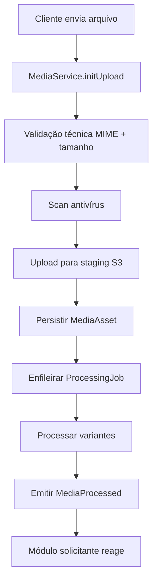
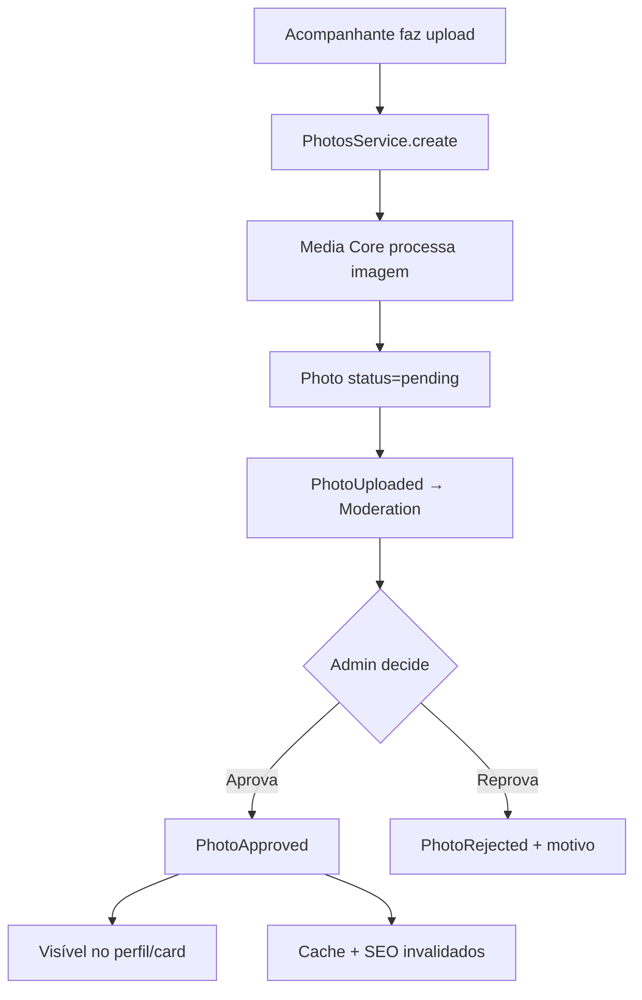
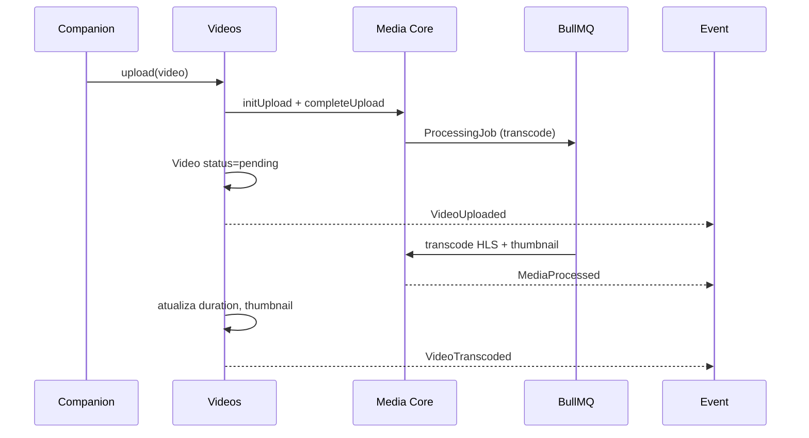
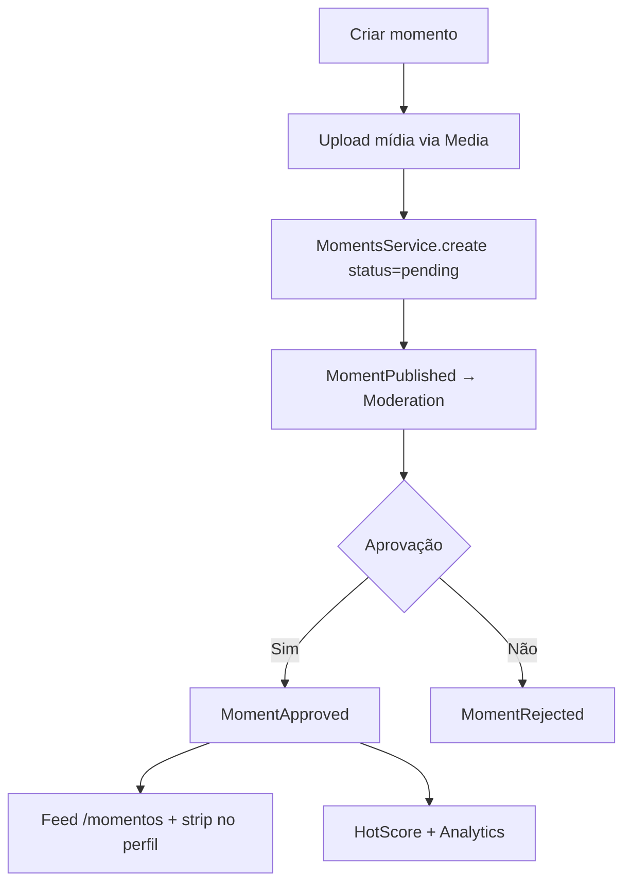
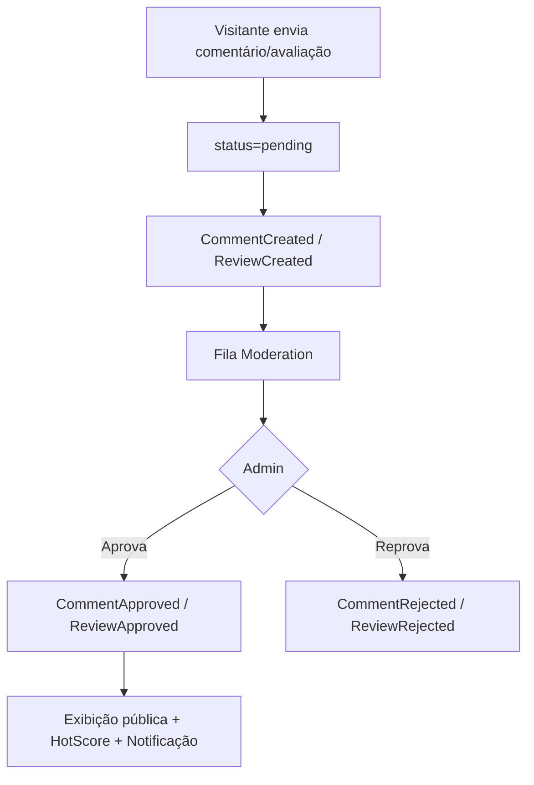
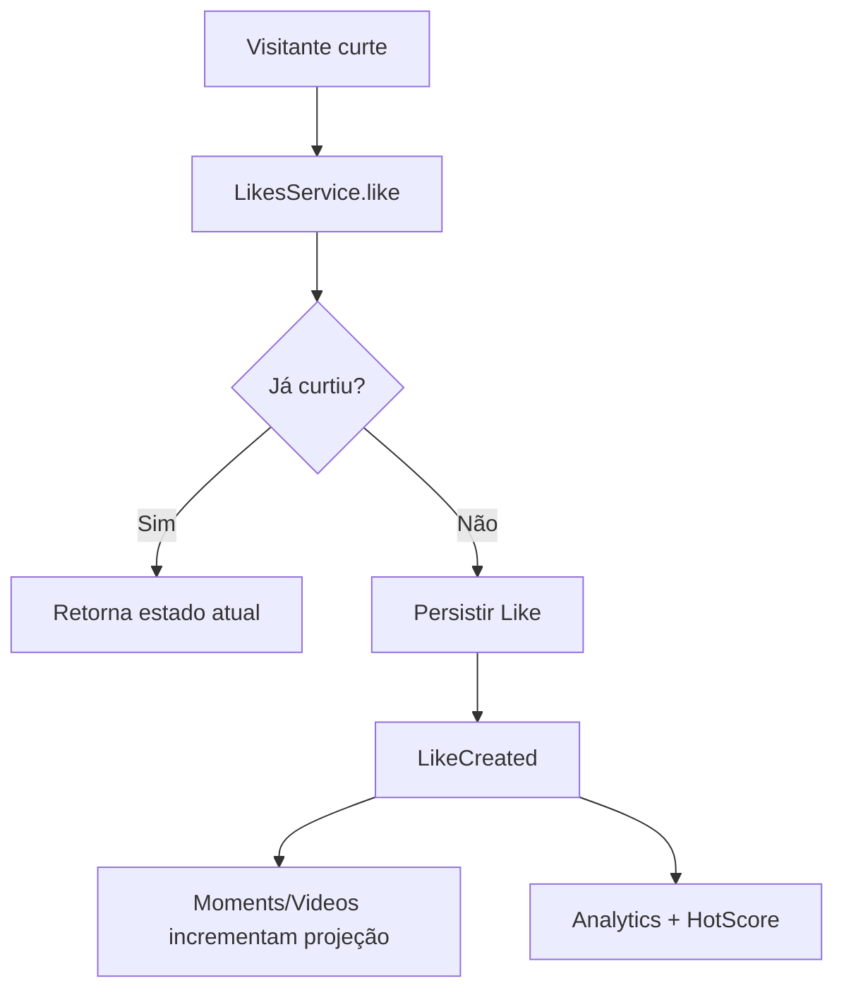
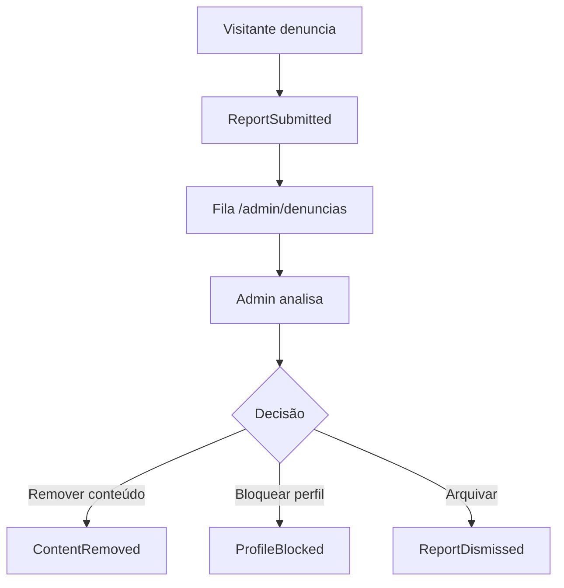
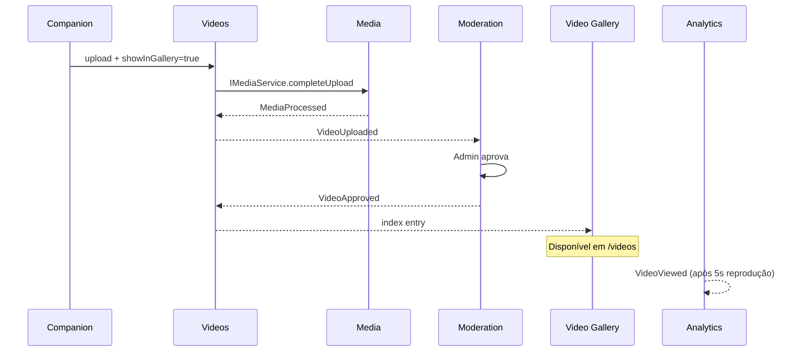

# Documento 6 — Conteúdo, Mídia e Interações

**Versão:** 1.0.0  
**Status:** Especificação Oficial  
**Última atualização:** 2026-07-09  
**Dependências:**
- [Documento 1 — Arquitetura da Plataforma](../arquitetura/DOCUMENTO-01-ARQUITETURA-DA-PLATAFORMA.md)
- [Documento 2 — Área Pública da Plataforma](./DOCUMENTO-02-AREA-PUBLICA.md)
- [Documento 3 — Área do Acompanhante](./DOCUMENTO-03-AREA-DO-ACOMPANHANTE.md)
- [Documento 4 — Área Administrativa](./DOCUMENTO-04-AREA-ADMINISTRATIVA.md)
- [Documento 5 — Módulos de Engajamento, Inteligência e Descoberta](./DOCUMENTO-05-MODULOS-ENGAJAMENTO-INTELIGENCIA-DESCOBERTA.md)  
**Escopo:** Módulos de mídia, conteúdo publicado e interações (fotos, vídeos, momentos, comentários, curtidas, compartilhamentos, moderação)

---

## Sumário

1. [Visão Geral e Princípios](#1-visão-geral-e-princípios)
2. [Arquitetura dos Módulos](#2-arquitetura-dos-módulos)
3. [Módulo Media Core](#3-módulo-media-core)
4. [Módulo Photos](#4-módulo-photos)
5. [Módulo Videos](#5-módulo-videos)
6. [Módulo Moments](#6-módulo-moments)
7. [Módulo Video Gallery](#7-módulo-video-gallery)
8. [Módulo Comments e Reviews](#8-módulo-comments-e-reviews)
9. [Módulo Likes](#9-módulo-likes)
10. [Módulo Sharing](#10-módulo-sharing)
11. [Moderação e Denúncias](#11-moderação-e-denúncias)
12. [Analytics de Conteúdo](#12-analytics-de-conteúdo)
13. [Catálogo de Eventos](#13-catálogo-de-eventos)
14. [Integrações Entre Módulos](#14-integrações-entre-módulos)
15. [Segurança](#15-segurança)
16. [Critérios de Aceitação](#16-critérios-de-aceitação)

---

## 1. Visão Geral e Princípios

### 1.1 Objetivo

Criar uma **estrutura completa de gerenciamento de conteúdo multimídia** que suporte:

| Capacidade | Descrição |
|---|---|
| **Fotos** | Foto principal + galeria com ordenação e moderação |
| **Vídeos** | Upload, processamento, visibilidade configurável |
| **Momentos** | Publicações permanentes com interações |
| **Galeria de Vídeos** | Página pública exclusiva de vídeos autorizados |
| **Comentários** | Em perfis, momentos e vídeos |
| **Avaliações** | Notas 1–5 em perfis |
| **Curtidas** | Sistema genérico anti-abuso |
| **Compartilhamentos** | Registro e métricas |
| **Moderação** | Aprovação administrativa de todo conteúdo |
| **Estatísticas** | Métricas por tipo de conteúdo |

O objetivo é uma experiência **dinâmica e de alto engajamento**, com módulos totalmente desacoplados.

### 1.2 Módulos deste Documento

| Módulo | Pacote | Responsabilidade |
|---|---|---|
| **Media Core** | `packages/modules/media/` | Upload, storage, processamento, otimização |
| **Photos** | `packages/modules/photos/` | Galeria de fotos do perfil |
| **Videos** | `packages/modules/videos/` | Vídeos do perfil + processamento |
| **Moments** | `packages/modules/moments/` | Publicações permanentes |
| **Video Gallery** | `packages/modules/video-gallery/` | Índice público de vídeos autorizados |
| **Comments** | `packages/modules/comments/` | Comentários em conteúdos |
| **Reviews** | `packages/modules/reviews/` | Avaliações estruturadas em perfis |
| **Likes** | `packages/modules/likes/` | Curtidas genéricas |
| **Sharing** | `packages/modules/sharing/` | Registro de compartilhamentos |
| **Moderation** | `packages/modules/moderation/` | Fila e decisões (integração) |
| **Reports** | `packages/modules/reports/` | Denúncias de conteúdo |

### 1.3 Princípio Central — Media Core Sem Regras de Negócio

```
┌─────────────────────────────────────────────────────────────┐
│                      MEDIA CORE                              │
│  Upload │ Storage │ Transform │ CDN │ Permissões técnicas   │
│         ★ NÃO conhece: Profile, HotScore, Analytics,        │
│           Notifications, Rankings, Moderation ★              │
└────────────────────────────┬────────────────────────────────┘
                             │ MediaProcessed (evento)
              ┌──────────────┼──────────────┐
              ▼              ▼              ▼
          Photos          Videos         Moments
              │              │              │
              └──────────────┼──────────────┘
                             │ eventos de domínio
                             ▼
                    Moderation, Analytics,
                    HotScore, Notifications
```

| Restrição | Descrição |
|---|---|
| Media **não** calcula score | Emite `MediaProcessed`; HotScore reage |
| Media **não** notifica usuários | Módulos consumidores reagem |
| Media **não** decide moderação | Photos/Videos/Moments criam registro; Moderation decide |
| Media **não** conhece perfil | Recebe apenas `ownerId` + `ownerType` como metadado |

### 1.4 Comunicação Obrigatória

| Canal | Uso |
|---|---|
| **Eventos** | Efeitos colaterais (moderação, analytics, score) |
| **Interfaces públicas** | Consultas síncronas entre módulos de conteúdo |
| **Media API** | Upload e processamento técnico |

---

## 2. Arquitetura dos Módulos

### 2.1 Diagrama de Dependências

```
                    ┌──────────────┐
                    │  Media Core  │
                    └──────┬───────┘
                           │ IMediaService
         ┌─────────────────┼─────────────────┐
         ▼                 ▼                 ▼
    ┌─────────┐      ┌─────────┐      ┌─────────┐
    │ Photos  │      │ Videos  │      │ Moments │
    └────┬────┘      └────┬────┘      └────┬────┘
         │                │                │
         └────────────────┼────────────────┘
                          │ eventos
    ┌─────────┐     ┌─────▼─────┐     ┌─────────┐
    │Comments │     │   Likes   │     │ Sharing │
    └────┬────┘     └─────┬─────┘     └────┬────┘
         │                │                │
         └────────────────┼────────────────┘
                          ▼
              ┌───────────────────────┐
              │ Moderation │ Reports  │
              └───────────┬───────────┘
                          │ eventos
                          ▼
              Analytics, HotScore, Notifications,
              Rankings, Search, Cache
```

### 2.2 Schema de Banco (Ownership)

```
PostgreSQL
├── schema: media          → Media Core (assets, jobs, variants)
├── schema: media          → Photos
├── schema: media          → Videos
├── schema: media          → Moments
├── schema: media          → Video Gallery (projeção)
├── schema: engagement     → Comments, Reviews, Likes, Sharing
├── schema: platform       → Moderation, Reports
```

### 2.3 Estados Globais de Conteúdo

| Status | Descrição | Visível publicamente |
|---|---|---|
| `pending` | Aguardando moderação | ❌ |
| `approved` | Aprovado pelo admin | ✅ |
| `rejected` | Reprovado | ❌ |
| `hidden` | Ocultado pelo admin ou denúncia | ❌ |
| `removed` | Soft delete | ❌ |

### 2.4 Padrão de Publicação

Todo conteúdo segue o ciclo:

```
Criação → pending → [Moderação] → approved/rejected
                                → hidden/removed (pós-publicação)
```

---

## 3. Módulo Media Core

### 3.1 Responsabilidade

Módulo **puramente técnico** de gerenciamento de arquivos. Responsável por infraestrutura de mídia, sem regras de negócio de domínio.

### 3.2 Funcionalidades

| Função | Descrição |
|---|---|
| **Upload** | Recepção de arquivo, validação técnica, staging |
| **Armazenamento** | Persistência em object storage (S3-compatible) |
| **Processamento** | Jobs assíncronos de transformação |
| **Conversão** | WebP/AVIF (imagens), HLS (vídeos) |
| **Otimização** | Compressão, redimensionamento, qualidade adaptativa |
| **Organização** | Paths por `ownerType/ownerId/assetId` |
| **Permissões técnicas** | URLs assinadas, TTL, escopo de acesso |

### 3.3 Tipos Suportados

| Tipo | MIME permitidos | Tamanho máx. (Settings) |
|---|---|---|
| Imagem | `image/jpeg`, `image/png`, `image/webp` | `media.photos.max_size_mb` (10) |
| Vídeo | `video/mp4`, `video/webm`, `video/quicktime` | `media.videos.max_size_mb` (100) |

### 3.4 Entidades

| Entidade | Descrição |
|---|---|
| `MediaAsset` | Arquivo original + metadados técnicos |
| `MediaVariant` | Versão processada (thumb, medium, large, HLS) |
| `UploadJob` | Job de upload com progresso |
| `ProcessingJob` | Job de transformação/transcodificação |

### 3.5 Pipeline de Upload



### 3.6 Otimização de Imagens

| Variante | Largura | Formato | Uso |
|---|---|---|---|
| `thumb` | 400px | WebP | Cards, thumbnails |
| `medium` | 800px | WebP | Galeria, perfil |
| `large` | 1200px | WebP | Lightbox, zoom |
| `original` | — | Original ou WebP | Backup interno |
| `blur_hash` | — | String | Placeholder LQIP |

| Técnica | Implementação |
|---|---|
| Compressão automática | Quality 80–85 WebP |
| Múltiplos tamanhos | Gerados no ProcessingJob |
| Thumbnail | Variante `thumb` obrigatória |
| Carregamento progressivo | Blur hash + lazy load (apresentação) |
| CDN | URLs públicas via CDN com cache |

### 3.7 Processamento de Vídeo

| Etapa | Descrição |
|---|---|
| Transcodificação | H.264/H.265 → HLS (múltiplas qualidades) |
| Compressão | Bitrate adaptativo por qualidade |
| Thumbnail | Frame aos 2s + poster image |
| Streaming | HLS manifest + segments no CDN |
| Controle de qualidade | 360p, 480p, 720p (configurável) |

Arquitetura preparada via `ProcessingJob` — implementação pode ser FFmpeg em worker ou serviço externo (Mux, Cloudflare Stream).

### 3.8 Interface Pública

```typescript
interface IMediaService {
  initUpload(input: InitUploadInput): Promise<UploadSessionDTO>;
  completeUpload(sessionId: string): Promise<MediaAssetDTO>;
  getAsset(assetId: string): Promise<MediaAssetDTO>;
  getVariants(assetId: string): Promise<MediaVariantDTO[]>;
  deleteAsset(assetId: string, actorId: string): Promise<void>;
  getSignedUrl(assetId: string, variant: string, ttl?: number): Promise<string>;
}
```

**Media Core emite apenas:**

| Evento | Quando |
|---|---|
| `MediaUploaded` | Upload completo em staging |
| `MediaProcessed` | Todas as variantes geradas |
| `MediaProcessingFailed` | Falha no processamento |
| `MediaDeleted` | Asset removido |

### 3.9 Regras — Media Core

| ID | Regra |
|---|---|
| RN-MED-001 | Validação MIME por magic bytes, não extensão |
| RN-MED-002 | Scan antivírus obrigatório antes de processar |
| RN-MED-003 | Media não emite eventos de negócio (PhotoAdded, etc.) |
| RN-MED-004 | `ownerId` + `ownerType` são metadados opacos para Media |
| RN-MED-005 | URLs assinadas para conteúdo não público (ex.: moderação) |
| RN-MED-006 | Retenção de original: configurável; variantes são servidas |

---

## 4. Módulo Photos

### 4.1 Responsabilidade

Gerenciar **fotos de perfil** — galeria, ordenação, capa e ciclo de moderação.

### 4.2 Entidade `Photo`

| Campo | Tipo | Descrição |
|---|---|---|
| id | UUID | Identificador |
| profileId | UUID | Perfil dono |
| mediaAssetId | UUID | Referência ao Media Core |
| status | enum | pending / approved / rejected / hidden / removed |
| order | int | Ordem na galeria (0 = primeira) |
| isCover | bool | Foto principal |
| isActive | bool | Visível quando aprovada |
| rejectionReason | string? | Motivo se rejected |
| uploadedAt | datetime | Data de envio |
| moderatedAt | datetime? | Data da decisão |
| moderatedBy | UUID? | Operador |

### 4.3 DTO Público

| Campo | Origem |
|---|---|
| url | MediaVariant `medium` |
| thumbnailUrl | MediaVariant `thumb` |
| blurHash | MediaVariant metadata |
| order | Photo.order |

### 4.4 Funcionalidades (Acompanhante — Doc 3)

| Ação | Evento |
|---|---|
| Upload | `PhotoUploaded` → Moderation |
| Exclusão | `PhotoDeleted` |
| Reordenação | `PhotoReordered` |
| Definir capa | `PhotoCoverSet` |
| Ativar/desativar | `PhotoToggled` |

### 4.5 Regras de Negócio

| ID | Regra |
|---|---|
| RN-PHO-001 | Máximo de fotos: `profiles.photos.max` (default: 20) |
| RN-PHO-002 | Todo upload inicia com `status = pending` |
| RN-PHO-003 | Apenas fotos `approved` + `isActive` exibidas publicamente |
| RN-PHO-004 | Capa deve ser foto `approved`; fallback: primeira aprovada |
| RN-PHO-005 | Reordenação não reinicia moderação |
| RN-PHO-006 | Exclusão é soft delete (`status = removed`) |
| RN-PHO-007 | 3 primeiras fotos aprovadas usadas no hover do card (Doc 2) |

### 4.6 Fluxo de Publicação



### 4.7 Interface Pública

```typescript
interface IPhotosService {
  upload(profileId: string, file: UploadInput): Promise<PhotoDTO>;
  getByProfileId(profileId: string): Promise<PhotoDTO[]>;
  getApprovedByProfileId(profileId: string): Promise<PhotoPublicDTO[]>;
  reorder(profileId: string, photoOrder: string[]): Promise<void>;
  setCover(profileId: string, photoId: string): Promise<void>;
  toggleActive(profileId: string, photoId: string, active: boolean): Promise<void>;
  delete(profileId: string, photoId: string): Promise<void>;
}
```

---

## 5. Módulo Videos

### 5.1 Responsabilidade

Gerenciar **vídeos do perfil** com configuração de visibilidade e processamento assíncrono.

### 5.2 Entidade `Video`

| Campo | Tipo | Descrição |
|---|---|---|
| id | UUID | Identificador |
| profileId | UUID | Perfil dono |
| mediaAssetId | UUID | Referência ao Media Core |
| title | string? | Título opcional |
| description | string? | Descrição opcional |
| status | enum | pending / approved / rejected / hidden / removed |
| showInProfile | bool | Exibir no perfil |
| showInGallery | bool | Exibir na Galeria Pública |
| duration | int? | Segundos (após transcode) |
| viewCount | int | Projeção de Analytics |
| likeCount | int | Projeção de Likes |
| commentCount | int | Projeção de Comments |
| uploadedAt | datetime | Data |
| transcodedAt | datetime? | Após processamento |

### 5.3 Configuração de Exibição

| Opção | showInProfile | showInGallery | Efeito |
|---|---|---|---|
| Somente no perfil | true | false | Apenas `/perfil/[slug]` |
| Perfil + Galeria | true | true | Perfil + `/videos` |
| Somente galeria | false | true | Apenas `/videos` |
| Nenhum (rascunho) | false | false | Não exibido (mesmo aprovado) |

Alteração posterior permitida; emite `VideoVisibilityChanged` → Video Gallery reindexa.

### 5.4 Processamento



### 5.5 Regras de Negócio

| ID | Regra |
|---|---|
| RN-VID-001 | Máximo: `profiles.videos.max` (default: 10) |
| RN-VID-002 | Duração máx.: `media.videos.max_duration_sec` (300s) |
| RN-VID-003 | Exibição pública exige `approved` + flag de visibilidade |
| RN-VID-004 | Thumbnail gerada automaticamente; editável futuramente |
| RN-VID-005 | Visualização contabilizada após 5s (Analytics) |
| RN-VID-006 | `showInGallery` indexa no Video Gallery após aprovação |

### 5.6 Interface Pública

```typescript
interface IVideosService {
  upload(profileId: string, input: VideoUploadInput): Promise<VideoDTO>;
  update(profileId: string, videoId: string, input: VideoUpdateInput): Promise<VideoDTO>;
  getByProfileId(profileId: string): Promise<VideoDTO[]>;
  getPublicByProfileId(profileId: string): Promise<VideoPublicDTO[]>;
  delete(profileId: string, videoId: string): Promise<void>;
}
```

---

## 6. Módulo Moments

### 6.1 Responsabilidade

**Publicações permanentes** (estilo Stories sem expiração automática) com mídia, legenda e interações.

### 6.2 Entidade `Moment`

| Campo | Tipo | Descrição |
|---|---|---|
| id | UUID | Identificador |
| profileId | UUID | Perfil dono |
| mediaAssetId | UUID | Foto ou vídeo curto |
| mediaType | enum | photo / video |
| caption | string? | Legenda (máx. 300 chars) |
| status | enum | pending / approved / rejected / hidden / removed |
| viewCount | int | Projeção Analytics |
| likeCount | int | Projeção Likes |
| commentCount | int | Projeção Comments |
| shareCount | int | Projeção Sharing |
| publishedAt | datetime | Data de publicação |
| createdAt | datetime | Criação |

> **Diferença do Doc 1:** Moments no Doc 1 mencionava expiração; no Doc 6 e Doc 2 a exibição pública é **permanente**. Campo `expiresAt` reservado para evolução futura (opcional).

### 6.3 Criação

| Campo | Obrigatório | Limite |
|---|---|---|
| Mídia (foto ou vídeo) | Sim | 1 por momento |
| Legenda | Não | 300 caracteres |

Vídeo curto: máx. 60s (`moments.video.max_duration_sec`).

### 6.4 Exibição Pública (`/momentos` — Doc 2)

| Elemento | Fonte |
|---|---|
| Conteúdo (foto/vídeo) | Media variants |
| Nome do acompanhante | Profiles (via ID) |
| Foto do perfil | Photos (capa) |
| Data | Moment.publishedAt |
| Legenda | Moment.caption |
| Curtidas | Likes module |
| Comentários | Comments (aprovados) |
| Compartilhamentos | Sharing module |

### 6.5 Interações

| Ação | Módulo | Evento |
|---|---|---|
| Curtir | Likes | `LikeCreated` / `LikeRemoved` |
| Comentar | Comments | `CommentCreated` |
| Compartilhar | Sharing | `ShareCreated` |

### 6.6 Fluxo de Publicação



### 6.7 Regras de Negócio

| ID | Regra |
|---|---|
| RN-MOM-001 | Todo momento inicia `pending` |
| RN-MOM-002 | Apenas `approved` no feed público |
| RN-MOM-003 | Exclusão = soft delete |
| RN-MOM-004 | Métricas atualizadas via eventos (projeção) |
| RN-MOM-005 | Máx. momentos ativos: `profiles.moments.max` (default: 50) |

### 6.8 Interface Pública

```typescript
interface IMomentsService {
  create(profileId: string, input: MomentCreateInput): Promise<MomentDTO>;
  getByProfileId(profileId: string): Promise<MomentDTO[]>;
  getFeed(cursor?: string): Promise<MomentFeedDTO>;
  getMetrics(momentId: string): Promise<MomentMetricsDTO>;
  delete(profileId: string, momentId: string): Promise<void>;
}
```

---

## 7. Módulo Video Gallery

### 7.1 Responsabilidade

**Índice e listagem pública** de vídeos autorizados para a página `/videos` (Doc 2). Não gerencia upload — consome dados do módulo Videos via eventos.

### 7.2 Entidade `VideoGalleryEntry` (Read Model)

| Campo | Origem |
|---|---|
| videoId | Videos |
| profileId | Videos |
| profileName | Projeção Profiles |
| profilePhoto | Projeção Photos |
| thumbnailUrl | Media |
| title | Videos |
| duration | Videos |
| viewCount | Analytics projection |
| likeCount | Likes projection |
| commentCount | Comments projection |
| city | GeoLocation projection |
| tags | Tags projection |
| publishedAt | Videos |

### 7.3 Critérios de Inclusão

Vídeo entra na galeria quando **todas** as condições são verdadeiras:

1. `status = approved`
2. `showInGallery = true`
3. Perfil `approved` + `isPublic`
4. Transcodificação completa (`VideoTranscoded`)

### 7.4 Cards de Vídeo (Doc 2)

| Campo exibido | Fonte |
|---|---|
| Thumbnail | Media variant |
| Nome/título | Videos.title ou profileName |
| Foto do perfil | Photos (capa) |
| Duração | Videos.duration |
| Visualizações | viewCount |
| Curtidas | likeCount |
| Comentários | commentCount |
| Data | publishedAt |

### 7.5 Filtros

| Filtro | Param | Fonte índice |
|---|---|---|
| Cidade | `cidade` | GeoLocation |
| Tags | `tags[]` | Tags |
| Preferência sexual | `preferencia` | Profiles |
| Posição | `posicao` | Profiles |
| Verificado | `verificado` | Verification |
| Premium | `premium` | Profiles |
| Destaque | `destaque` | Profiles |
| Mais recentes | `ordenar=recentes` | publishedAt DESC |
| Mais visualizados | `ordenar=visualizacoes` | viewCount DESC |
| Mais curtidos | `ordenar=curtidas` | likeCount DESC |

### 7.6 Atualização do Índice

| Evento | Ação |
|---|---|
| `VideoApproved` + `showInGallery` | Adicionar/atualizar entrada |
| `VideoVisibilityChanged` | Adicionar ou remover |
| `VideoDeleted` / `VideoHidden` | Remover do índice |
| `ProfileBlocked` | Remover todos os vídeos do perfil |
| Analytics view | Atualizar viewCount (debounced) |

### 7.7 Interface Pública

```typescript
interface IVideoGalleryService {
  search(filters: VideoGalleryFilters, cursor?: string): Promise<VideoGalleryResultDTO>;
  getPublic(limit: number): Promise<VideoGalleryEntryDTO[]>;
  getByVideoId(videoId: string): Promise<VideoGalleryEntryDTO | null>;
}
```

---

## 8. Módulo Comments e Reviews

### 8.1 Comments — Responsabilidade

Sistema de **comentários textuais** em perfis, momentos e vídeos.

### 8.2 Entidade `Comment`

| Campo | Tipo | Descrição |
|---|---|---|
| id | UUID | Identificador |
| targetType | enum | profile / moment / video |
| targetId | UUID | ID do alvo |
| profileId | UUID | Perfil relacionado (dono do conteúdo) |
| authorName | string | Nome informado (visitante) |
| authorId | UUID? | Futuro: usuário autenticado |
| content | string | Texto (máx. 500 chars) |
| status | enum | pending / approved / rejected / hidden |
| rejectionReason | string? | Motivo |
| createdAt | datetime | Data |

### 8.3 Reviews — Responsabilidade

**Avaliações estruturadas** exclusivamente em perfis (Doc 2).

### 8.4 Entidade `Review`

| Campo | Tipo | Descrição |
|---|---|---|
| id | UUID | Identificador |
| profileId | UUID | Perfil avaliado |
| authorName | string | Nome do avaliador |
| rating | int | 1–5 estrelas |
| comment | string? | Comentário opcional (máx. 500) |
| status | enum | pending / approved / rejected / hidden |
| createdAt | datetime | Data |

### 8.5 Cálculo de Avaliações

```
averageRating = Σ(rating de reviews approved) / count(approved)
reviewCount = count(reviews WHERE status = approved)
distribution = { 1: n, 2: n, 3: n, 4: n, 5: n }
```

Recalculado em `ReviewApproved` / `ReviewRejected` / `ReviewDeleted`.

### 8.6 Moderação de Comentários

| Status | Visível publicamente | Ação admin |
|---|---|---|
| `pending` | ❌ | Aguardando fila |
| `approved` | ✅ | Aprovar |
| `rejected` | ❌ | Reprovar + motivo |
| `hidden` | ❌ | Ocultar (pós-aprovação) |

### 8.7 Fluxo de Moderação



### 8.8 Regras de Negócio

| ID | Regra |
|---|---|
| RN-COM-001 | Todo comentário inicia `pending` |
| RN-COM-002 | Visitante não autenticado: informa nome |
| RN-COM-003 | Rate limit: 1 review por perfil/IP/24h |
| RN-COM-004 | Comentário em momento/vídeo: mesmo fluxo |
| RN-COM-005 | HTML sanitizado antes de persistir |
| RN-COM-006 | Apenas `approved` exibidos publicamente |
| RN-REV-001 | Nota obrigatória 1–5 inteiro |
| RN-REV-002 | Média apenas com reviews `approved` |

### 8.9 Interfaces Públicas

```typescript
interface ICommentsService {
  create(input: CommentCreateInput): Promise<CommentDTO>;
  getApprovedByTarget(targetType: string, targetId: string, cursor?: string): Promise<CommentListDTO>;
  getPending(filters: ModerationFilters): Promise<CommentDTO[]>;
}

interface IReviewsService {
  create(input: ReviewCreateInput): Promise<ReviewDTO>;
  getApprovedByProfileId(profileId: string, cursor?: string): Promise<ReviewListDTO>;
  getSummary(profileId: string): Promise<ReviewSummaryDTO>;
}
```

---

## 9. Módulo Likes

### 9.1 Responsabilidade

Sistema **genérico de curtidas** para momentos e vídeos, com proteção anti-abuso.

### 9.2 Entidade `Like`

| Campo | Tipo | Descrição |
|---|---|---|
| id | UUID | Identificador |
| targetType | enum | moment / video |
| targetId | UUID | Conteúdo curtido |
| visitorId | string | Identificador do visitante |
| source | enum | fingerprint / session / user |
| createdAt | datetime | Data |

### 9.3 Identificação do Visitante

| Mecanismo | Prioridade | Persistência |
|---|---|---|
| `userId` | 1 (futuro) | Permanente |
| `visitor_session` cookie | 2 | 30 dias |
| Browser fingerprint hash | 3 | Com session |
| IP parcial (mascarado) | Auxiliar | Log apenas |

```
visitorId = hash(userId ?? sessionId ?? fingerprint)
```

### 9.4 Controle Anti-Abuso

| Regra | Valor (Settings) |
|---|---|
| 1 curtida por visitante por conteúdo | Única (UNIQUE constraint) |
| Rate limit global | `likes.rate_limit_per_hour` (50) |
| Toggle | Curtir/descurtir permitido |
| Bot detection | Padrão de curtidas > 20/min → bloqueio temporário |

### 9.5 Fluxo



### 9.6 Regras de Negócio

| ID | Regra |
|---|---|
| RN-LIK-001 | UNIQUE (targetType, targetId, visitorId) |
| RN-LIK-002 | Apenas conteúdo `approved` pode receber curtidas |
| RN-LIK-003 | Contagem exposta via projeção (não COUNT em tempo real) |
| RN-LIK-004 | Arquitetura preparada para `userId` autenticado |

### 9.7 Interface Pública

```typescript
interface ILikesService {
  like(targetType: LikeTargetType, targetId: string, visitorId: string): Promise<LikeResultDTO>;
  unlike(targetType: LikeTargetType, targetId: string, visitorId: string): Promise<LikeResultDTO>;
  hasLiked(targetType: LikeTargetType, targetId: string, visitorId: string): Promise<boolean>;
  getCount(targetType: LikeTargetType, targetId: string): Promise<number>;
}
```

---

## 10. Módulo Sharing

### 10.1 Responsabilidade

Registrar **compartilhamentos** de conteúdo para métricas e integrações futuras.

### 10.2 Entidade `Share`

| Campo | Tipo | Descrição |
|---|---|---|
| id | UUID | Identificador |
| targetType | enum | profile / moment / video |
| targetId | UUID | Conteúdo compartilhado |
| profileId | UUID | Perfil dono |
| channel | enum | web_share / copy_link / whatsapp / social |
| visitorId | string? | Visitante |
| createdAt | datetime | Data |

### 10.3 Canais

| Canal | Implementação atual | Futuro |
|---|---|---|
| `web_share` | Web Share API | — |
| `copy_link` | Clipboard | — |
| `whatsapp` | Link wa.me | Integração nativa |
| `social` | — | Twitter, Facebook, etc. |

### 10.4 Agregação

| Métrica | Cálculo |
|---|---|
| Total por conteúdo | COUNT shares por targetId |
| Por canal | GROUP BY channel |
| Por período | Agregação diária (Analytics) |

### 10.5 Eventos

| Evento | Payload | Consumidores |
|---|---|---|
| `ShareCreated` | targetType, targetId, channel, profileId | Analytics, HotScore, Moments (projeção) |

### 10.6 Interface Pública

```typescript
interface ISharingService {
  track(input: ShareTrackInput): Promise<void>;
  getCount(targetType: string, targetId: string): Promise<number>;
  getByProfile(profileId: string, period: Period): Promise<ShareStatsDTO>;
}
```

---

## 11. Moderação e Denúncias

### 11.1 Integração com Central de Moderação (Doc 4)

Todo conteúdo deste documento alimenta a fila unificada:

| Tipo na fila | Módulo origem |
|---|---|
| Foto pendente | Photos |
| Vídeo pendente | Videos |
| Momento pendente | Moments |
| Comentário pendente | Comments |
| Avaliação pendente | Reviews |
| Conteúdo denunciado | Reports |

### 11.2 Ações de Moderação em Conteúdo

| Ação | Efeito | Evento |
|---|---|---|
| Aprovar | `status → approved` | `*Approved` |
| Reprovar | `status → rejected` + motivo | `*Rejected` |
| Ocultar | `status → hidden` | `ContentHidden` |
| Remover | `status → removed` (soft) | `ContentRemoved` |
| Bloquear usuário | Perfil → blocked | `ProfileBlocked` (Profiles) |

### 11.3 Módulo Reports — Denúncia

#### Alvos denunciáveis

| Tipo | targetType |
|---|---|
| Foto | photo |
| Vídeo | video |
| Momento | moment |
| Comentário | comment |
| Perfil | profile |

#### Motivos

| Código | Label |
|---|---|
| `inappropriate` | Conteúdo inadequado |
| `fake_profile` | Perfil falso |
| `spam` | Spam |
| `other` | Outro (descrição obrigatória) |

#### Entidade `Report`

| Campo | Tipo |
|---|---|
| id | UUID |
| targetType | enum |
| targetId | UUID |
| reason | enum |
| description | string? |
| reporterId | string? (session/fingerprint) |
| status | new / in_review / resolved / dismissed |
| resolvedBy | UUID? |
| resolution | string? |
| createdAt | datetime |

#### Fluxo



### 11.4 Regras

| ID | Regra |
|---|---|
| RN-MOD-001 | Conteúdo `pending` não visível publicamente |
| RN-MOD-002 | Reprovação exige motivo |
| RN-MOD-003 | 3+ denúncias no mesmo alvo → prioridade alta |
| RN-MOD-004 | Denúncia rate limit: 5/visitante/24h |
| RN-RPT-001 | Visitante pode denunciar sem autenticação |
| RN-RPT-002 | Mesmo visitante não pode denunciar mesmo alvo 2x |

---

## 12. Analytics de Conteúdo

### 12.1 Responsabilidade

Métricas de conteúdo são coletadas pelo módulo **Analytics** (Doc 5) via eventos emitidos pelos módulos deste documento. Este documento define **quais eventos** cada tipo de conteúdo gera.

### 12.2 Métricas por Tipo

#### Fotos

| Métrica | Evento | Condição |
|---|---|---|
| Visualizações | `PhotoViewed` | Abertura na galeria/lightbox |
| Deduplicação | 1 por session + photoId / 30min | — |

#### Vídeos

| Métrica | Evento | Condição |
|---|---|---|
| Visualizações | `VideoViewed` | Reprodução ≥ 5s |
| Tempo assistido | `VideoViewed.duration` | Segundos totais |
| Retenção | `VideoRetention` | Checkpoints 25/50/75/100% |

#### Momentos

| Métrica | Evento |
|---|---|
| Visualizações | `MomentViewed` |
| Curtidas | `LikeCreated` |
| Comentários | `CommentApproved` (contagem) |
| Compartilhamentos | `ShareCreated` |

### 12.3 Projeções nos Módulos de Conteúdo

Módulos Photos, Videos, Moments mantêm **contadores desnormalizados** atualizados por handlers de eventos (eventual consistency):

| Campo | Atualizado por |
|---|---|
| viewCount | `*Viewed` handlers |
| likeCount | `LikeCreated` / `LikeRemoved` |
| commentCount | `CommentApproved` |
| shareCount | `ShareCreated` |

### 12.4 Disponibilização

| Consumidor | Dados | Interface |
|---|---|---|
| Acompanhante (Doc 3) | Métricas do próprio conteúdo | `IAnalyticsService.getProfileInsights()` |
| Admin (Doc 4) | Top conteúdos globais | `IAnalyticsService.getAdminAnalytics()` |
| Video Gallery | viewCount, likeCount | Projeção local + sync |

---

## 13. Catálogo de Eventos

### 13.1 Eventos — Media Core

| Evento | Payload | Consumidores |
|---|---|---|
| `MediaUploaded` | `{ assetId, ownerType, ownerId, mimeType }` | — (interno) |
| `MediaProcessed` | `{ assetId, variants[], duration? }` | Photos, Videos, Moments |
| `MediaProcessingFailed` | `{ assetId, error }` | Notifications, Health Monitor |
| `MediaDeleted` | `{ assetId }` | Módulos donos |

### 13.2 Eventos — Photos

| Evento | Payload | Consumidores |
|---|---|---|
| `PhotoUploaded` | `{ photoId, profileId, mediaAssetId }` | Moderation, Analytics |
| `PhotoApproved` | `{ photoId, profileId }` | Cache, SEO, Notifications |
| `PhotoRejected` | `{ photoId, profileId, reason }` | Notifications |
| `PhotoDeleted` | `{ photoId, profileId }` | Cache, SEO |
| `PhotoReordered` | `{ profileId, order[] }` | — |
| `PhotoCoverSet` | `{ profileId, photoId }` | Cache |

### 13.3 Eventos — Videos

| Evento | Payload | Consumidores |
|---|---|---|
| `VideoUploaded` | `{ videoId, profileId, showInGallery }` | Moderation, Media (transcode) |
| `VideoTranscoded` | `{ videoId, duration, thumbnailUrl }` | Notifications |
| `VideoApproved` | `{ videoId, profileId }` | Video Gallery, Cache |
| `VideoRejected` | `{ videoId, reason }` | Notifications |
| `VideoVisibilityChanged` | `{ videoId, showInProfile, showInGallery }` | Video Gallery |
| `VideoDeleted` | `{ videoId, profileId }` | Video Gallery, Cache |

### 13.4 Eventos — Moments

| Evento | Payload | Consumidores |
|---|---|---|
| `MomentPublished` | `{ momentId, profileId, mediaType }` | Moderation |
| `MomentApproved` | `{ momentId, profileId }` | Cache, HotScore, Analytics |
| `MomentRejected` | `{ momentId, reason }` | Notifications |
| `MomentDeleted` | `{ momentId, profileId }` | Cache, Analytics |

### 13.5 Eventos — Comments e Reviews

| Evento | Payload | Consumidores |
|---|---|---|
| `CommentCreated` | `{ commentId, targetType, targetId, profileId }` | Moderation, Analytics |
| `CommentApproved` | `{ commentId, profileId }` | HotScore, Notifications, UI |
| `CommentRejected` | `{ commentId, reason }` | — |
| `ReviewCreated` | `{ reviewId, profileId, rating }` | Moderation |
| `ReviewApproved` | `{ reviewId, profileId, rating }` | HotScore, Rankings, Search, Notifications |

### 13.6 Eventos — Likes e Sharing

| Evento | Payload | Consumidores |
|---|---|---|
| `LikeCreated` | `{ targetType, targetId, profileId, visitorId }` | Analytics, HotScore, projeções |
| `LikeRemoved` | `{ targetType, targetId, visitorId }` | Analytics, projeções |
| `ShareCreated` | `{ targetType, targetId, channel, profileId }` | Analytics, HotScore |

### 13.7 Eventos — Reports

| Evento | Payload | Consumidores |
|---|---|---|
| `ContentReported` | `{ reportId, targetType, targetId, reason }` | Moderation, Audit |
| `ContentRemoved` | `{ targetType, targetId, removedBy }` | Cache, Video Gallery |
| `ContentHidden` | `{ targetType, targetId }` | Cache |

### 13.8 Cadeia de Eventos — Exemplo Completo

```
Visitante curte momento
  → LikesService.like()
  → LikeCreated
      → Moments handler (likeCount++)
      → Analytics handler (track)
      → HotScore handler (recalcular)
      → (sem acesso direto entre módulos)
```

---

## 14. Integrações Entre Módulos

### 14.1 Matriz de Integração

| De → Para | Canal | Descrição |
|---|---|---|
| Photos → Media | `IMediaService` | Upload e variantes |
| Videos → Media | `IMediaService` | Upload e transcode |
| Moments → Media | `IMediaService` | Upload mídia |
| Photos → Moderation | Evento `PhotoUploaded` | Entrada na fila |
| Videos → Video Gallery | Evento `VideoApproved` | Indexação |
| Comments → Moderation | Evento `CommentCreated` | Fila |
| Likes → Moments/Videos | Evento `LikeCreated` | Projeção contador |
| Sharing → Analytics | Evento `ShareCreated` | Métricas |
| Reports → Moderation | Evento `ContentReported` | Fila denúncias |
| Todos → Analytics | Eventos `*Viewed`, `*Created` | Tracking |
| Todos → HotScore | Eventos aprovados/interações | Score (Doc 5) |
| Todos → Notifications | Eventos de moderação | Alertas (via evento) |

### 14.2 O Que É Proibido

| Anti-padrão | Motivo |
|---|---|
| Media importar ProfilesService | Viola desacoplamento |
| Photos calcular HotScore | Responsabilidade do módulo HotScore |
| Videos enviar notificação diretamente | Deve emitir evento |
| Comments acessar Photos repository | Cross-module |
| Likes consultar Analytics repository | Usar eventos para projeção |

### 14.3 Fluxo Integrado — Publicação de Vídeo



---

## 15. Segurança

### 15.1 Controle de Upload

| Medida | Implementação |
|---|---|
| Tamanho máximo | Validado no BFF + Media (Settings) |
| MIME validation | Magic bytes no Media Core |
| Antivírus | Scan antes de ProcessingJob |
| Rate limit | 10 uploads/hora por perfil |
| Quota | Máx. fotos/vídeos por Settings |

### 15.2 Validação de Arquivos

| Tipo | Validações |
|---|---|
| Imagem | MIME, dimensões mín. 400×400, máx. 8000×8000 |
| Vídeo | MIME, duração máx., codec permitido |

### 15.3 Proteção contra Arquivos Maliciosos

- Scan antivírus (ClamAV ou cloud).
- Rejeição de polyglot files.
- Strip EXIF metadata de imagens (privacidade).
- Vídeos processados em sandbox (worker isolado).

### 15.4 Controle de Acesso

| Recurso | Quem pode |
|---|---|
| Upload | Acompanhante autenticada (próprio perfil) |
| Delete próprio | Acompanhante (próprio conteúdo) |
| Moderar | Admin com permissão |
| Ver pending | Admin + dono do conteúdo |
| URLs assinadas | Media Core; TTL curto para moderação |

### 15.5 Conteúdo Gerado por Usuário

- Comentários sanitizados (DOMPurify).
- Nomes de autor truncados e escapados.
- Rate limiting em comentários, curtidas e denúncias.

---

## 16. Critérios de Aceitação

### 16.1 Media Core

| ID | Critério | Prioridade |
|---|---|---|
| CA-MED-01 | Upload de imagem e vídeo com validação MIME | Must |
| CA-MED-02 | Geração de variantes (thumb, medium, large, WebP) | Must |
| CA-MED-03 | Transcodificação HLS + thumbnail para vídeos | Must |
| CA-MED-04 | Media não contém regras de negócio de outros módulos | Must |
| CA-MED-05 | Scan antivírus antes de processar | Must |
| CA-MED-06 | Emite apenas eventos técnicos (MediaProcessed, etc.) | Must |

### 16.2 Photos

| ID | Critério | Prioridade |
|---|---|---|
| CA-PHO-01 | Upload, exclusão, reordenação, capa, ativar/desativar | Must |
| CA-PHO-02 | Status pending → approved/rejected via moderação | Must |
| CA-PHO-03 | Apenas approved exibidas publicamente | Must |
| CA-PHO-04 | Blur hash para carregamento progressivo | Should |

### 16.3 Videos

| ID | Critério | Prioridade |
|---|---|---|
| CA-VID-01 | Upload com título, descrição, visibilidade | Must |
| CA-VID-02 | Opções showInProfile e showInGallery alteráveis | Must |
| CA-VID-03 | Processamento assíncrono com VideoTranscoded | Must |
| CA-VID-04 | Streaming HLS após transcode | Must |

### 16.4 Moments

| ID | Critério | Prioridade |
|---|---|---|
| CA-MOM-01 | Publicação foto/vídeo + legenda | Must |
| CA-MOM-02 | Permanente (sem expiração automática) | Must |
| CA-MOM-03 | Interações: curtir, comentar, compartilhar | Must |
| CA-MOM-04 | Métricas por momento no painel companion | Must |

### 16.5 Video Gallery

| ID | Critério | Prioridade |
|---|---|---|
| CA-VG-01 | Apenas vídeos approved + showInGallery + perfil approved | Must |
| CA-VG-02 | Cards com todos os campos especificados | Must |
| CA-VG-03 | 11 filtros funcionais | Must |
| CA-VG-04 | Indexação event-driven | Must |

### 16.6 Comments e Reviews

| ID | Critério | Prioridade |
|---|---|---|
| CA-COM-01 | Comentários em perfil, momento e vídeo | Must |
| CA-COM-02 | Moderação obrigatória (pending → approved) | Must |
| CA-REV-01 | Avaliação 1–5 + comentário em perfis | Must |
| CA-REV-02 | Média e contagem apenas com approved | Must |

### 16.7 Likes

| ID | Critério | Prioridade |
|---|---|---|
| CA-LIK-01 | Curtidas em momentos e vídeos | Must |
| CA-LIK-02 | Proteção anti-duplicata (fingerprint + session) | Must |
| CA-LIK-03 | Toggle curtir/descurtir | Must |
| CA-LIK-04 | Preparado para userId autenticado | Should |

### 16.8 Sharing

| ID | Critério | Prioridade |
|---|---|---|
| CA-SHR-01 | Registro de compartilhamentos com canal | Must |
| CA-SHR-02 | ShareCreated alimenta Analytics e HotScore | Must |
| CA-SHR-03 | Web Share API + copiar link | Should |

### 16.9 Moderação e Denúncias

| ID | Critério | Prioridade |
|---|---|---|
| CA-MOD-01 | Todo conteúdo passa por fila de moderação | Must |
| CA-MOD-02 | 4 status: pending, approved, rejected, hidden | Must |
| CA-RPT-01 | Denúncia de foto, vídeo, momento, comentário | Must |
| CA-RPT-02 | 4 motivos + fluxo de resolução | Must |

### 16.10 Arquitetura

| ID | Critério | Prioridade |
|---|---|---|
| CA-ARQ-01 | Módulos desacoplados; comunicação por eventos | Must |
| CA-ARQ-02 | Media Core sem regras de negócio externas | Must |
| CA-ARQ-03 | Projeções de contador via handlers idempotentes | Must |
| CA-ARQ-04 | Soft delete em todo conteúdo | Must |

---

## Apêndice A — Configurações (Settings)

| Chave | Tipo | Default | Módulo |
|---|---|---|---|
| `media.photos.max_size_mb` | number | 10 | Media |
| `media.videos.max_size_mb` | number | 100 | Media |
| `media.videos.max_duration_sec` | number | 300 | Media |
| `media.image.variants` | json | thumb/medium/large | Media |
| `media.video.qualities` | json | [360, 480, 720] | Media |
| `profiles.photos.max` | number | 20 | Photos |
| `profiles.videos.max` | number | 10 | Videos |
| `profiles.moments.max` | number | 50 | Moments |
| `moments.video.max_duration_sec` | number | 60 | Moments |
| `moments.caption.max_length` | number | 300 | Moments |
| `comments.max_length` | number | 500 | Comments |
| `reviews.rate_limit_hours` | number | 24 | Reviews |
| `likes.rate_limit_per_hour` | number | 50 | Likes |
| `reports.rate_limit_per_day` | number | 5 | Reports |
| `moderation.auto_approve.*` | json | false (todos) | Moderation |

---

## Apêndice B — DTOs Principais

| DTO | Módulo | Uso |
|---|---|---|
| `MediaAssetDTO` | Media | Referência técnica de arquivo |
| `MediaVariantDTO` | Media | URLs por tamanho/qualidade |
| `PhotoDTO` / `PhotoPublicDTO` | Photos | Gestão / exibição |
| `VideoDTO` / `VideoPublicDTO` | Videos | Gestão / player |
| `MomentDTO` / `MomentFeedDTO` | Moments | Painel / feed público |
| `VideoGalleryEntryDTO` | Video Gallery | Cards em `/videos` |
| `CommentDTO` | Comments | Listagem e moderação |
| `ReviewDTO` / `ReviewSummaryDTO` | Reviews | Avaliações e média |
| `LikeResultDTO` | Likes | Estado curtida + count |
| `ShareStatsDTO` | Sharing | Métricas de compartilhamento |
| `ReportDTO` | Reports | Denúncias |
| `MomentMetricsDTO` | Moments | Views, likes, comments, shares |

---

## Apêndice C — Referências Cruzadas

| Documento | Relação |
|---|---|
| [Documento 1 — Arquitetura](../arquitetura/DOCUMENTO-01-ARQUITETURA-DA-PLATAFORMA.md) | Módulos Media, Photos, Videos, etc. |
| [Documento 2 — Área Pública](./DOCUMENTO-02-AREA-PUBLICA.md) | Exibição: galeria, momentos, vídeos, comentários |
| [Documento 3 — Área do Acompanhante](./DOCUMENTO-03-AREA-DO-ACOMPANHANTE.md) | Gestão de conteúdo pelo companion |
| [Documento 4 — Área Administrativa](./DOCUMENTO-04-AREA-ADMINISTRATIVA.md) | Moderação, denúncias, aprovação |
| [Documento 5 — Engajamento](./DOCUMENTO-05-MODULOS-ENGAJAMENTO-INTELIGENCIA-DESCOBERTA.md) | Analytics, HotScore consomem eventos |

### Mapa Conteúdo → Superfícies

| Conteúdo | Criação (Doc 3) | Exibição (Doc 2) | Moderação (Doc 4) |
|---|---|---|---|
| Fotos | `/painel/fotos` | Card + galeria perfil | Central moderação |
| Vídeos | `/painel/videos` | Perfil + `/videos` | Central moderação |
| Momentos | `/painel/momentos` | `/momentos` + perfil | Central moderação |
| Comentários | — (público) | Perfil, momentos, vídeos | `/admin/comentarios` |
| Avaliações | — (público) | Perfil | `/admin/comentarios` |
| Denúncias | — (público) | Botão denunciar | `/admin/denuncias` |

---

> **Este documento é a especificação oficial dos módulos de Conteúdo, Mídia e Interações.**  
> Toda implementação de upload, publicação, interação e moderação de conteúdo deve seguir estas definições.  
> Desvios exigem atualização formal deste documento e validação contra o Documento 1.
