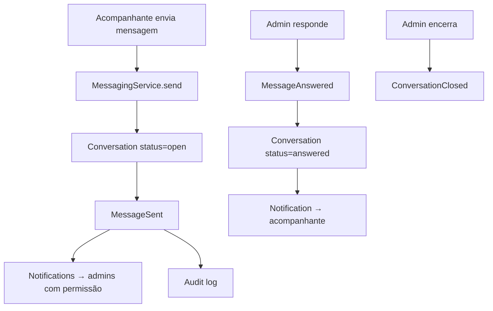

# Documento 7 — Comunicação, Notificações e Mensageria

**Versão:** 1.0.0  
**Status:** Especificação Oficial  
**Última atualização:** 2026-07-09  
**Dependências:**
- [Documento 1 — Arquitetura da Plataforma](../arquitetura/DOCUMENTO-01-ARQUITETURA-DA-PLATAFORMA.md)
- [Documento 2 — Área Pública da Plataforma](./DOCUMENTO-02-AREA-PUBLICA.md)
- [Documento 3 — Área do Acompanhante](./DOCUMENTO-03-AREA-DO-ACOMPANHANTE.md)
- [Documento 4 — Área Administrativa](./DOCUMENTO-04-AREA-ADMINISTRATIVA.md)
- [Documento 5 — Módulos de Engajamento](./DOCUMENTO-05-MODULOS-ENGAJAMENTO-INTELIGENCIA-DESCOBERTA.md)
- [Documento 6 — Conteúdo, Mídia e Interações](./DOCUMENTO-06-CONTEUDO-MIDIA-E-INTERACOES.md)  
**Escopo:** Módulos Notifications Core, Messaging, canais de comunicação, preferências e auditoria

---

## Sumário

1. [Visão Geral e Princípios](#1-visão-geral-e-princípios)
2. [Arquitetura de Comunicação](#2-arquitetura-de-comunicação)
3. [Módulo Notifications Core](#3-módulo-notifications-core)
4. [Central de Notificações (UI)](#4-central-de-notificações-ui)
5. [Mapa de Eventos → Notificações](#5-mapa-de-eventos--notificações)
6. [Preferências de Notificação](#6-preferências-de-notificação)
7. [Canais de Comunicação](#7-canais-de-comunicação)
8. [Módulo Mensageria](#8-módulo-mensageria)
9. [SLA, Prioridades e Auditoria](#9-sla-prioridades-e-auditoria)
10. [Catálogo de Eventos](#10-catálogo-de-eventos)
11. [Permissões e Segurança](#11-permissões-e-segurança)
12. [Performance](#12-performance)
13. [Critérios de Aceitação](#13-critérios-de-aceitação)

---

## 1. Visão Geral e Princípios

### 1.1 Objetivo

Criar uma **infraestrutura completa de comunicação** baseada em eventos, capaz de:

| Capacidade | Descrição |
|---|---|
| **Avisar administradores** | Pendências operacionais, denúncias, mensagens |
| **Avisar acompanhantes** | Aprovações, interações, alterações de status |
| **Registrar históricos** | Notificações e conversas persistidas |
| **Comunicação interna** | Mensagens acompanhante ↔ administração |
| **Canais futuros** | E-mail, WhatsApp, push, SMS (arquitetura preparada) |

A comunicação deve ser **escalável, desacoplada e orientada a eventos**.

### 1.2 Módulos deste Documento

| Módulo | Pacote | Responsabilidade |
|---|---|---|
| **Notifications Core** | `packages/modules/notifications/` | Criação, entrega, histórico, preferências |
| **Messaging** | `packages/modules/messaging/` | Conversas acompanhante ↔ admin |
| **Notification Channels** | `packages/modules/notifications/channels/` | Adaptadores por canal (in-app, email, etc.) |

### 1.3 Princípio Fundamental

> **Nenhum módulo de negócio cria notificações diretamente.** Todo aviso é gerado quando o **Notifications Core** reage a um **evento de domínio**.

```
┌──────────────┐     ProfileApproved      ┌──────────────────┐
│   Profiles   │ ────────────────────────► │    Event Bus     │
│  Moderation  │     CommentCreated       └────────┬─────────┘
│  Messaging   │     MessageSent                    │
│  HotScore    │     HotScoreUpdated                ▼
└──────────────┘                          ┌──────────────────┐
         ★ NUNCA chama                     │ Notifications    │
           NotificationsService            │ Core (handler)   │
           diretamente ★                   └────────┬─────────┘
                                                    │
                              ┌─────────────────────┼─────────────────────┐
                              ▼                     ▼                     ▼
                        In-App Channel        Email Channel (futuro)   Push (futuro)
```

### 1.4 Restrições Obrigatórias (Documento 1)

| Restrição | Aplicação |
|---|---|
| Sem criação direta de notificações | Profiles, Moderation, etc. emitem eventos apenas |
| Handlers idempotentes | Mesmo evento não gera notificação duplicada |
| Preferências respeitadas | Usuário pode desativar tipos (exceto críticas) |
| Auditoria | Messaging e ações admin registradas no Audit |
| Configuração via Settings | Templates, retenção, limites |

---

## 2. Arquitetura de Comunicação

### 2.1 Diagrama de Contexto

```
                    EVENT BUS
                        │
    ┌───────────────────┼───────────────────┐
    │                   │                   │
    ▼                   ▼                   ▼
ProfileApproved   CommentCreated    MessageSent
VerificationReq   ReportSubmitted   HotScoreUpdated
    │                   │                   │
    └───────────────────┼───────────────────┘
                        ▼
              ┌─────────────────────┐
              │  Notification       │
              │  Dispatcher         │
              │  (roteia por tipo)  │
              └──────────┬──────────┘
                         │
         ┌───────────────┼───────────────┐
         ▼               ▼               ▼
   Check prefs    Resolve template   Determine channels
         │               │               │
         └───────────────┼───────────────┘
                         ▼
              ┌─────────────────────┐
              │  Channel Router       │
              └──────────┬──────────┘
                         │
         ┌───────┬───────┼───────┬───────┐
         ▼       ▼       ▼       ▼       ▼
      In-App  Email   WhatsApp  Push    SMS
      (v1)   (futuro) (futuro) (futuro)(futuro)
```

### 2.2 Schema de Banco (Ownership)

```
PostgreSQL
├── schema: platform     → Notifications (notificações, preferências)
├── schema: platform     → Messaging (conversas, mensagens, anexos)
```

### 2.3 Fluxo Padrão de Notificação

```mermaid
flowchart TD
    A[Evento de domínio publicado] --> B[NotificationHandler recebe]
    B --> C{Mapeamento existe?}
    C -->|Não| D[Ignorar]
    C -->|Sim| E[Resolver destinatário(s)]
    E --> F{Preferência habilitada?}
    F -->|Não| G[Skip — exceto critical]
    F -->|Sim| H[Resolver template Settings]
    H --> I[Criar Notification status=unread]
    I --> J[NotificationCreated]
    J --> K[Channel Router]
    K --> L[In-App entregue]
    K --> M[Canais externos — fila async]
```

### 2.4 Fluxo Padrão de Mensagem



---

## 3. Módulo Notifications Core

### 3.1 Responsabilidade

Módulo **único** autorizado a criar, entregar e gerenciar notificações. Reage a eventos; nunca é invocado diretamente por módulos de negócio (exceto leitura via interface pública).

### 3.2 Entidade `Notification`

| Campo | Tipo | Descrição |
|---|---|---|
| id | UUID | Identificador |
| userId | UUID | Destinatário |
| type | string | Tipo da notificação (ex.: `profile_approved`) |
| title | string | Título renderizado |
| message | string | Corpo da mensagem |
| priority | enum | low / normal / high / critical |
| status | enum | unread / read / archived |
| sourceEvent | string | Nome do evento origem |
| sourceEventId | UUID | ID do evento |
| actionUrl | string? | Link de ação na plataforma |
| metadata | json? | Dados extras (profileId, etc.) |
| channelsDelivered | string[] | Canais onde foi entregue |
| createdAt | datetime | Data de criação |
| readAt | datetime? | Data de leitura |
| archivedAt | datetime? | Data de arquivamento |

### 3.3 Estados

| Status | Descrição | Transições permitidas |
|---|---|---|
| `unread` | Não visualizada | → read, archived |
| `read` | Visualizada pelo usuário | → archived |
| `archived` | Arquivada pelo usuário | — (somente leitura) |

### 3.4 Prioridades

| Prioridade | Uso | Bypass preferências |
|---|---|---|
| `low` | Informativo (Hot Score mudou levemente) | Não |
| `normal` | Padrão (comentário aprovado) | Não |
| `high` | Importante (perfil aprovado, mensagem respondida) | Não |
| `critical` | Urgente (perfil bloqueado, denúncia crítica) | **Sim** — sempre entregue |

### 3.5 Funcionalidades do Core

| Função | Descrição |
|---|---|
| **Criar** | Via handler de evento (interno) |
| **Entregar** | Roteamento para canais habilitados |
| **Armazenar** | Persistência com retenção configurável |
| **Marcar lida** | Individual ou em lote |
| **Arquivar** | Ocultar da lista ativa |
| **Contador** | `unreadCount` por usuário (cache Redis) |
| **Preferências** | Verificar antes de criar |

### 3.6 Dispatcher — Mapeamento Evento → Notificação

O `NotificationDispatcher` mantém registro de handlers:

```typescript
// Conceitual — implementação no módulo
type NotificationMapping = {
  eventName: string;
  recipientResolver: (payload) => string[];  // userIds
  type: string;
  priority: Priority;
  templateKey: string;
  actionUrlBuilder: (payload) => string;
  audience: 'companion' | 'admin' | 'both';
};
```

### 3.7 Templates

Templates armazenados em Settings (`notifications.templates.*`):

```json
{
  "profile_approved": {
    "title": "Perfil aprovado!",
    "message": "Seu perfil foi aprovado e já está visível na plataforma.",
    "actionUrl": "/painel"
  }
}
```

Suporte a variáveis: `{{displayName}}`, `{{reason}}`, `{{score}}`, etc.

### 3.8 Interface Pública

```typescript
interface INotificationsService {
  // Leitura (consumido por UI)
  getByUserId(userId: string, filters: NotificationFilters, cursor?: string): Promise<NotificationListDTO>;
  getUnreadCount(userId: string): Promise<number>;
  markAsRead(userId: string, notificationId: string): Promise<void>;
  markAllAsRead(userId: string): Promise<void>;
  archive(userId: string, notificationId: string): Promise<void>;

  // Preferências
  getPreferences(userId: string): Promise<NotificationPreferencesDTO>;
  updatePreferences(userId: string, prefs: NotificationPreferencesDTO): Promise<void>;

  // ★ create() NÃO é público — apenas handlers internos
}
```

### 3.9 Regras de Negócio — Notifications

| ID | Regra |
|---|---|
| RN-NOT-001 | Apenas Notifications Core cria registros de notificação |
| RN-NOT-002 | Handler idempotente: `sourceEvent + sourceEventId + userId` único |
| RN-NOT-003 | Notificações `critical` ignoram preferências desabilitadas |
| RN-NOT-004 | Retenção: `notifications.retention_days` (default: 90) |
| RN-NOT-005 | Após retenção: arquivar automaticamente ou purgar |
| RN-NOT-006 | `unreadCount` em cache Redis; invalidado em create/read |
| RN-NOT-007 | Usuário só acessa próprias notificações |

---

## 4. Central de Notificações (UI)

### 4.1 Superfícies

| Superfície | Rota | Público |
|---|---|---|
| **Ícone sino + badge** | Header (companion + admin) | Autenticado |
| **Lista rápida (dropdown)** | Click no sino | Autenticado |
| **Página completa** | `/painel/notificacoes` (companion) | Acompanhante |
| **Página completa** | `/admin/notificacoes` (admin) | Admin |

### 4.2 Componentes (Documentos 3 e 4)

| Componente | Descrição |
|---|---|
| `NotificationBell` | Ícone sino + badge com `unreadCount` |
| `NotificationDropdown` | Últimas 5–10 notificações + link "Ver todas" |
| `NotificationList` | Lista paginada com filtros |
| `NotificationItem` | Título, mensagem, data, ação, status |
| `NotificationFilters` | Por categoria/tipo, lidas/não lidas |

### 4.3 Funcionalidades

| Ação | Endpoint BFF |
|---|---|
| Listar | `GET /api/.../notifications` |
| Contador | `GET /api/.../notifications/unread-count` |
| Marcar lida | `PUT /api/.../notifications/[id]/read` |
| Marcar todas lidas | `PUT /api/.../notifications/read-all` |
| Arquivar | `PUT /api/.../notifications/[id]/archive` |
| Filtrar por categoria | Query param `?type=profile,messaging` |
| Pesquisar | Query param `?q=texto` |

### 4.4 Comportamento Visual

| Estado | Comportamento |
|---|---|
| Nova notificação | Badge incrementa; opcional toast |
| Click em item | Marca como lida + navega para `actionUrl` |
| Dropdown | Exibe 5 mais recentes não arquivadas |
| Página completa | Paginação cursor-based, 20 por página |
| Vazia | Ilustração + "Nenhuma notificação" |

### 4.5 Atualização em Tempo Real (Preparação)

Arquitetura preparada para WebSocket/SSE:

- Fase 1: Polling a cada 60s no `unreadCount`.
- Fase 2: SSE para push de novas notificações.

---

## 5. Mapa de Eventos → Notificações

### 5.1 Notificações para Acompanhante

| Evento origem | Tipo | Título (template) | Prioridade | actionUrl |
|---|---|---|---|---|
| `ProfileApproved` | `profile_approved` | "Seu perfil foi aprovado." | high | `/painel` |
| `ProfileRejected` | `profile_rejected` | "Seu perfil precisa de ajustes." | high | `/painel/perfil` |
| `ProfileBlocked` | `profile_blocked` | "Seu perfil foi bloqueado." | critical | `/painel` |
| `ProfileChangeRequested` | `profile_changes_requested` | "Alterações solicitadas no seu perfil." | high | `/painel/perfil` |
| `CommentApproved` | `comment_approved` | "Você recebeu um novo comentário aprovado." | normal | `/painel` |
| `ReviewApproved` | `review_approved` | "Nova avaliação no seu perfil." | normal | `/painel` |
| `VerificationApproved` | `verification_approved` | "Seu perfil foi verificado." | high | `/painel/verificacao` |
| `VerificationRejected` | `verification_rejected` | "Verificação não aprovada." | normal | `/painel/verificacao` |
| `PhotoApproved` | `photo_approved` | "Foto aprovada." | low | `/painel/fotos` |
| `PhotoRejected` | `photo_rejected` | "Foto não aprovada." | normal | `/painel/fotos` |
| `VideoApproved` | `video_approved` | "Vídeo aprovado." | low | `/painel/videos` |
| `VideoRejected` | `video_rejected` | "Vídeo não aprovado." | normal | `/painel/videos` |
| `MomentApproved` | `moment_approved` | "Momento aprovado." | low | `/painel/momentos` |
| `MomentRejected` | `moment_rejected` | "Momento não aprovado." | normal | `/painel/momentos` |
| `MessageAnswered` | `message_answered` | "A administração respondeu sua mensagem." | high | `/painel/mensagens/[id]` |
| `ConversationClosed` | `conversation_closed` | "Sua conversa foi encerrada." | normal | `/painel/mensagens` |
| `HotScoreUpdated` | `hotscore_changed` | "Seu nível de popularidade mudou." | low | `/painel/popularidade` |
| `PremiumActivated` | `premium_activated` | "Status Premium ativado." | high | `/painel/status` |
| `FeaturedActivated` | `featured_activated` | "Destaque ativado no seu perfil." | high | `/painel/status` |
| `HotScoreAdjusted` | `hotscore_adjusted` | "Seu Hot Score foi ajustado." | normal | `/painel/popularidade` |

> `HotScoreUpdated` dispara notificação apenas quando **nível visual muda** (ex.: Morno → Quente), não a cada recálculo.

### 5.2 Notificações para Administrador

Destinatários: operadores com permissão relevante (role + preferência).

| Evento origem | Tipo | Título (template) | Prioridade | Permissão | actionUrl |
|---|---|---|---|---|---|
| `ProfileCreated` | `new_profile_pending` | "Novo perfil aguardando aprovação." | high | `profiles:moderate` | `/admin/aprovacoes/[id]` |
| `CommentCreated` | `comment_pending` | "Novo comentário aguardando moderação." | normal | `comments:moderate` | `/admin/comentarios` |
| `ReviewCreated` | `review_pending` | "Nova avaliação aguardando moderação." | normal | `comments:moderate` | `/admin/comentarios` |
| `VerificationRequested` | `verification_pending` | "Novo pedido de verificação." | normal | `verification:moderate` | `/admin/verificacoes/[id]` |
| `MessageSent` | `new_message_received` | "Novo contato recebido." | high | `messaging:manage` | `/admin/mensagens/[id]` |
| `ContentReported` | `report_new` | "Nova denúncia recebida." | high | `reports:manage` | `/admin/denuncias/[id]` |
| `PhotoUploaded` | `photo_pending` | "Nova foto aguardando moderação." | low | `moderation:read` | `/admin/moderacao` |
| `VideoUploaded` | `video_pending` | "Novo vídeo aguardando moderação." | low | `moderation:read` | `/admin/moderacao` |
| `MomentPublished` | `moment_pending` | "Novo momento aguardando moderação." | low | `moderation:read` | `/admin/moderacao` |
| `MediaProcessingFailed` | `system_media_error` | "Falha no processamento de mídia." | high | `health:read` | `/admin/saude` |
| `SettingChanged` | `system_config_changed` | "Configuração alterada." | low | `settings:manage` | `/admin/configuracoes` |

### 5.3 Agrupamento e Digest (Futuro)

Settings `notifications.digest.enabled`:

- Agrupar notificações `low` em digest diário.
- `high` e `critical` sempre imediatas.

---

## 6. Preferências de Notificação

### 6.1 Entidade `NotificationPreference`

| Campo | Tipo | Descrição |
|---|---|---|
| userId | UUID | Usuário |
| type | string | Tipo de notificação |
| inApp | bool | Receber in-app |
| email | bool | Receber por e-mail (futuro) |
| push | bool | Receber push (futuro) |
| updatedAt | datetime | Última alteração |

### 6.2 Preferências do Acompanhante

| Categoria | Tipos incluídos | Default |
|---|---|---|
| Aprovação de perfil | `profile_approved`, `profile_rejected`, `profile_changes_requested` | ✅ |
| Comentários e avaliações | `comment_approved`, `review_approved` | ✅ |
| Verificação | `verification_approved`, `verification_rejected` | ✅ |
| Mensagens | `message_answered`, `conversation_closed` | ✅ |
| Alterações de status | `profile_blocked`, `premium_activated`, `featured_activated` | ✅ |
| Hot Score | `hotscore_changed`, `hotscore_adjusted` | ✅ |
| Conteúdo (mídia) | `photo_*`, `video_*`, `moment_*` | ✅ |
| Avisos gerais | Demais tipos companion | ✅ |

UI: `/painel/configuracoes` → seção Notificações (Doc 3).

### 6.3 Preferências do Administrador

| Categoria | Tipos incluídos | Default |
|---|---|---|
| Novos cadastros | `new_profile_pending` | ✅ |
| Comentários pendentes | `comment_pending`, `review_pending` | ✅ |
| Denúncias | `report_new` | ✅ |
| Solicitações | `verification_pending` | ✅ |
| Mensagens | `new_message_received` | ✅ |
| Moderação de mídia | `photo_pending`, `video_pending`, `moment_pending` | ❌ (opt-in) |
| Alertas do sistema | `system_*` | ✅ |

UI: `/admin/configuracoes` → seção Notificações.

### 6.4 Regras

| ID | Regra |
|---|---|
| RN-PREF-001 | Default: todas habilitadas (in-app) |
| RN-PREF-002 | `critical` ignora preferência off |
| RN-PREF-003 | Alteração emite `PreferenceUpdated` + Audit |
| RN-PREF-004 | Canais externos respeitam preferência por canal |

---

## 7. Canais de Comunicação

### 7.1 Arquitetura de Canais

```
INotificationChannel (interface)
├── InAppChannel          ← Fase 1 (implementado)
├── EmailChannel          ← Fase 2 (preparado)
├── WhatsAppChannel       ← Fase 3 (preparado)
├── PushChannel           ← Fase 3 (preparado)
└── SmsChannel            ← Fase 4 (preparado)
```

Cada canal é **independente** — falha em um não bloqueia outros.

### 7.2 Interface de Canal

```typescript
interface INotificationChannel {
  readonly channelId: string;  // 'in_app' | 'email' | 'whatsapp' | 'push' | 'sms'
  deliver(notification: NotificationDTO, user: UserDTO): Promise<DeliveryResult>;
  isAvailable(userId: string): Promise<boolean>;
}
```

### 7.3 Canal In-App (Fase 1)

| Aspecto | Implementação |
|---|---|
| Entrega | Persistência em `Notification` + cache unreadCount |
| UI | Sino, dropdown, página completa |
| Status | Única fonte de verdade |

### 7.4 Canais Futuros — Preparação

| Canal | Pré-requisito | Fila |
|---|---|---|
| **E-mail** | `user.email` verificado | `notifications.email` (BullMQ) |
| **WhatsApp** | `user.phone` + opt-in | `notifications.whatsapp` |
| **Push** | Device token registrado | `notifications.push` |
| **SMS** | `user.phone` + opt-in | `notifications.sms` |

Configuração global: `notifications.channels.email.enabled`, etc.

### 7.5 Roteamento

```typescript
// Channel Router — conceitual
async function route(notification, user, prefs) {
  const channels = [];
  if (prefs.inApp) channels.push(InAppChannel);
  if (prefs.email && settings.email.enabled) channels.push(EmailChannel);
  // ...
  for (const ch of channels) {
    await queue.add(`notifications.${ch.channelId}`, { notificationId, userId });
  }
}
```

Entrega externa **sempre assíncrona** via fila.

---

## 8. Módulo Mensageria

### 8.1 Responsabilidade

Sistema de **comunicação bidirecional** entre acompanhante e administração. Independente do Notifications Core — emite eventos que o Notifications consome.

### 8.2 Entidades

#### `Conversation`

| Campo | Tipo | Descrição |
|---|---|---|
| id | UUID | Identificador |
| profileId | UUID | Perfil da acompanhante |
| userId | UUID | User da acompanhante |
| subject | string | Assunto (máx. 100 chars) |
| status | enum | open / in_progress / answered / closed |
| priority | enum | low / normal / high / critical |
| assignedTo | UUID? | Operador responsável |
| internalNotes | text? | Observações admin (não visíveis ao companion) |
| createdAt | datetime | Abertura |
| updatedAt | datetime | Última atividade |
| closedAt | datetime? | Encerramento |
| closedBy | UUID? | Quem encerrou |

#### `Message`

| Campo | Tipo | Descrição |
|---|---|---|
| id | UUID | Identificador |
| conversationId | UUID | Conversa |
| senderType | enum | companion / admin / system |
| senderId | UUID | User do remetente |
| body | string | Conteúdo (máx. 2000 chars) |
| attachments | UUID[]? | Referências a anexos |
| createdAt | datetime | Envio |
| readAt | datetime? | Leitura pelo destinatário |

#### `MessageAttachment` (preparado)

| Campo | Tipo | Descrição |
|---|---|---|
| id | UUID | Identificador |
| messageId | UUID | Mensagem |
| mediaAssetId | UUID | Referência Media Core |
| fileName | string | Nome original |
| mimeType | string | Tipo |
| sizeBytes | int | Tamanho |

### 8.3 Estados da Conversa

| Status | Label UI | Descrição | Quem pode enviar |
|---|---|---|---|
| `open` | Aberta | Nova ou aguardando admin | Acompanhante + Admin |
| `in_progress` | Em atendimento | Admin assumiu | Acompanhante + Admin |
| `answered` | Respondida | Admin respondeu | Acompanhante + Admin |
| `closed` | Encerrada | Finalizada | Ninguém (somente leitura) |

**Transições:**

```
open → in_progress (admin abre/atribui)
open → answered (admin responde)
in_progress → answered (admin responde)
answered → closed (admin encerra)
closed → open (admin reabre)
```

### 8.4 Caixa de Entrada Administrativa (Doc 4)

| Coluna | Fonte |
|---|---|
| Acompanhante | Profiles.displayName + foto |
| Assunto | Conversation.subject |
| Última mensagem | Message.body (truncado) |
| Data | Conversation.updatedAt |
| Status | Conversation.status |
| Prioridade | Conversation.priority |
| Badge | Nova se última msg de companion não lida |

Rota: `/admin/mensagens` e `/admin/mensagens/[id]`.

### 8.5 Área do Acompanhante (Doc 3)

| Funcionalidade | Rota |
|---|---|
| Lista de conversas | `/painel/mensagens` |
| Nova mensagem | Formulário inline |
| Conversa | `/painel/mensagens/[id]` |
| Status visual | Badge na conversa |

### 8.6 Funcionalidades — Administrador

| Ação | Permissão | Evento |
|---|---|---|
| Visualizar conversa | `messaging:manage` | — |
| Responder | `messaging:manage` | `MessageAnswered` |
| Encerrar | `messaging:manage` | `ConversationClosed` |
| Reabrir | `messaging:manage` | `ConversationReopened` |
| Atribuir operador | `messaging:manage` | — |
| Alterar prioridade | `messaging:manage` | — |
| Notas internas | `messaging:manage` | Audit only |

### 8.7 Funcionalidades — Acompanhante

| Ação | Evento |
|---|---|
| Enviar mensagem (nova conversa) | `MessageSent` |
| Responder em conversa existente | `MessageSent` |
| Visualizar histórico | — |
| Receber respostas | Via `MessageAnswered` → Notification |

### 8.8 Anexos (Preparado)

| Regra | Valor (Settings) |
|---|---|
| Máx. anexos por mensagem | 3 |
| Tamanho máx. por arquivo | 5 MB |
| Tipos permitidos | image/jpeg, image/png, application/pdf |
| Upload via | Media Core |
| Scan antivírus | Obrigatório |

Fase 1: arquitetura e entidade; UI pode lançar sem anexos.

### 8.9 Interface Pública

```typescript
interface IMessagingService {
  // Companion
  sendMessage(userId: string, input: SendMessageInput): Promise<ConversationDTO>;
  reply(userId: string, conversationId: string, body: string): Promise<MessageDTO>;
  getConversations(userId: string, cursor?: string): Promise<ConversationListDTO>;
  getConversation(userId: string, conversationId: string): Promise<ConversationDetailDTO>;

  // Admin
  getAdminInbox(filters: InboxFilters, cursor?: string): Promise<ConversationListDTO>;
  adminReply(adminId: string, conversationId: string, body: string): Promise<MessageDTO>;
  closeConversation(adminId: string, conversationId: string): Promise<void>;
  reopenConversation(adminId: string, conversationId: string): Promise<void>;
  assign(conversationId: string, adminId: string): Promise<void>;
  setPriority(conversationId: string, priority: Priority): Promise<void>;
  addInternalNote(adminId: string, conversationId: string, note: string): Promise<void>;

  // SLA
  getSlaMetrics(period: Period): Promise<MessagingSlaDTO>;
}
```

### 8.10 Regras de Negócio — Messaging

| ID | Regra |
|---|---|
| RN-MSG-001 | Acompanhante só acessa próprias conversas |
| RN-MSG-002 | Conversa `closed` não aceita novas mensagens |
| RN-MSG-003 | Rate limit: 5 mensagens/hora por acompanhante |
| RN-MSG-004 | Assunto obrigatório em nova conversa |
| RN-MSG-005 | Resposta admin emite `MessageAnswered` + notificação |
| RN-MSG-006 | Notas internas nunca expostas ao companion |
| RN-MSG-007 | Toda alteração de status gera Audit |

---

## 9. SLA, Prioridades e Auditoria

### 9.1 Indicadores de SLA

| Métrica | Cálculo | Dashboard admin |
|---|---|---|
| Tempo médio de primeira resposta | Média `firstReplyAt - createdAt` | ✅ |
| Tempo médio de resolução | Média `closedAt - createdAt` | ✅ |
| Mensagens abertas | COUNT status=open | ✅ |
| Em atendimento | COUNT status=in_progress | ✅ |
| Respondidas aguardando | COUNT status=answered | ✅ |
| Encerradas no período | COUNT closed no período | ✅ |
| Conversas por prioridade | GROUP BY priority | ✅ |

Exposto via `IMessagingService.getSlaMetrics()` → Dashboard Doc 4.

### 9.2 SLA Configurável

| Configuração | Chave | Default |
|---|---|---|
| SLA primeira resposta | `messaging.sla.first_response_hours` | 24 |
| SLA resolução | `messaging.sla.resolution_hours` | 72 |
| Alerta SLA estourado | `messaging.sla.alert_enabled` | true |

Conversa acima do SLA → notificação `critical` para admins.

### 9.3 Prioridades de Conversa

| Prioridade | Quando usar | Ordenação na fila |
|---|---|---|
| `low` | Dúvidas gerais | 4 |
| `normal` | Padrão | 3 |
| `high` | Problemas com perfil/conteúdo | 2 |
| `critical` | Bloqueio, denúncia, urgência | 1 |

### 9.4 Auditoria

| Ação auditada | Módulo |
|---|---|
| Mensagem enviada (companion) | Audit |
| Mensagem enviada (admin) | Audit |
| Status alterado | Audit |
| Conversa encerrada/reaberta | Audit |
| Prioridade alterada | Audit |
| Nota interna adicionada | Audit |
| Notificação criada (batch) | Audit (opcional, high/critical) |
| Preferência alterada | Audit |

Campos: `actorId`, `action`, `resource`, `oldValue`, `newValue`, `timestamp`.

---

## 10. Catálogo de Eventos

### 10.1 Eventos do Módulo Notifications

| Evento | Trigger | Payload |
|---|---|---|
| `NotificationCreated` | Notificação criada | `{ notificationId, userId, type, priority }` |
| `NotificationRead` | Marcada como lida | `{ notificationId, userId }` |
| `NotificationArchived` | Arquivada | `{ notificationId, userId }` |
| `PreferenceUpdated` | Preferência alterada | `{ userId, type, channels }` |

### 10.2 Eventos do Módulo Messaging

| Evento | Trigger | Payload | Notifications |
|---|---|---|---|
| `MessageSent` | Mensagem enviada | `{ conversationId, messageId, senderType, profileId }` | Admin: `new_message_received` |
| `MessageAnswered` | Admin respondeu | `{ conversationId, messageId, answeredBy }` | Companion: `message_answered` |
| `ConversationClosed` | Conversa encerrada | `{ conversationId, closedBy }` | Companion: `conversation_closed` |
| `ConversationReopened` | Conversa reaberta | `{ conversationId, reopenedBy }` | Companion: opcional |
| `ConversationAssigned` | Operador atribuído | `{ conversationId, assignedTo }` | — (interno) |

### 10.3 Eventos Consumidos (entrada)

O Notifications Core **escuta** todos os eventos listados na seção 5. O Messaging **escuta**:

| Evento | Ação |
|---|---|
| `ProfileBlocked` | Opcional: encerrar conversas abertas |

### 10.4 Idempotência

| Evento | Chave idempotente |
|---|---|
| NotificationCreated | `sourceEvent + sourceEventId + userId` |
| MessageSent | `messageId` (único) |
| NotificationRead | `notificationId + userId` |

---

## 11. Permissões e Segurança

### 11.1 Permissões — Notifications

| Ação | Companion | Admin |
|---|---|---|
| Ver próprias notificações | ✅ | ✅ |
| Marcar lida/arquivar | ✅ (próprias) | ✅ (próprias) |
| Configurar preferências | ✅ (próprias) | ✅ (próprias) |
| Ver notificações de outros | ❌ | ❌ |

### 11.2 Permissões — Messaging

| Ação | Companion | Admin |
|---|---|---|
| Enviar mensagem | ✅ (próprio perfil) | ❌ (inicia via resposta) |
| Ver conversas | ✅ (próprias) | ✅ (`messaging:manage`) |
| Responder | ✅ (em conversa aberta) | ✅ |
| Encerrar/reabrir | ❌ | ✅ |
| Notas internas | ❌ | ✅ |
| Ver métricas SLA | ❌ | ✅ (`messaging:manage`) |

### 11.3 Segurança

| Medida | Implementação |
|---|---|
| Controle de acesso | Guards JWT + ownership |
| Privacidade | Conversas isoladas por profileId |
| Anti-spam | Rate limit 5 msg/hora (companion) |
| Conteúdo | Sanitização de body (XSS) |
| Anexos | Media Core + antivírus |
| Logs | Audit para ações sensíveis |
| Criptografia | TLS em trânsito; dados em repouso no PostgreSQL |

### 11.4 Rate Limiting

| Ação | Limite |
|---|---|
| Enviar mensagem (companion) | 5 / hora |
| Nova conversa | 3 / dia |
| Marcar todas lidas | 10 / hora |
| Atualizar preferências | 20 / hora |

---

## 12. Performance

### 12.1 Processamento Assíncrono

| Operação | Padrão |
|---|---|
| Criação de notificação (handler) | Síncrono leve (< 50ms) |
| Entrega canal externo | BullMQ fila assíncrona |
| Envio de e-mail/WhatsApp | Worker dedicado |
| Atualização unreadCount | Redis INCR/DECR |

### 12.2 Cache

| Dado | TTL | Invalidação |
|---|---|---|
| `unreadCount` por userId | — | create / read / readAll |
| Preferências | 10 min | PreferenceUpdated |
| Templates | 15 min | SettingChanged |
| Lista recente (dropdown) | 30s | NotificationCreated |

### 12.3 Paginação

| Contexto | Tipo | Tamanho |
|---|---|---|
| Lista de notificações | Cursor | 20 |
| Inbox admin | Cursor | 25 |
| Thread de mensagens | Cursor | 50 |
| Histórico completo | Cursor | 50 |

### 12.4 Retenção e Arquivamento

| Dado | Retenção | Ação |
|---|---|---|
| Notificações lidas | 90 dias | Auto-archive |
| Notificações arquivadas | 1 ano | Purge |
| Mensagens | Permanente | — |
| Conversas encerradas | Permanente | Somente leitura |

### 12.5 Metas

| Operação | p95 |
|---|---|
| getUnreadCount | < 20ms |
| Listar notificações | < 100ms |
| Enviar mensagem | < 200ms |
| Handler NotificationCreated | < 50ms |

---

## 13. Critérios de Aceitação

### 13.1 Notifications Core

| ID | Critério | Prioridade |
|---|---|---|
| CA-NOT-01 | Nenhum módulo externo cria notificação diretamente | Must |
| CA-NOT-02 | Notificações geradas apenas via eventos | Must |
| CA-NOT-03 | Estrutura completa (id, tipo, título, msg, prioridade, status, origem, link) | Must |
| CA-NOT-04 | Estados: unread, read, archived | Must |
| CA-NOT-05 | Handlers idempotentes | Must |
| CA-NOT-06 | Templates configuráveis via Settings | Must |
| CA-NOT-07 | Critical ignora preferências desabilitadas | Must |

### 13.2 Central de Notificações (UI)

| ID | Critério | Prioridade |
|---|---|---|
| CA-UI-01 | Sino + badge com contador | Must |
| CA-UI-02 | Dropdown com lista rápida | Must |
| CA-UI-03 | Página completa com paginação | Must |
| CA-UI-04 | Marcar lida / marcar todas / arquivar | Must |
| CA-UI-05 | Filtrar por categoria e pesquisar | Should |

### 13.3 Mapa de Eventos

| ID | Critério | Prioridade |
|---|---|---|
| CA-EVT-01 | 20+ tipos companion mapeados | Must |
| CA-EVT-02 | 10+ tipos admin mapeados | Must |
| CA-EVT-03 | HotScore notifica apenas em mudança de nível | Should |

### 13.4 Preferências

| ID | Critério | Prioridade |
|---|---|---|
| CA-PREF-01 | Companion configura 7 categorias | Must |
| CA-PREF-02 | Admin configura 6 categorias | Must |
| CA-PREF-03 | PreferenceUpdated com auditoria | Should |

### 13.5 Canais

| ID | Critério | Prioridade |
|---|---|---|
| CA-CH-01 | In-app funcional (Fase 1) | Must |
| CA-CH-02 | Interface INotificationChannel para canais futuros | Must |
| CA-CH-03 | Entrega externa via fila assíncrona | Should |

### 13.6 Messaging

| ID | Critério | Prioridade |
|---|---|---|
| CA-MSG-01 | Conversas com histórico completo | Must |
| CA-MSG-02 | 4 estados: open, in_progress, answered, closed | Must |
| CA-MSG-03 | Admin: responder, encerrar, reabrir, notas internas | Must |
| CA-MSG-04 | Companion: enviar, histórico, receber respostas | Must |
| CA-MSG-05 | MessageSent → notificação admin | Must |
| CA-MSG-06 | MessageAnswered → notificação companion | Must |
| CA-MSG-07 | SLA métricas no dashboard admin | Should |
| CA-MSG-08 | Prioridades low/normal/high/critical | Should |
| CA-MSG-09 | Arquitetura de anexos preparada | Should |

### 13.7 Segurança e Arquitetura

| ID | Critério | Prioridade |
|---|---|---|
| CA-SEC-01 | Rate limit anti-spam em mensagens | Must |
| CA-SEC-02 | Conversas privadas por ownership | Must |
| CA-SEC-03 | Auditoria de ações de messaging | Must |
| CA-ARQ-01 | Módulos desacoplados; eventos como único acoplamento | Must |
| CA-ARQ-02 | Processamento assíncrono para canais externos | Must |

---

## Apêndice A — Configurações (Settings)

| Chave | Tipo | Default |
|---|---|---|
| `notifications.retention_days` | number | 90 |
| `notifications.templates.*` | json | Ver §5 |
| `notifications.digest.enabled` | boolean | false |
| `notifications.channels.in_app.enabled` | boolean | true |
| `notifications.channels.email.enabled` | boolean | false |
| `notifications.channels.whatsapp.enabled` | boolean | false |
| `notifications.channels.push.enabled` | boolean | false |
| `notifications.channels.sms.enabled` | boolean | false |
| `messaging.rate_limit_per_hour` | number | 5 |
| `messaging.new_conversation_limit_per_day` | number | 3 |
| `messaging.sla.first_response_hours` | number | 24 |
| `messaging.sla.resolution_hours` | number | 72 |
| `messaging.attachments.max_per_message` | number | 3 |
| `messaging.attachments.max_size_mb` | number | 5 |

---

## Apêndice B — DTOs Principais

| DTO | Módulo | Uso |
|---|---|---|
| `NotificationDTO` | Notifications | Item de notificação |
| `NotificationListDTO` | Notifications | Lista paginada |
| `NotificationPreferencesDTO` | Notifications | Preferências do usuário |
| `ConversationDTO` | Messaging | Resumo de conversa |
| `ConversationDetailDTO` | Messaging | Conversa + mensagens |
| `MessageDTO` | Messaging | Mensagem individual |
| `MessagingSlaDTO` | Messaging | Métricas SLA |
| `DeliveryResultDTO` | Notifications | Resultado por canal |

---

## Apêndice C — Referências Cruzadas

| Documento | Relação |
|---|---|
| [Documento 1 — Arquitetura](../arquitetura/DOCUMENTO-01-ARQUITETURA-DA-PLATAFORMA.md) | Event Bus, módulos Notifications e Messaging |
| [Documento 3 — Acompanhante](./DOCUMENTO-03-AREA-DO-ACOMPANHANTE.md) | `/painel/notificacoes`, `/painel/mensagens` |
| [Documento 4 — Admin](./DOCUMENTO-04-AREA-ADMINISTRATIVA.md) | `/admin/mensagens`, alertas operacionais |
| [Documento 5 — Engajamento](./DOCUMENTO-05-MODULOS-ENGAJAMENTO-INTELIGENCIA-DESCOBERTA.md) | HotScoreUpdated → notificação |
| [Documento 6 — Conteúdo](./DOCUMENTO-06-CONTEUDO-MIDIA-E-INTERACOES.md) | Eventos de mídia → notificações |

### Fluxo Resumido — Do Evento à Notificação

```
ProfileApproved (Profiles/Moderation)
  → Event Bus
  → NotificationsCore.handler
  → resolve userId (companion)
  → check preference (profile_approval: on)
  → template: "Seu perfil foi aprovado."
  → NotificationCreated
  → InAppChannel.deliver
  → Badge++ no sino do companion
```

---

> **Este documento é a especificação oficial de Comunicação, Notificações e Mensageria.**  
> Toda implementação de avisos e mensagens deve seguir o modelo event-driven aqui definido.  
> Desvios exigem atualização formal deste documento e validação contra o Documento 1.
