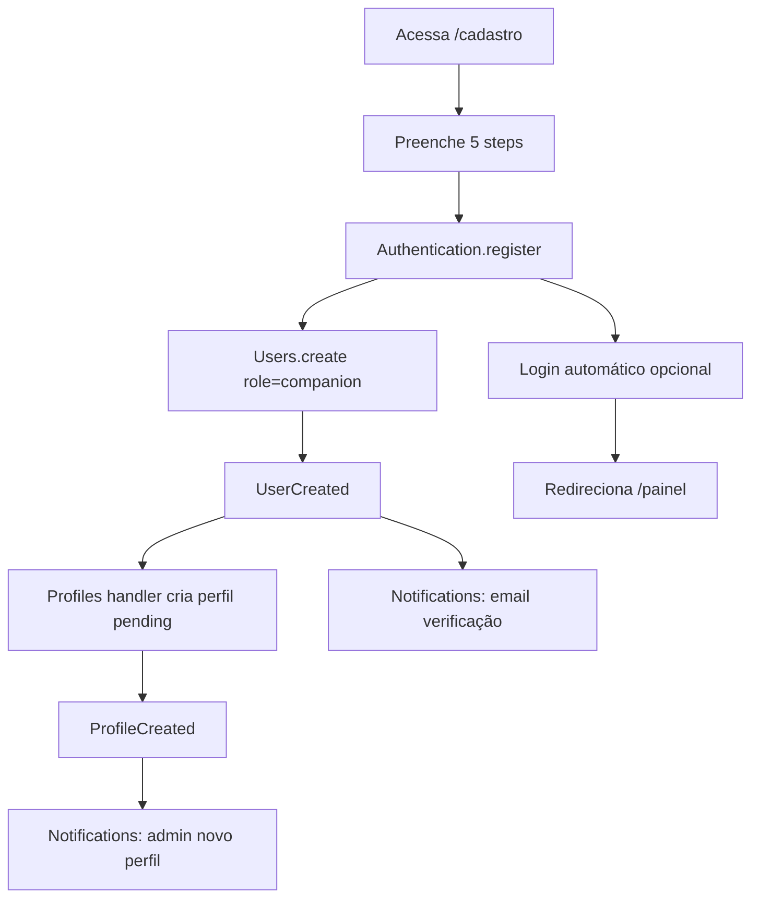
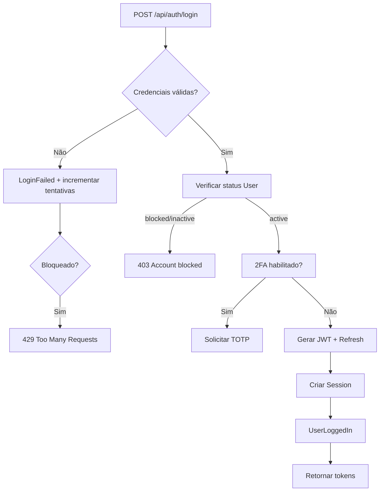
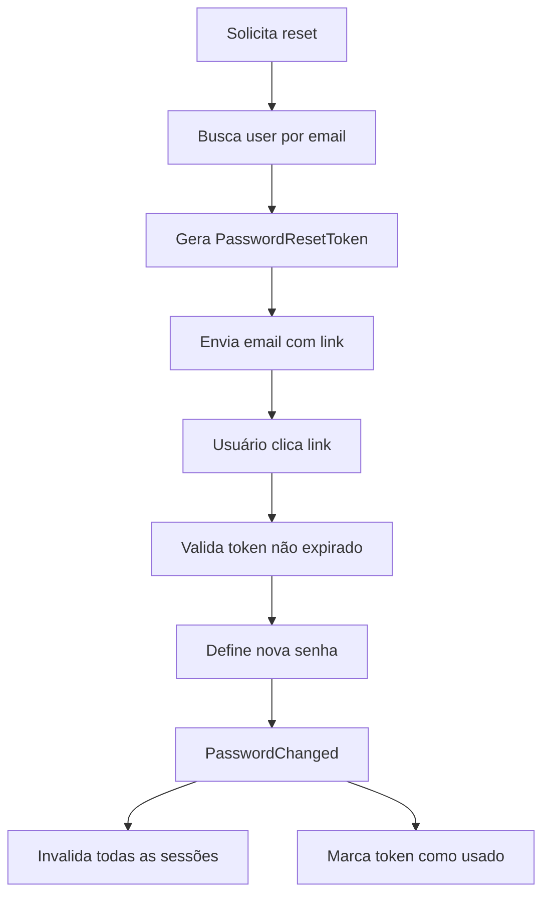
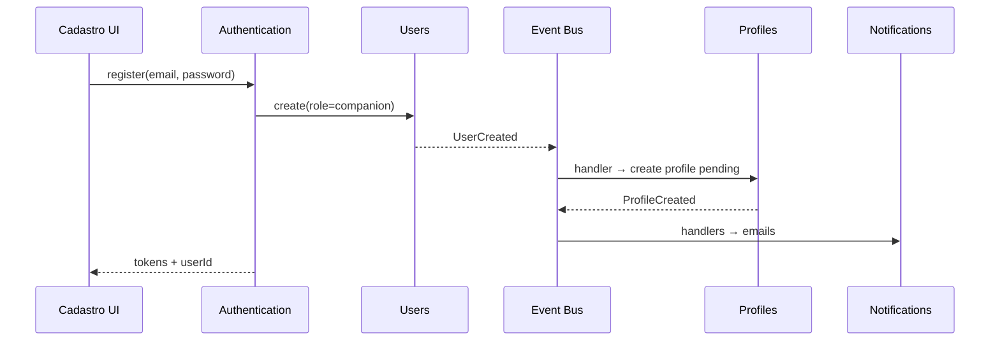

# Documento 8 — Autenticação, Usuários, Permissões e Segurança

**Versão:** 1.0.0  
**Status:** Especificação Oficial  
**Última atualização:** 2026-07-09  
**Dependências:**
- [Documento 1 — Arquitetura da Plataforma](../arquitetura/DOCUMENTO-01-ARQUITETURA-DA-PLATAFORMA.md)
- [Documento 2 — Área Pública da Plataforma](./DOCUMENTO-02-AREA-PUBLICA.md)
- [Documento 3 — Área do Acompanhante](./DOCUMENTO-03-AREA-DO-ACOMPANHANTE.md)
- [Documento 4 — Área Administrativa](./DOCUMENTO-04-AREA-ADMINISTRATIVA.md)
- [Documento 7 — Comunicação e Mensageria](./DOCUMENTO-07-COMUNICACAO-NOTIFICACOES-E-MENSAGERIA.md)  
**Escopo:** Módulos Authentication, Users, RBAC, sessões, segurança e preparação multi-tenant

---

## Sumário

1. [Visão Geral e Princípios](#1-visão-geral-e-princípios)
2. [Arquitetura de Usuários e Identidade](#2-arquitetura-de-usuários-e-identidade)
3. [Módulo Authentication Core](#3-módulo-authentication-core)
4. [Módulo Users](#4-módulo-users)
5. [Tipos de Usuário e Papéis](#5-tipos-de-usuário-e-papéis)
6. [Sistema de Permissões (RBAC)](#6-sistema-de-permissões-rbac)
7. [Fluxos de Autenticação](#7-fluxos-de-autenticação)
8. [Sessões e Tokens](#8-sessões-e-tokens)
9. [Segurança](#9-segurança)
10. [Privacidade e Proteção de Dados](#10-privacidade-e-proteção-de-dados)
11. [Auditoria de Segurança](#11-auditoria-de-segurança)
12. [Verificação de Usuários](#12-verificação-de-usuários)
13. [Arquitetura Multi-Tenant (Futuro)](#13-arquitetura-multi-tenant-futuro)
14. [Integração com Outros Módulos](#14-integração-com-outros-módulos)
15. [Catálogo de Eventos](#15-catálogo-de-eventos)
16. [Critérios de Aceitação](#16-critérios-de-aceitação)

---

## 1. Visão Geral e Princípios

### 1.1 Objetivo

Criar uma **base segura e escalável** para gerenciamento de identidade, autenticação, autorização e proteção da plataforma, suportando:

| Ator | Tipo | Autenticação |
|---|---|---|
| **Visitante** | Não autenticado | — |
| **Acompanhante** | Autenticado | E-mail + senha |
| **Administrador** | Autenticado | E-mail + senha (+ 2FA opcional) |
| **Moderador** | Autenticado (role) | E-mail + senha |
| **Analista** | Autenticado (role) | E-mail + senha |
| **Futuros tipos** | Extensível via RBAC | OAuth / SSO (preparado) |

### 1.2 Módulos deste Documento

| Módulo | Pacote | Responsabilidade |
|---|---|---|
| **Authentication Core** | `packages/modules/authentication/` | Login, logout, sessões, tokens, senhas |
| **Users** | `packages/modules/users/` | Conta, papéis, status, preferências de conta |
| **Authorization** | `packages/shared-core/auth-guards/` | RBAC, guards, verificação de permissões |
| **Verification** | `packages/modules/verification/` | Badge verificado (módulo independente — §12) |

### 1.3 Princípio Fundamental

> **Nenhum módulo de negócio implementa regras próprias de login, permissão ou segurança.** Toda verificação passa pelo **Authentication Core** e **Authorization Service** do Shared Core.

```
┌─────────────────────────────────────────────────────────────┐
│  Profiles │ Moderation │ Analytics │ Dashboard │ ...        │
│         ★ NUNCA implementam login, RBAC ou hash ★          │
└────────────────────────────┬────────────────────────────────┘
                             │ IAuthenticationService
                             │ IUsersService
                             │ AuthorizationService (Shared Core)
                             │ eventos (UserCreated, etc.)
┌────────────────────────────▼────────────────────────────────┐
│              AUTHENTICATION CORE + USERS                     │
│  Login │ Sessions │ Tokens │ Passwords │ Roles │ Status     │
└─────────────────────────────────────────────────────────────┘
```

### 1.4 Restrições Obrigatórias (Documento 1)

| Restrição | Aplicação |
|---|---|
| Authentication independente | Sem dependência de Profiles, Moderation, etc. |
| Comunicação via interfaces | `IAuthenticationService`, `IUsersService` |
| Efeitos via eventos | `UserCreated` → Profiles cria perfil |
| Guards centralizados | Shared Core `auth-guards/` |
| Default deny | Sem permissão explícita = acesso negado |
| Configuração via Settings | Regras de senha, sessão, rate limits |

---

## 2. Arquitetura de Usuários e Identidade

### 2.1 Modelo de Identidade

```
┌─────────────┐     1:1 (companion)     ┌─────────────┐
│    User     │◄───────────────────────►│   Profile   │
│  (Users)    │     0:1 (admin roles)   │  (Profiles) │
└──────┬──────┘                         └─────────────┘
       │
       │ N:M
       ▼
┌─────────────┐
│    Role     │
│  + Perms    │
└─────────────┘
```

| Conceito | Módulo | Descrição |
|---|---|---|
| **User** | Users | Conta de acesso (e-mail, status, roles) |
| **Credential** | Authentication | Senha hash, tokens, 2FA secrets |
| **Session** | Authentication | Sessão ativa com device info |
| **Role** | Users | Papel RBAC (companion, admin, etc.) |
| **Permission** | Users / Settings | Permissão granular `<recurso>:<ação>` |
| **Profile** | Profiles | Perfil público da acompanhante (separado) |

### 2.2 Schema de Banco (Ownership)

```
PostgreSQL
├── schema: auth          → Authentication (credentials, sessions, tokens, refresh)
├── schema: users         → Users (users, roles, user_roles, permission_overrides)
└── schema: platform      → Audit (security audit log)
```

### 2.3 Superfícies de Autenticação

| Superfície | Login | Sessão | Token refresh |
|---|---|---|---|
| Área Pública | — | `visitor_session` (anônimo) | — |
| Área Companion | `/login` | JWT + Redis | `/api/auth/refresh` |
| Área Admin | `/admin/login` | JWT + Redis (TTL menor) | `/api/admin/auth/refresh` |

> Login admin e companion podem compartilhar `Authentication Core` com **contexto de superfície** (`surface: companion | admin`).

### 2.4 Diagrama de Contexto

```
Request
   │
   ▼
┌──────────────┐
│  Auth Guard  │ ──► JWT válido? Sessão ativa?
└──────┬───────┘
       ▼
┌──────────────┐
│  Role Guard  │ ──► Role adequado à superfície?
└──────┬───────┘
       ▼
┌──────────────────┐
│ Permission Guard │ ──► Permissão para ação?
└──────┬───────────┘
       ▼
┌──────────────────┐
│ Ownership Guard  │ ──► Recurso pertence ao user? (companion)
└──────┬───────────┘
       ▼
   Service / Handler
```

---

## 3. Módulo Authentication Core

### 3.1 Responsabilidade

Módulo **único** responsável por credenciais, autenticação, sessões e tokens. Totalmente independente dos demais módulos de negócio.

### 3.2 Funcionalidades

| Função | Descrição |
|---|---|
| **Cadastro** | Criação de credenciais (delega User ao módulo Users) |
| **Login** | Autenticação e-mail + senha |
| **Logout** | Invalidação de sessão/token |
| **Logout global** | Encerrar todas as sessões do usuário |
| **Recuperação de senha** | Fluxo reset via e-mail |
| **Controle de sessão** | CRUD de sessões ativas |
| **Tokens** | JWT access + refresh com rotação |
| **2FA** | Preparado (TOTP) |
| **OAuth** | Preparado (Google, etc.) |

### 3.3 Entidades

#### `Credential`

| Campo | Tipo | Descrição |
|---|---|---|
| id | UUID | Identificador |
| userId | UUID | Referência Users |
| passwordHash | string | bcrypt/argon2 |
| passwordChangedAt | datetime | Última alteração |
| failedAttempts | int | Tentativas falhas consecutivas |
| lockedUntil | datetime? | Bloqueio temporário |
| twoFactorEnabled | bool | 2FA ativo |
| twoFactorSecret | string? | TOTP secret (criptografado) |

#### `Session`

| Campo | Tipo | Descrição |
|---|---|---|
| id | UUID | Identificador |
| userId | UUID | Usuário |
| refreshTokenHash | string | Hash do refresh token |
| deviceName | string? | Ex.: "Chrome on Windows" |
| deviceType | enum | desktop / mobile / tablet / unknown |
| ipAddress | string | IP mascarado |
| userAgent | string | User-Agent truncado |
| surface | enum | companion / admin |
| createdAt | datetime | Criação |
| lastActiveAt | datetime | Último acesso |
| expiresAt | datetime | Expiração |
| revokedAt | datetime? | Revogação |

#### `PasswordResetToken`

| Campo | Tipo | Descrição |
|---|---|---|
| id | UUID | Identificador |
| userId | UUID | Usuário |
| tokenHash | string | Hash do token |
| expiresAt | datetime | Expiração (1h) |
| usedAt | datetime? | Utilizado |

### 3.4 Interface Pública

```typescript
interface IAuthenticationService {
  register(input: RegisterInput): Promise<AuthResultDTO>;
  login(input: LoginInput): Promise<AuthResultDTO>;
  logout(sessionId: string): Promise<void>;
  logoutAll(userId: string): Promise<void>;
  refresh(refreshToken: string): Promise<TokenPairDTO>;
  requestPasswordReset(email: string): Promise<void>;
  resetPassword(token: string, newPassword: string): Promise<void>;
  changePassword(userId: string, currentPassword: string, newPassword: string): Promise<void>;
  getSessions(userId: string): Promise<SessionDTO[]>;
  revokeSession(userId: string, sessionId: string): Promise<void>;
  validateAccessToken(token: string): Promise<TokenPayloadDTO>;
}
```

### 3.5 Regras — Authentication

| ID | Regra |
|---|---|
| RN-AUTH-001 | Senha nunca armazenada em texto plano |
| RN-AUTH-002 | Hash: Argon2id (preferencial) ou bcrypt (cost ≥ 12) |
| RN-AUTH-003 | Access token: 15 min (companion), 15 min (admin) |
| RN-AUTH-004 | Refresh token: 7 dias (companion), 4h (admin) |
| RN-AUTH-005 | Refresh token com rotação — uso único |
| RN-AUTH-006 | 5 falhas de login → bloqueio 15 min |
| RN-AUTH-007 | Reset de senha invalida todas as sessões |
| RN-AUTH-008 | Login admin em superfície separada (`/admin/login`) |

---

## 4. Módulo Users

### 4.1 Responsabilidade

Gerenciar **contas de usuário**, papéis, status e metadados de conta. Não gerencia credenciais (Authentication) nem perfil público (Profiles).

### 4.2 Entidade `User`

| Campo | Tipo | Descrição |
|---|---|---|
| id | UUID | Identificador |
| email | string | Único, normalizado (lowercase) |
| emailVerified | bool | E-mail confirmado |
| status | enum | active / inactive / blocked / pending_verification |
| roles | Role[] | Papéis associados |
| permissionOverrides | Permission[]? | Override granular (admin) |
| displayName | string? | Nome interno (admin) |
| lastLoginAt | datetime? | Último login |
| createdAt | datetime | Criação |
| updatedAt | datetime | Atualização |
| blockedAt | datetime? | Bloqueio |
| blockedReason | string? | Motivo |
| tenantId | UUID? | Multi-tenant futuro (default: platform) |

### 4.3 Entidade `Role`

| Campo | Tipo | Descrição |
|---|---|---|
| id | UUID | Identificador |
| name | string | `companion`, `super_admin`, etc. |
| displayName | string | Label UI |
| permissions | string[] | Lista de permissões |
| isSystem | bool | Não deletável |
| tenantId | UUID? | Multi-tenant futuro |

### 4.4 Status do Usuário

| Status | Pode login | Descrição |
|---|---|---|
| `active` | ✅ | Conta normal |
| `pending_verification` | ❌ | Aguardando confirmação de e-mail |
| `inactive` | ❌ | Desativado pelo admin |
| `blocked` | ❌ | Bloqueado por violação |

### 4.5 Interface Pública

```typescript
interface IUsersService {
  create(input: CreateUserInput): Promise<UserDTO>;
  getById(id: string): Promise<UserDTO | null>;
  getByEmail(email: string): Promise<UserDTO | null>;
  update(id: string, input: UpdateUserInput): Promise<UserDTO>;
  block(id: string, reason: string, actorId: string): Promise<void>;
  unblock(id: string, actorId: string): Promise<void>;
  deactivate(id: string, actorId: string): Promise<void>;
  assignRole(userId: string, roleName: string, actorId: string): Promise<void>;
  removeRole(userId: string, roleName: string, actorId: string): Promise<void>;
  getPermissions(userId: string): Promise<string[]>;
  hasPermission(userId: string, permission: string): Promise<boolean>;
  listAdmins(filters: AdminFilters): Promise<UserDTO[]>;
}
```

### 4.6 Regras — Users

| ID | Regra |
|---|---|
| RN-USR-001 | E-mail único na plataforma (por tenant) |
| RN-USR-002 | Companion recebe role `companion` no cadastro |
| RN-USR-003 | Admin criado apenas por `super_admin` |
| RN-USR-004 | Usuário não pode alterar próprio role |
| RN-USR-005 | Bloqueio invalida todas as sessões (via evento) |
| RN-USR-006 | Soft delete — nunca DELETE físico |

---

## 5. Tipos de Usuário e Papéis

### 5.1 Visitante (Não Autenticado)

Não é um registro em `Users` — é o estado **sem JWT válido**.

| Pode | Não pode |
|---|---|
| Visualizar perfis públicos aprovados | Acessar painel companion/admin |
| Buscar e filtrar | Gerenciar conteúdo |
| Assistir vídeos públicos | Ver dados de outros usuários |
| Visualizar momentos aprovados | Alterar configurações |
| Enviar comentários/avaliações (com rate limit) | Acessar analytics |
| Denunciar conteúdo | — |
| Curtir (via fingerprint/session) | — |

Identificação anônima: cookie `visitor_session` (UUID) — Doc 2, Doc 6.

### 5.2 Acompanhante (`role: companion`)

| Pode | Não pode |
|---|---|
| Gerenciar próprio perfil | Alterar dados de outros |
| Publicar conteúdo (fotos, vídeos, momentos) | Acessar área admin |
| Visualizar métricas próprias | Moderar conteúdo |
| Receber/responder mensagens com admin | Alterar configurações globais |
| Solicitar verificação | Gerenciar outros usuários |
| Configurar preferências e notificações | Ver analytics globais |

Escopo: **ownership** — toda operação limitada ao `profileId` do usuário.

### 5.3 Administrador (`role: admin`)

| Pode | Não pode |
|---|---|
| Gerenciar usuários (exceto equipe) | Alterar settings críticos |
| Moderar conteúdo e perfis | Criar/remover operadores |
| Configurar Hot Score | — |
| Visualizar analytics | — |
| Gerenciar CMS | — |
| Responder mensagens | — |

Matriz completa: Documento 4, §4.2.

### 5.4 Super Administrador (`role: super_admin`)

| Pode | Restrição |
|---|---|
| Tudo que admin pode | — |
| Gerenciar equipe (criar/desativar operadores) | — |
| Alterar settings críticos | — |
| Gerenciar roles e permissões | — |
| 2FA obrigatório (configurável) | Settings |

### 5.5 Moderador (`role: moderator`)

Permissões configuráveis (default Doc 4):

| Pode | Não pode |
|---|---|
| Moderar comentários e conteúdos | Alterar configurações |
| Analisar denúncias | Gerenciar equipe |
| Aprovar/reprovar perfis | Alterar Hot Score |
| Responder mensagens | Acessar settings |
| Visualizar dashboard | Analytics detalhado (opcional) |

### 5.6 Analista (`role: analyst`)

| Pode | Não pode |
|---|---|
| Visualizar dashboards | Alterar qualquer dado |
| Analytics e relatórios | Moderar conteúdo |
| Rankings (leitura) | Configurações |
| Auditoria (leitura) | Mensagens |

Somente leitura — **nenhuma permissão de escrita**.

### 5.7 Roles do Sistema (Imutáveis)

| Role | `isSystem` | Criado em |
|---|---|---|
| `companion` | true | Cadastro |
| `super_admin` | true | Seed / manual |
| `admin` | true | Seed |
| `moderator` | true | Seed |
| `analyst` | true | Seed |

Roles customizados futuros: `isSystem: false`, criados por `super_admin`.

---

## 6. Sistema de Permissões (RBAC)

### 6.1 Modelo

```
User ──N:M──► Role ──► Permissions[]
                │
                └──► Settings (admin.roles.*) — configurável
User ──► permissionOverrides[] (opcional, por operador)
```

### 6.2 Formato de Permissão

```
<recurso>:<ação>
```

### 6.3 Catálogo Completo de Permissões

#### Usuários

| Permissão | Descrição |
|---|---|
| `users:read` | Visualizar usuários |
| `users:write` | Editar usuários |
| `users:block` | Bloquear usuários |
| `users:delete` | Excluir (soft) usuários |
| `users:manage_admin` | Gerenciar operadores |

#### Perfis

| Permissão | Descrição |
|---|---|
| `profiles:read` | Visualizar perfis |
| `profiles:write` | Editar perfis |
| `profiles:moderate` | Aprovar/reprovar/bloquear |
| `profiles:delete` | Excluir perfis |
| `profiles:manage_status` | Premium/Destaque |
| `verification:moderate` | Aprovar verificação |

#### Conteúdo

| Permissão | Descrição |
|---|---|
| `comments:moderate` | Aprovar/reprovar comentários |
| `comments:delete` | Excluir comentários |
| `moderation:read` | Central de moderação |
| `moderation:batch` | Aprovação em lote |
| `reports:manage` | Gerenciar denúncias |

#### Configurações e Plataforma

| Permissão | Descrição |
|---|---|
| `settings:read` | Visualizar configurações |
| `settings:manage` | Alterar configurações |
| `hotscore:manage` | Configurar Hot Score |
| `cms:manage` | Gerenciar CMS |
| `analytics:read` | Visualizar analytics |
| `rankings:read` | Visualizar rankings |
| `dashboard:read` | Visualizar dashboard |
| `messaging:manage` | Gerenciar mensagens |
| `health:read` | Saúde da plataforma |
| `audit:read` | Visualizar auditoria |

### 6.4 Matriz Role × Permissão

Referência completa: [Documento 4, §4.2](./DOCUMENTO-04-AREA-ADMINISTRATIVA.md).

Resumo:

| Role | Escopo |
|---|---|
| `companion` | Ownership do próprio perfil (guards, não RBAC admin) |
| `moderator` | Moderação + mensagens + leitura |
| `analyst` | Leitura: dashboard, analytics, rankings, audit |
| `admin` | Operação completa exceto equipe e settings |
| `super_admin` | Acesso total |

### 6.5 Authorization Service (Shared Core)

```typescript
// packages/shared-core/auth-guards/AuthorizationService.ts
interface IAuthorizationService {
  hasPermission(userId: string, permission: string): Promise<boolean>;
  hasAnyPermission(userId: string, permissions: string[]): Promise<boolean>;
  hasAllPermissions(userId: string, permissions: string[]): Promise<boolean>;
  canAccessResource(userId: string, resourceType: string, resourceId: string): Promise<boolean>;
  getEffectivePermissions(userId: string): Promise<string[]>;
}
```

### 6.6 Guards (NestJS + Next.js Middleware)

| Guard | Verificação |
|---|---|
| `JwtAuthGuard` | Token válido e não expirado |
| `SessionGuard` | Sessão ativa no Redis |
| `RoleGuard` | Role adequado (`@Roles('admin')`) |
| `PermissionGuard` | Permissão específica (`@RequirePermission('profiles:moderate')`) |
| `OwnershipGuard` | `userId` → `profileId` ownership |
| `SurfaceGuard` | Companion não acessa rotas admin |

### 6.7 Regras RBAC

| ID | Regra |
|---|---|
| RN-RBAC-001 | Default deny — sem permissão = 403 |
| RN-RBAC-002 | Permissões de role configuráveis via Settings |
| RN-RBAC-003 | Override por operador somente por `super_admin` |
| RN-RBAC-004 | Alteração de permissões gera `PermissionChanged` + Audit |
| RN-RBAC-005 | Companion usa OwnershipGuard, não RBAC admin |
| RN-RBAC-006 | Permissões cacheadas em Redis (TTL 5 min) |

---

## 7. Fluxos de Autenticação

### 7.1 Cadastro do Acompanhante



| Etapa | Módulo | Evento |
|---|---|---|
| 1. Criar conta | Authentication + Users | `UserCreated` |
| 2. Preencher dados | Profiles (via cadastro) | — |
| 3. Confirmar e-mail | Authentication | `EmailVerified` |
| 4. Perfil pendente | Profiles | `ProfileCreated` |
| 5. Admin analisa | Moderation | `ProfileApproved/Rejected` |

### 7.2 Login



### 7.3 Logout

| Tipo | Ação | Evento |
|---|---|---|
| Logout simples | Revoga sessão atual | `UserLoggedOut` |
| Logout global | Revoga todas as sessões | `UserLoggedOutAll` |
| Reset senha | Revoga todas as sessões | `SessionExpired` (batch) |
| Bloqueio admin | Revoga todas as sessões | `AccountBlocked` |

### 7.4 Recuperação de Senha



| Regra | Valor |
|---|---|
| Token expira em | 1 hora |
| Token uso único | Sim |
| Rate limit solicitação | 3 / hora por e-mail |
| Não revelar se e-mail existe | Resposta genérica sempre |

### 7.5 Login Administrativo

- Rota separada: `/admin/login`.
- Verifica role ∈ `{ super_admin, admin, moderator, analyst }`.
- Companion com credenciais válidas → **403** em `/admin/login`.
- Sessão admin: refresh TTL 4h, inatividade 15 min.
- 2FA obrigatório para `super_admin` (Settings).

### 7.6 Preparação — OAuth e 2FA

| Recurso | Fase | Interface |
|---|---|---|
| **OAuth 2.0** | Fase 2 | `IOAuthProvider` (Google, Apple) |
| **2FA TOTP** | Fase 2 | `IAuthenticationService.enable2FA()` |
| **Login social** | Fase 2 | Vinculação a User existente ou criação |
| **SSO/SAML** | Fase 3 | Enterprise / multi-tenant |

```typescript
// Preparado — não implementar na Fase 1
interface IOAuthProvider {
  getAuthorizationUrl(provider: string): string;
  handleCallback(code: string): Promise<AuthResultDTO>;
}
```

---

## 8. Sessões e Tokens

### 8.1 Estratégia de Tokens

| Token | Tipo | TTL | Armazenamento client |
|---|---|---|---|
| Access Token | JWT | 15 min | Memory / httpOnly cookie |
| Refresh Token | Opaque | 7d (companion) / 4h (admin) | httpOnly cookie |

### 8.2 Payload JWT (Access Token)

```typescript
interface TokenPayload {
  sub: string;          // userId
  email: string;
  roles: string[];
  surface: 'companion' | 'admin';
  sessionId: string;
  iat: number;
  exp: number;
}
```

> Permissões **não** no JWT — consultadas via AuthorizationService (cache Redis).

### 8.3 Rotação de Refresh Token

```
1. Client envia refresh token
2. Authentication valida hash no Redis/DB
3. Gera NOVO par access + refresh
4. Invalida refresh token anterior
5. Retorna novo par
```

Previne replay attacks.

### 8.4 Gestão de Sessões (UI)

Disponível em `/painel/seguranca` (companion) e perfil admin:

| Dado exibido | Fonte |
|---|---|
| Dispositivo | Session.deviceName |
| Tipo | Session.deviceType |
| IP | Session.ipAddress (mascarado) |
| Último acesso | Session.lastActiveAt |
| Sessão atual | Highlight |
| Ação | Encerrar sessão |

### 8.5 Expiração

| Evento | Ação |
|---|---|
| Inatividade (companion) | Logout após 30 min (Settings) |
| Inatividade (admin) | Logout após 15 min |
| Refresh expirado | Redirect login |
| Senha alterada | Todas sessões revogadas |
| Bloqueio | Todas sessões revogadas |

Emite: `SessionExpired` por sessão ou batch.

---

## 9. Segurança

### 9.1 Segurança de Senhas

| Aspecto | Especificação |
|---|---|
| Algoritmo | Argon2id (preferred) ou bcrypt (cost ≥ 12) |
| Mínimo | 8 caracteres (Settings: `auth.password.min_length`) |
| Complexidade | 1 maiúscula + 1 número (Settings) |
| Histórico | Últimas 5 senhas não reutilizáveis (futuro) |
| Nunca logar | Senha nunca em logs, audit ou analytics |

### 9.2 Proteção Contra Abuso

#### Rate Limiting (Shared Core)

| Endpoint / Ação | Limite | Janela | Chave |
|---|---|---|---|
| Login | 5 tentativas | 15 min | IP + email |
| Cadastro | 3 | 1 hora | IP |
| Reset senha | 3 | 1 hora | email |
| Comentários | 1/perfil | 24h | fingerprint (Doc 6) |
| Curtidas | 50 | 1 hora | session (Doc 6) |
| Mensagens | 5 | 1 hora | userId (Doc 7) |
| API geral (público) | 100 | 1 min | IP |
| API autenticada | 200 | 1 min | userId |

Implementação: Redis sliding window (`packages/shared-core/rate-limiter/`).

#### Bloqueio Temporário

| Condição | Duração |
|---|---|
| 5 falhas de login | 15 min |
| 10 falhas de login (24h) | 1 hora |
| Rate limit excedido 3x | 30 min |
| Comportamento suspeito | Configurável |

#### Detecção de Comportamento Suspeito

| Sinal | Ação |
|---|---|
| Login de IP/geo novo | Notificação ao usuário (futuro) |
| Múltiplas contas mesmo IP | Flag para admin |
| Padrão de bot (UA, timing) | CAPTCHA (futuro) |
| Volume anormal de requests | Auto-block temporário |

### 9.3 Proteção Contra Bots

| Fase | Mecanismo |
|---|---|
| Fase 1 | Rate limiting + fingerprint |
| Fase 2 | CAPTCHA em cadastro e login após falhas |
| Fase 3 | hCaptcha/reCAPTCHA configurável via Settings |

### 9.4 Headers de Segurança

| Header | Valor |
|---|---|
| `Strict-Transport-Security` | max-age=31536000 |
| `X-Content-Type-Options` | nosniff |
| `X-Frame-Options` | DENY |
| `Content-Security-Policy` | Configurável |
| `Referrer-Policy` | strict-origin-when-cross-origin |

### 9.5 CORS e Cookies

| Cookie | Flags |
|---|---|
| `access_token` | httpOnly, Secure, SameSite=Strict |
| `refresh_token` | httpOnly, Secure, SameSite=Strict, Path=/api/auth |
| `visitor_session` | Secure, SameSite=Lax (não httpOnly — JS legítimo) |

---

## 10. Privacidade e Proteção de Dados

### 10.1 Princípios (LGPD — Doc 2)

| Princípio | Implementação |
|---|---|
| **Minimização** | Coletar apenas dados necessários |
| **Separação** | Dados públicos (Profile) vs privados (User, Credential) |
| **Controle de acesso** | RBAC + Ownership |
| **Direito de exclusão** | Soft delete + anonimização após período |
| **Portabilidade** | Export de dados do usuário (futuro) |
| **Consentimento** | Cookie banner para tracking |

### 10.2 Classificação de Dados

| Dado | Classificação | Módulo | Exposto publicamente |
|---|---|---|---|
| E-mail | PII sensível | Users | ❌ |
| Senha hash | Crítico | Authentication | ❌ |
| Nome real | PII | Profiles | ❌ |
| Nome público | Público | Profiles | ✅ |
| WhatsApp | PII sensível | Profiles | ❌ (apenas link) |
| CEP/Coordenadas | PII | GeoLocation | ❌ (apenas cidade) |
| IP | PII parcial | Session/Audit | ❌ (mascarado) |
| Documentos verificação | Crítico | Verification | ❌ (admin only) |

### 10.3 Controle de Acesso a Dados

| Operação | Verificação |
|---|---|
| Companion lê próprio User | OwnershipGuard |
| Companion lê outro Profile público | Público (approved) |
| Admin lê User qualquer | `users:read` |
| Admin lê documentos verificação | `verification:moderate` |
| Analista lê analytics | `analytics:read` (agregado) |

### 10.4 Retenção

| Dado | Retenção | Após retenção |
|---|---|---|
| Sessions revogadas | 90 dias | Purge |
| Login failures log | 30 dias | Purge |
| Audit security | 2 anos | Arquivo |
| Users inativos | 2 anos | Anonimização |
| Credentials (conta excluída) | — | Delete com user |

---

## 11. Auditoria de Segurança

### 11.1 Eventos Auditados

| Ação | Módulo Audit | Prioridade |
|---|---|---|
| Login realizado | `auth.login.success` | info |
| Login falho | `auth.login.failed` | warning |
| Logout | `auth.logout` | info |
| Senha alterada | `auth.password.changed` | high |
| Reset senha solicitado | `auth.password.reset_requested` | info |
| Reset senha concluído | `auth.password.reset_completed` | high |
| Sessão encerrada | `auth.session.revoked` | info |
| Conta bloqueada | `user.blocked` | critical |
| Conta desbloqueada | `user.unblocked` | high |
| Role alterado | `user.role.changed` | critical |
| Permissão alterada | `user.permission.changed` | critical |
| Operador criado | `admin.user.created` | critical |
| Operador desativado | `admin.user.deactivated` | critical |
| 2FA habilitado/desabilitado | `auth.2fa.toggled` | high |
| Comportamento suspeito | `security.suspicious` | warning |

### 11.2 Estrutura do Registro

| Campo | Descrição |
|---|---|
| id | UUID |
| actorId | UUID? (null se login falho) |
| action | string (ex.: `auth.login.success`) |
| resourceType | user / session / role |
| resourceId | UUID? |
| ipAddress | Mascarado (xxx.xxx.*.*) |
| userAgent | Truncado (200 chars) |
| deviceType | desktop / mobile / etc. |
| metadata | json (email tentado, reason, etc.) |
| createdAt | datetime |

### 11.3 Regras

| ID | Regra |
|---|---|
| RN-AUD-001 | Logs de auditoria são imutáveis |
| RN-AUD-002 | Login falho registra e-mail tentado (hash parcial) |
| RN-AUD-003 | Retenção: 2 anos (Settings) |
| RN-AUD-004 | Acesso à auditoria: `audit:read` |

---

## 12. Verificação de Usuários

### 12.1 Separação de Módulos

| Conceito | Módulo | Escopo |
|---|---|---|
| **Autenticação** | Authentication | Provar identidade no login |
| **Verificação de perfil** | Verification | Badge "verificado" no perfil |
| **Confirmação de e-mail** | Authentication | `emailVerified` flag |

O módulo **Verification** (`packages/modules/verification/`) é **independente** de Authentication:

- Authentication prova que o e-mail é válido.
- Verification prova identidade real (documentos) para badge público.

### 12.2 Fluxo (Doc 3, Doc 4)

```
Companion solicita → VerificationRequested
Admin analisa documentos → VerificationApproved/Rejected
Badge exibido no card/perfil
```

### 12.3 Preparação Futura

| Recurso | Fase |
|---|---|
| Upload de documentos | Fase 1 (Verification module) |
| Verificação automática (OCR/IA) | Fase 3 |
| Identidade confirmada (KYC provider) | Fase 4 |
| Biometria | Fase 4 |

Authentication **não** armazena documentos — delega a Verification + Media Core.

---

## 13. Arquitetura Multi-Tenant (Futuro)

### 13.1 Objetivo

Preparar estrutura para suportar **múltiplos clientes/marcas** sem reconstrução arquitetural.

### 13.2 Estratégia

| Aspecto | Preparação atual | Evolução |
|---|---|---|
| **Tenant ID** | Campo `tenantId` em User, Role (default: `platform`) | Isolamento por tenant |
| **Settings** | Chave prefixada `tenant.{id}.*` | Config por tenant |
| **Dados** | Schema compartilhado com `tenant_id` column | Schema por tenant (se necessário) |
| **Auth** | JWT inclui `tenantId` (futuro) | Login por domínio/subdomínio |
| **Branding** | Settings: logo, cores, nome | White-label |
| **Catálogo** | Profiles scoped por tenant | Catálogos independentes |

### 13.3 Regras Multi-Tenant (Futuro)

| ID | Regra |
|---|---|
| RN-TEN-001 | Toda query filtra por `tenantId` |
| RN-TEN-002 | Usuário pertence a um tenant |
| RN-TEN-003 | Super admin global (cross-tenant) opcional |
| RN-TEN-004 | Eventos incluem `tenantId` no payload |

### 13.4 O Que NÃO Muda

- Interfaces públicas (`IAuthenticationService`, `IUsersService`).
- Formato de permissões (`<recurso>:<ação>`).
- Event-driven architecture.
- Guards e Authorization Service.

---

## 14. Integração com Outros Módulos

### 14.1 Matriz de Integração

| Módulo | Como consome Auth/Users | Canal |
|---|---|---|
| **Profiles** | `UserCreated` → cria perfil; OwnershipGuard para escopo | Evento + Guard |
| **Notifications** | `UserCreated` → email verificação; `UserLoggedIn` → alerta novo device (futuro) | Evento |
| **Analytics** | `userId` / `visitorSession` em tracking; sem acesso a Credential | Evento + BFF |
| **Audit** | Escuta todos os eventos `auth.*` e `user.*` | Evento |
| **Moderation** | Permissão `profiles:moderate` via AuthorizationService | Interface |
| **Dashboard** | `userId` + role para escopo de métricas | Interface |
| **Messaging** | `userId` para conversas; permissão `messaging:manage` | Interface + Guard |
| **Settings** | Roles/permissões configuráveis | Settings |
| **Verification** | Independente; apenas `userId` como referência | ID |

### 14.2 Fluxo — Cadastro Completo (Cross-Module)



### 14.3 O Que Módulos NÃO Podem Fazer

| Proibido | Módulo correto |
|---|---|
| Validar senha | Authentication |
| Criar JWT | Authentication |
| Verificar permissão inline | AuthorizationService |
| Hash de senha | Authentication |
| Criar/deletar User | Users |
| Bloquear conta | Users (via admin) |

---

## 15. Catálogo de Eventos

### 15.1 Eventos — Authentication

| Evento | Trigger | Payload | Consumidores |
|---|---|---|---|
| `UserRegistered` | Cadastro concluído | `{ userId, email, role }` | Users, Notifications |
| `UserLoggedIn` | Login bem-sucedido | `{ userId, sessionId, ip, device }` | Audit, Analytics |
| `UserLoggedOut` | Logout | `{ userId, sessionId }` | Audit |
| `UserLoggedOutAll` | Logout global | `{ userId, sessionCount }` | Audit |
| `LoginFailed` | Credenciais inválidas | `{ email, ip, reason }` | Audit, Security |
| `PasswordChanged` | Senha alterada | `{ userId }` | Audit, Notifications, Sessions (revoke) |
| `PasswordResetRequested` | Solicitação reset | `{ userId, email }` | Notifications (email) |
| `PasswordResetCompleted` | Reset concluído | `{ userId }` | Audit, Sessions (revoke) |
| `SessionExpired` | Sessão expirada/revogada | `{ userId, sessionId }` | Audit |
| `EmailVerified` | E-mail confirmado | `{ userId }` | Users, Notifications |

> `UserCreated` (Doc 1/3) é alias de `UserRegistered` — padronizar como `UserCreated` para compatibilidade.

### 15.2 Eventos — Users

| Evento | Trigger | Payload | Consumidores |
|---|---|---|---|
| `UserCreated` | Conta criada | `{ userId, email, role }` | Profiles, Notifications, Audit |
| `UserUpdated` | Dados alterados | `{ userId, changes }` | Audit |
| `AccountBlocked` | Conta bloqueada | `{ userId, reason, blockedBy }` | Authentication (revoke sessions), Notifications, Audit |
| `AccountUnblocked` | Conta desbloqueada | `{ userId, unblockedBy }` | Notifications, Audit |
| `UserDeactivated` | Conta desativada | `{ userId, deactivatedBy }` | Authentication, Audit |
| `PermissionChanged` | Permissão/role alterada | `{ userId, oldRoles, newRoles, changedBy }` | Audit, Cache (invalidate) |
| `RoleAssigned` | Role adicionado | `{ userId, role, assignedBy }` | Audit |
| `RoleRemoved` | Role removido | `{ userId, role, removedBy }` | Audit |

### 15.3 Eventos Consumidos pela Auth

| Evento | Ação |
|---|---|
| `AccountBlocked` | Revogar todas as sessões |
| `UserDeactivated` | Revogar todas as sessões |

---

## 16. Critérios de Aceitação

### 16.1 Authentication Core

| ID | Critério | Prioridade |
|---|---|---|
| CA-AUTH-01 | Login/logout funcional (companion + admin) | Must |
| CA-AUTH-02 | JWT access + refresh com rotação | Must |
| CA-AUTH-03 | Senha com hash seguro (Argon2/bcrypt) | Must |
| CA-AUTH-04 | Recuperação de senha com token único | Must |
| CA-AUTH-05 | 5 falhas → bloqueio 15 min | Must |
| CA-AUTH-06 | Reset/invalidate sessões em troca de senha | Must |
| CA-AUTH-07 | Módulo independente — sem deps de negócio | Must |
| CA-AUTH-08 | Interface preparada para OAuth e 2FA | Should |

### 16.2 Users

| ID | Critério | Prioridade |
|---|---|---|
| CA-USR-01 | CRUD de usuários com roles | Must |
| CA-USR-02 | E-mail único | Must |
| CA-USR-03 | Status: active, blocked, inactive, pending | Must |
| CA-USR-04 | Bloqueio revoga sessões via evento | Must |
| CA-USR-05 | Gestão de operadores admin (super_admin) | Must |

### 16.3 RBAC

| ID | Critério | Prioridade |
|---|---|---|
| CA-RBAC-01 | 5 roles: companion, super_admin, admin, moderator, analyst | Must |
| CA-RBAC-02 | Permissões formato `<recurso>:<ação>` | Must |
| CA-RBAC-03 | Matriz role × permissão conforme Doc 4 | Must |
| CA-RBAC-04 | Default deny — 403 sem permissão | Must |
| CA-RBAC-05 | Guards: JWT, Role, Permission, Ownership, Surface | Must |
| CA-RBAC-06 | Permissões configuráveis via Settings | Should |
| CA-RBAC-07 | PermissionChanged com auditoria | Must |

### 16.4 Sessões

| ID | Critério | Prioridade |
|---|---|---|
| CA-SES-01 | Listar sessões ativas com device/IP | Must |
| CA-SES-02 | Encerrar sessão individual | Must |
| CA-SES-03 | Logout global | Must |
| CA-SES-04 | Expiração por inatividade configurável | Must |

### 16.5 Segurança

| ID | Critério | Prioridade |
|---|---|---|
| CA-SEC-01 | Rate limiting em login, cadastro, reset | Must |
| CA-SEC-02 | Headers de segurança (HSTS, CSP, etc.) | Must |
| CA-SEC-03 | Cookies httpOnly + Secure + SameSite | Must |
| CA-SEC-04 | IP mascarado em logs e audit | Must |
| CA-SEC-05 | Nenhum módulo externo implementa auth própria | Must |

### 16.6 Auditoria

| ID | Critério | Prioridade |
|---|---|---|
| CA-AUD-01 | Login/logout/falha auditados | Must |
| CA-AUD-02 | Alteração senha/permissão auditada | Must |
| CA-AUD-03 | Registros imutáveis com IP, device, timestamp | Must |

### 16.7 Integração

| ID | Critério | Prioridade |
|---|---|---|
| CA-INT-01 | UserCreated → Profiles cria perfil (evento) | Must |
| CA-INT-02 | AccountBlocked → sessões revogadas (evento) | Must |
| CA-INT-03 | Comunicação apenas via interfaces e eventos | Must |
| CA-INT-04 | tenantId preparado em User/Role | Should |

---

## Apêndice A — Configurações (Settings)

| Chave | Tipo | Default |
|---|---|---|
| `auth.password.min_length` | number | 8 |
| `auth.password.require_uppercase` | boolean | true |
| `auth.password.require_number` | boolean | true |
| `auth.token.access_ttl_min` | number | 15 |
| `auth.token.refresh_ttl_days` | number | 7 |
| `auth.token.admin_refresh_ttl_hours` | number | 4 |
| `auth.session.inactivity_min` | number | 30 |
| `auth.session.admin_inactivity_min` | number | 15 |
| `auth.login.max_attempts` | number | 5 |
| `auth.login.lockout_min` | number | 15 |
| `auth.reset.token_ttl_hours` | number | 1 |
| `auth.2fa.required_roles` | json | `["super_admin"]` |
| `auth.captcha.enabled` | boolean | false |
| `admin.roles.*` | json | Matriz Doc 4 |
| `security.audit.retention_days` | number | 730 |

---

## Apêndice B — DTOs Principais

| DTO | Módulo | Uso |
|---|---|---|
| `AuthResultDTO` | Authentication | Login/register response |
| `TokenPairDTO` | Authentication | Access + refresh tokens |
| `TokenPayloadDTO` | Authentication | JWT decoded |
| `SessionDTO` | Authentication | Lista de sessões |
| `UserDTO` | Users | Dados do usuário |
| `RoleDTO` | Users | Papel + permissões |
| `RegisterInput` | Authentication | Cadastro |
| `LoginInput` | Authentication | Login |

---

## Apêndice C — Referências Cruzadas

| Documento | Relação |
|---|---|
| [Documento 1 — Arquitetura](../arquitetura/DOCUMENTO-01-ARQUITETURA-DA-PLATAFORMA.md) | Módulos Auth, Users, Guards |
| [Documento 2 — Área Pública](./DOCUMENTO-02-AREA-PUBLICA.md) | Visitante, visitor_session, LGPD |
| [Documento 3 — Acompanhante](./DOCUMENTO-03-AREA-DO-ACOMPANHANTE.md) | Cadastro, /painel/seguranca |
| [Documento 4 — Admin](./DOCUMENTO-04-AREA-ADMINISTRATIVA.md) | RBAC, /admin/login, equipe |
| [Documento 7 — Comunicação](./DOCUMENTO-07-COMUNICACAO-NOTIFICACOES-E-MENSAGERIA.md) | Notificações de auth events |

### Mapa de Atores

| Ator | Autenticação | Superfície | Role |
|---|---|---|---|
| Visitante | Não | Pública (Doc 2) | — |
| Acompanhante | Sim | `/painel/*` (Doc 3) | `companion` |
| Moderador | Sim | `/admin/*` (Doc 4) | `moderator` |
| Analista | Sim | `/admin/*` (Doc 4) | `analyst` |
| Administrador | Sim | `/admin/*` (Doc 4) | `admin` |
| Super Admin | Sim + 2FA | `/admin/*` (Doc 4) | `super_admin` |

---

> **Este documento é a especificação oficial de Autenticação, Usuários, Permissões e Segurança.**  
> Toda implementação de identidade e controle de acesso deve seguir estas definições.  
> Desvios exigem atualização formal deste documento e validação contra o Documento 1.
